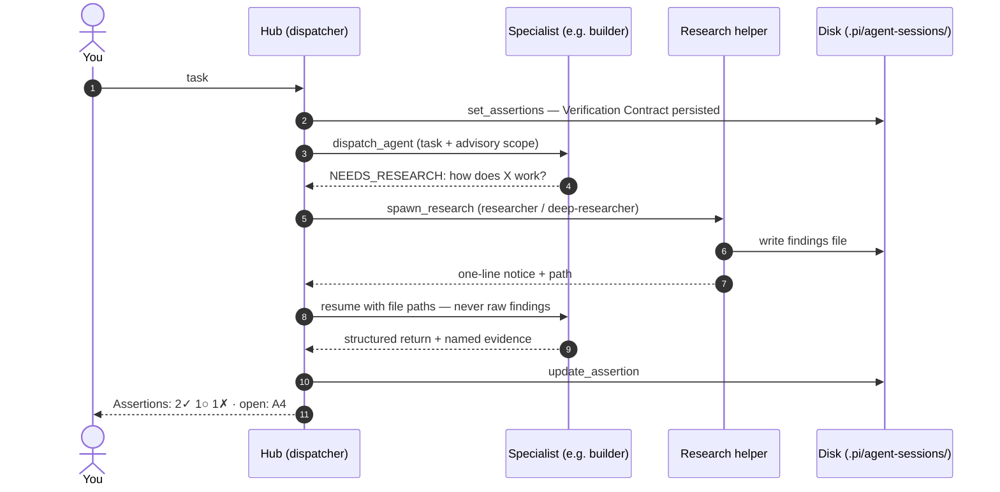

# agent-hub

A multi-agent dispatcher with [`coms`](../coms/README.md) **embedded** — so the dispatcher is
*also* a peer-to-peer node. The recommended `just fleet hub` mode loads Fleet Core
first: [`damage-control-continue`](../damage-control-continue/README.md),
[`ask-user-remote`](../ask-user-remote/README.md), STT, Compact & Continue, BTW, and the
update checker. The dispatcher therefore has guardrails and an `ask_user` handoff tool
before `agent-hub` starts. It combines local specialist
orchestration (fixed specialist grid, read-only research helpers, `/af-zoom`, kill/restart, per-agent
model, dispatcher persona gate) with peer-to-peer collaboration: it can **hand a session off to
another main agent** and **use a coms peer as a subagent**.

> Consolidates the retired `agent-team` dispatcher into this harness and embeds the ported `coms`
> P2P layer from [`pi-vs-claude-code`](https://github.com/disler/pi-vs-claude-code) by
> [disler](https://github.com/disler) (MIT). See the
> [extension catalog](../../../docs/pi-extensions.md) and the
> [design plan](../../../docs/plans/agent-hub/).

**Optional phone control:** `just fleet team <team> --project <name>` can supply the live peers for the experimental [Codex Android conductor](../../../docs/codex-remote-conductor.md). Configure Codex for the same project; do not also launch `just fleet conductor codex <team>` for the same peers. Hermes remains the inbound `ask_user` route, while Codex performs only human-confirmed, approval-gated outbound delegation.

## What it does

The whole dispatch loop, end to end:



Every borrowed idea from another harness passes one test before it lands: *does this persistently enter the dispatcher context?* If yes, it goes to disk or a one-line status instead.

`agent-hub` is the supported home for the former standalone dispatcher features:

- **Dispatcher grid** — a live dashboard of fixed specialists from `.pi/agents/teams.yaml`.
- **Specialist delegation** — `dispatch_agent` sends writable tasks to configured specialists.
- **Research helpers** — `spawn_research` and `/af-research` launch read-only helper agents. Two
  `kind: research` personas ship by default: `researcher` (fast `gpt-5.3-codex-spark`) for simple
  reads and `deep-researcher` (`gpt-5.5` / xhigh) for hard, cross-cutting investigation. The
  orchestrator routes by persona; each persona's model + thinking level is shown in its catalog.
  Finished helpers are **auto-pruned** so the research row doesn't grow without bound: auto-research
  pipe helpers disappear as soon as they finish (their findings persist as `findings/*.md` files and
  their handles are never resumed), while manual/persona helpers keep only the `research-keep` most
  recently finished (default 4 — resumable via `/af-agents-cont rN`; older cards, and their session
  files, are dropped oldest-first). Set `research-keep: <n>|all` in the overrides file to change
  the cap. Running helpers are never pruned and `rN` handles are never reused.
- **Human handoff path** — `ask_user` is exposed by the `ask-user-remote` wrapper (capturing stock
  `pi-ask-user` and optionally racing a `user-remote` bridge), so specialists can bubble decisions
  back through the dispatcher.
- **Auto-research pipe (`NEEDS_RESEARCH:`)** — a specialist that lacks information pauses by ending
  its turn with `NEEDS_RESEARCH: <question>` lines (mirror of the `ASK_USER:` protocol). The hub
  intercepts them **in code**: it fans out read-only research helpers (max 4 questions per pause,
  2 pauses per dispatch), writes each helper's findings to `.pi/agent-sessions/findings/*.md`, and
  resumes the specialist's session with the file paths. The dispatcher LLM sees only a one-line
  notice — raw findings never enter its context. Findings files are wiped at session start.
- **Verification Contract (assertion ledger)** — the dispatcher owns a ledger of checkable
  acceptance assertions built from the request *before* any builder runs, so a clearly stated
  requirement is never silently dropped. `set_assertions` records the numbered, tagged assertions
  (`test` | `runtime-ui` | `code-grep` | `manual`, one pass condition each, plus a required
  `source` naming where the requirement comes from) and rebuilds the whole
  ledger on a "wrong again" regression reset; `update_assertion` marks each one proven (named
  evidence required), unproven, or failed after a verification gate; `get_assertions` reads the
  full ledger (ids, tags, pass conditions, evidence) back. The hub persists the ledger to
  `.pi/agent-sessions/assertions.json` (wiped at session start like `findings/`) and renders a
  one-line status (`Assertions: 2✓ 1○ 1✗ · open: A4`) so the contract survives compaction without
  re-flooding the dispatcher LLM context — after a compaction the dispatcher calls `get_assertions`
  to recover the full text the status line omits. The `orchestrator` persona drives it — a deep-researcher
  parity inventory for "behave like" requests, runtime proof for UI/visibility assertions, the
  regression reset on a re-ask — per
  [`orchestration-verification`](../../../skills/orchestration-verification/SKILL.md). The hub also
  machine-parses each assertion-carrying specialist's structured return, writes the full raw output
  to `.pi/agent-sessions/artifacts/returns/<agentKey>-run<N>.md`, surfaces only a compact
  `details.structuredReturn` digest plus `details.returnPath`, and marks contract notices such as
  missing assertion ids or evidence-less `assertions_proven` entries (demoted to unproven in the
  tool text). `details.fullOutput` remains for `/af-zoom`/compatibility, but dispatcher-visible text is
  digest + path oriented. `update_assertion(status: "proven")` validates evidence by assertion tag:
  test evidence needs a command/test and outcome, `code-grep` needs pattern plus result sample,
  manual needs user/`ask_user` confirmation, and `runtime-ui` needs an existing artifact path under
  `.pi/agent-sessions/artifacts/evidence/`. **Advisory by design** (PRD open question 2): status is
  surfaced and "proven" requires named evidence, but a dispatch is never hard-refused on an unproven
  assertion — code-enforcement is the Checkpoint A decision. Two contract rules ARE enforced at the
  tool: a batch with any sourceless assertion is refused with the offending ids named (a specialist
  told to prove `A9` must be able to read its origin instead of spending a dispatch and an ASK_USER
  cycle asking where `A9` was defined), and a batch over **8** open assertions is accepted with a
  warning suggesting the split — declare the batch the next dispatches actually prove, and
  `set_assertions` the next one when it starts.
- **Artifact bus** — session handoffs live under `.pi/agent-sessions/artifacts/` with conventional
  `returns/`, `failures/`, `plans/`, `reviews/`, `inventories/`, and `evidence/` subdirectories, all
  **archived** into an immutable `runs/<runId>/` namespace at session start rather than wiped (see
  [Immutable per-run artifact namespaces](#immutable-per-run-artifact-namespaces-run-namespacejs)),
  so a later session can never overwrite an earlier one's returns. `failures/` is separate on purpose: a run
  that errored or timed out produced no specialist result, so its output goes there and the dispatch
  result names it a **delivery failure** carrying no assertion evidence. Filing a 142-byte coms error
  stub as `returns/code-reviewer-run4.md` once cost a 103-second dispatch investigating a review that
  had in fact succeeded — only its reply was lost. `dispatch_agent` and `spawn_research` accept optional
  `artifacts: string[]` paths (repo-relative or session-artifact-relative); the hub validates that
  they stay inside the repo/session roots and injects only the path plus first heading/one-line
  preview, never file bodies. Document-producing specialists are instructed to write plans, reviews,
  inventories, and reports to the real session path
  `.pi/agent-sessions/artifacts/<kind>/<agentKey>-run<N>.md` when their tools allow it, then report/pass
  the artifact-relative handoff path `artifacts/<kind>/<agentKey>-run<N>.md`, finish with that path plus
  a ≤10-line digest, and still include structured returns when assertions are carried. Repo-root
  `./artifacts/...` files are not session artifacts. Planner's existing PLAN_FILE behavior is preserved;
  the artifact path is an additional handoff channel.
- **Dispatch scope advisory** — `dispatch_agent` accepts optional `scope: string[]` for writable
  builder-style runs. The orchestrator should derive these globs from the plan task's file list,
  and skip scope for exploratory/reconnaissance work where the right files are not known yet. The
  hub snapshots git status before the writable dispatch, diffs after the whole tool call (including
  auto-research resumes), and reports out-of-scope paths in `details.scopeViolations` plus a ⚠ text
  notice. This is advisory only: the hub never blocks completion, reverts files, or escalates
  automatically. Known limitation: concurrent writable dispatches can only be attributed
  approximately, so overlapping runs are flagged in the notice.
- **Agent controls** — `/af-zoom` inspects a live agent timeline; `/af-agents-history` replays the run as a
  timeline (orchestrator turns, dispatches, research helpers) with per-agent durations, parallel-run
  markers, and a grand total; kill/restart controls manage running child agents; per-agent `model:`
  fields select models from team config. The `agents-*` commands address **both target kinds** —
  team specialists by persona name, research helpers by `rN` handle (mirroring `/af-zoom`):
  `/af-agents-kill <name|rN|all>` SIGTERMs a specialist (keeping its standing card), while on a
  research helper it kills **and removes** the card + session — helpers are disposable by design
  (`all` clears every helper); `/af-agents-restart <name|rN>` re-runs the last task fresh (a research
  helper must be finished first); `/af-agents-cont rN <prompt>` resumes a finished helper's session.
  The old `/af-research-rm` and `/af-research-clear` spellings remain as aliases of the kill semantics,
  `/af-research-cont` of `/af-agents-cont`.
  Restartable team specialists at or above 70% context render
  their context percentage with a warning marker/color in dashboard and compact views, and their next
  `dispatch_agent` result adds a `/af-agents-restart <persona>` hint. Research helpers are not warned,
  and the hub never restarts specialists automatically.
- **Model switching** — a persona's frontmatter `models:` list declares the models it may switch to
  (the default `model:` is implicitly a candidate). `/af-agent-model <persona>` picks from that list;
  the choice lasts for the session and takes effect on the persona's next dispatch
  (`/af-agents-restart <persona>` applies it immediately). The dot form
  `/af-agent-model <persona>.<role>` switches a delegate sub-role's model instead — its candidates are
  the role's declared default plus the parent persona's own candidate list; the switch is applied
  when the parent is next dispatched (it lands in the serialized delegate config, so nested
  children inherit it). `/af-models [profile]` applies a named profile
  from `.pi/agents/model-profiles.yaml` — a macro over the same declared candidates, validated at
  session start (a profile with any entry outside a persona's candidates is dropped whole, with an
  error); profiles never touch sub-role models — only `/af-agent-model` reaches those. Nothing
  outside the declared lists is ever selectable. When an effective project or session override
  fails with a model/provider error or aborted request before work begins (including local-model
  memory-limit failures), the hub retries once with the model originally declared in the persona
  frontmatter. For **write-capable** runs this is pre-work only: no fallback occurs after text
  output, a tool call, cancellation, timeout, drift stop, or a Pi process-spawn failure, avoiding
  duplicate writes. **Read-only children and research helpers** (tools limited to
  `read,grep,find,ls`) also retry once when the provider fails *mid-run* — re-running a reader
  repeats nothing, and those are exactly the children that exist to protect their parent's context,
  so losing one to a local-endpoint OOM halfway through discards work for no safety gain. A
  terminated run (watchdog, deadline, cancellation) never retries either way: that is a verdict on
  the work, not a provider outage. The failed attempt is removed from the child session before retry. Per project,
  `model.<persona>:` / `models.<persona>:` keys under `## agent-hub` in
  `.ai/agent-fleet-overrides.md` replace a persona's default model / candidate list.
  Research personas (`researcher` / `deep-researcher`, `kind: research`) are switchable the same
  way — `/af-agent-model <persona>` and `/af-agent-model-thinking <persona>` accept them alongside team
  members. Since research helpers are spawned fresh on each `/af-research` / `spawn_research`, the
  switch lands on their next spawn (there is no running instance to `/af-agents-restart`).
  `/af-agent-models-substitute <source> <target>` is the global one-shot form: walks every loaded
  persona (team + research + orchestrator), and for each whose **current effective model** is
  `<source>` and whose declared candidates include `<target>`, sets the session override to
  `<target>`. One-step flow — the dry-run summary (affected vs skipped, with reasons) is shown
  inline, then the swap is applied immediately and takes effect on each persona's next dispatch
  (`/af-agents-restart` to apply now). It never touches the dispatcher or delegate sub-roles.
- **Thinking levels** — each persona's frontmatter `thinking:` sets its pi `--thinking`
  reasoning effort (`off` · `minimal` · `low` · `medium` · `high` · `xhigh`). `/af-agent-model-thinking
  <persona>` switches it among those six levels for the session; like a model switch it takes effect
  on the persona's next dispatch (`/af-agents-restart <persona>` applies it now), and selecting the
  frontmatter default clears the override. The level shows as a short badge after the model
  everywhere a model is rendered — `gpt-5.5 (xh)` in the dashboard cards and the compact below-editor
  view (`min`/`low`/`med`/`hi`/`xh`; `off` shows no badge). Per project, a `thinking.<persona>:` key
  under `## agent-hub` in `.ai/agent-fleet-overrides.md` replaces a persona's default level.
- **Mid-turn delegation (`delegate` tool)** — a persona that declares a `subagents:` map in its
  frontmatter (`role: { model, tools? }` entries, or an indented `model:`/`tools:` block per role)
  gets a real mid-turn `delegate(role, instruction, context?, allow_write?)` tool, injected as an
  extra `-e delegate.ts` extension into its spawned process (the `delegate` tool name is appended to
  its `--tools` allowlist — pi filters extension tools too). Only declared roles are spawnable, on
  their declared models — model choice is configuration, never the child LLM's. Budgets are readable
  refusals: at most 4 delegate children per dispatch, tree-wide, and a per-persona `delegate_depth:`
  budget capped at 1 (the default). Children spawned with remaining depth 0 do not receive the
  `delegate` extension/tool. Write safety: children run read-only (`read,grep,find,ls`) unless a
  SINGLE live child gets `allow_write: true`, which inherits the parent's tools intersected with the
  role's `tools:` cap; if a declared role cap leaves no available tools, delegation is refused.
  Concurrent children are always forced read-only. Children stream timeline events through
  `.pi/agent-sessions/delegations/<persona>/events.jsonl`; the hub tails it and renders nested rows
  under the parent's card (child id, model, tokens, status),
  each openable with `/af-zoom <child-id>`. Each child also writes its full final output to
  `.pi/agent-sessions/delegations/<persona>/results/<childId>.md`; the parent receives only status,
  a required final `DIGEST:` section (≤30 lines with path:line citations), and the result-file path.
  If a child omits `DIGEST:`, the parent gets the first ~30 lines plus a no-DIGEST warning and the
  result path. Spend rolls up: every child row and the parent's subtree
  total show tokens, and a session-wide `Δ delegated` counter sits in the status line.
  `/af-agents-kill` on the parent SIGTERMs its whole process group, so the delegation tree dies with
  it. `context: fork` is accepted but treated as a summary brief in v1. Per project,
  `subagents.<persona>.<role>:` and `delegate-depth.<persona>:` keys under `## agent-hub` in
  `.ai/agent-fleet-overrides.md` replace individual sub-roles / the depth budget. An overridden
  role retains its frontmatter model as a one-shot fallback under the same pre-work-only safety
  rule; delegate cards and results show the model that ultimately ran. Six personas ship with
  declared sub-roles, on a three-tier OpenAI model ladder — `gpt-5.3-codex-spark` for
  recon/grep sweeps, `gpt-5.4` for analysis sweeps, the `gpt-5.5` (or opus) parent reserved for
  synthesis and verdicts:
  - `code-reviewer` — `preflight`+`docs` (spark), `quality`+`perf` (gpt-5.4); its first delegate
    call is always `preflight`, which studies the project rules and the files under review and
    returns a summary that drives the rest of the fan-out. Deep security review is not a
    sub-role — it belongs to the separate `security-auditor` persona, which the reviewer
    recommends dispatching when it spots deeper risk.
  - `planner` — `scout`+`rules` (spark) fan out before the plan is drafted; `risk` (gpt-5.4)
    optionally challenges the draft breakdown.
  - `plan-reviewer` — `feasibility` (gpt-5.4) checks plan claims against the actual codebase;
    `deps` (spark) verifies dependency ordering and file overlap. No preflight — the plan is
    the map.
  - `security-auditor` — solo `recon` (spark) maps the attack surface first, then
    `input-sweep` (gpt-5.4) and `secrets-sweep` (spark) fan out; exploit reasoning stays with
    the parent.
  - `builder` — `recon` (spark) maps call sites before edits; `verifier` (spark, the one
    `allow_write: true` child) runs the test suite after them. Implementation is never
    delegated.
  - `test-engineer` — `coverage-scout`+`conventions` (spark) inventory gaps and test patterns;
    test writing is never delegated.
- **Dispatcher persona gate** — optional `persona-gate: on` can require an orchestrator persona at
  session start; by default the dispatcher starts without the gate.
- **Default damage-control guardrails** — `just fleet hub` and `just fleet hub --solo` load the
  `damage-control-continue` harness before `agent-hub`, so dispatcher tool calls are checked against
  `.pi/damage-control-rules.yaml` and a blocked call feeds back instead of aborting the turn. A
  guardrail is also re-loaded into every native specialist, research helper, and nested delegate
  (see [Safety scope](#safety-scope)). Missing safety plumbing refuses child dispatch.
- **Embedded coms** — the dispatcher is a discoverable peer on the local machine. Multiple
  `agent-hub` (or plain `coms`) sessions on the same box find each other through per-project registry
  files and exchange messages over a unix socket (named pipe on Windows).

Inherited `/af-zoom` behavior in this harness expands the latest event by default. Use `Space` or
`Ctrl+C` to copy the selected row content, and `Q` or `Esc` to close the overlay. The overlay sizes
to the terminal and keeps the selected (and last) entry fully visible while you navigate with
`↑/↓`.

### `/af-agents-history`

`/af-agents-history` opens a read-only overlay (same chrome as `/af-zoom`) that replays the session as an
execution **tree**:

- **Orchestrator turns** — each dispatcher turn that actually dispatched something is a depth-0 row
  labelled `(dispatcher)`. Chat-only turns add no rows.
- **Dispatched specialists and research helpers** nest one level beneath the turn that launched them;
  **delegate sub-sub-agents** nest one level deeper still under the specialist that spawned them — in
  start order at every level.
- **Parallel runs** — siblings whose run times overlap are marked with a `│→` connector, so a
  concurrent fan-out reads as a visually grouped block.
- **Real-work durations** — each row shows that node's *own* work: its span **minus the time it spent
  awaiting children**. A dispatcher blocked on six concurrent agents is credited only for the time it
  actually worked between/around the awaits, never for the await itself — so the same wall-clock isn't
  counted twice up the tree. The same subtraction applies to a specialist awaiting its own delegate
  children. Format: plain seconds under a minute (`42sec`), `m:ss` above it (`10:20min` for 620s).
  Running rows tick live (the overlay re-renders once a second) and a new dispatch appears the instant
  it starts.
- **Footer** shows `Σ real work <total> · <n> runs (agents <a> + dispatchers <d>)` — the real work of
  *everyone*: the dispatched specialists' and research helpers' full runtime (`agents`) plus each
  dispatcher turn's own work (`dispatchers` — its span minus the time it awaited agents **and** the
  human via `ask_user`). Wall-clock is deliberately **not** shown: it would fold in the idle gaps
  while you're away between turns, and `ask_user` waits are subtracted for the same reason.

Navigate with `↑/↓`, press `G` to jump back to the live tail, and `Q`/`Esc` to close. The log resets
on each session start.

The agent view starts in **compact** mode, showing one line per *running* agent —
`name · context% · state` — *below* the input box, just above pi's status bar. Idle and done agents
are hidden, and the coms pool widget collapses too, so an idle session collapses to just the prompt
and footer. Press **`Alt+A`** to toggle to the full **dashboard** (bordered card grid drawn *above*
the input box) and back. The current mode and binding are shown in the footer
(`Alt+A view:compact` / `Alt+A view:dashboard`).

### Version footer

`agent-hub` renders its local harness version first in its custom footer:
`agent fleet v<version> · <model><thinking> · <team>`. It replaces pi's default footer, so it does **not**
consume or render the shared version status; it reads its own adjacent stamped manifest directly.
The three persistent-UI harnesses (`agent-hub`, `coms`, and
`damage-control-continue`) still register that one shared key, which gives default footers one
version in stacked non-hub sessions. In the supported guardrail-plus-hub stack, the hub's custom
footer supplies the single visible version. Damage-Control can update its own safety status after
a violation without overwriting the shared version entry. The canonical source is the
repository-root `package.json`; the adjacent harness manifest is a synchronized stamp maintained
by `bin/sync-harness-versions.js`. Its local `version.ts` reader intentionally stays with the
harness for copied or symlinked installs, but those installs still need the pre-existing full
`.pi/harnesses/` dependency installation.

The `agent fleet` half of the label is an OSC 8 terminal hyperlink to the project homepage —
clickable in terminals that support hyperlinks, ignored (rendered as plain text) elsewhere, and
free of footer columns because pi strips OSC sequences before measuring width. It opens the
repository in a browser, not a TUI panel: pi has no mouse tracking, so a click never reaches the
harness. `AGENT_FLEET_NO_LINKS=1` restores the plain label on multiplexers that mangle OSC 8
(GNU screen, tmux before 3.4).

### Voice dictation indicator

The custom footer renders the optional [`pi-voice-stt`](../../extensions/pi-voice-stt/README.md)
extension's recording indicator on a line **below the model line** — e.g.
`● REC 0:01 ⏎ send · esc cancel` while recording, or a `transcribing…` dot. Because agent-hub
replaces pi's built-in footer (where that indicator normally lives), it reads the extension's
`setStatus("voice-stt", …)` value via the footer data provider and surfaces it itself. The
indicator only appears once `pi-voice-stt` is installed and configured; otherwise the footer is
the single model line. Press **`Alt+S`** to start/stop dictation as in a normal pi session.

### Compact-view agent switcher

In **compact view**, the running-subagents list below the input doubles as a switcher. **`Alt+]`**
and **`Alt+[`** move a marker (`›` + highlight) to the next/previous running subagent; **`Alt+\`**
opens the read-only `/af-zoom` overlay on the marked one (`Q`/`Esc` to close). This only changes what
you *view* — **the input box always prompts the main session**, and `main` is never a marker target
(it is the session under the input, not a subagent). There is no transcript takeover: a subagent's
stream is surfaced through the modal zoom overlay, never by replacing the main scrollback. The keys
are inert in dashboard mode (use `/af-zoom <name>` there).

> Terminal note: `Alt+[` emits `ESC [` (a CSI prefix) and may be swallowed by some terminals'
> escape parsers; `Alt+]` and `Alt+\` are the reliable pair. `Alt+↑/↓/←/→` are reserved by the pi
> editor, which is why the switcher uses the bracket/backslash keys.

## Configuration

At session start, `agent-hub` reads `.ai/agent-fleet-overrides.md` in the workspace. The
canonical section name is `## agent-hub` (the legacy `## agent-team` name is still accepted):

```markdown
## agent-hub
# Replace Bulgarian with any language name.
language: Bulgarian
```

Omit the section to keep the default `English`. `language` applies to dispatcher replies,
`ask_user` questions and `context` fields, handoff summaries, and user-facing status text;
specialist task strings stay in English.

The same section can point the team at the project's own rule files and documentation
entry points:

```markdown
## agent-hub
rules: docs/rules, .ai/rules
docs: Docs/AGENTS.md, Docs/architecture/ARCHITECTURE_OVERVIEW.md
```

`rules:` lists repo-relative folders of HOW rules — implementation patterns the work must
comply with. Resolution is **index-first**: a folder with a top-level `README.md`/`index.md`
is treated as curated — personas read the index first and follow its loading manifest
(session bundles, conditional-load lists) instead of bulk-reading the tree; a folder without
an index is searched **recursively** through all subfolders. When set, every dispatched
specialist's system prompt gains a "Project rules" block naming the folders and the
resolution order; the planner and code-reviewer personas additionally validate their subject
against the relevant rules and pass them on (cited in plan acceptance criteria / handed to
delegate sub-reviewers).

`docs:` lists repo-relative WHAT/WHY documentation entry points — canonical files (e.g. an
`AGENTS.md`, an architecture overview) or doc folders (personas start from the folder's
README/index). Docs orient rather than bind: every dispatched specialist **and every research
helper** gains a "Project docs" block telling it to read the entry points relevant to its
task and follow their links instead of bulk-reading doc trees. The code-reviewer flags
changes that alter documented behavior without a doc update; the documenter treats the entry
points and the trees they link as the documentation it maintains.

The same section also tunes research-helper retention:

```markdown
## agent-hub
research-keep: 8
```

`research-keep:` caps how many **finished** manual/persona research helpers stay resumable
(LRU by finish time, default 4; `all` disables the cap). Auto-research pipe helpers are
always pruned as soon as they finish, regardless of this key.

### Bounded local-disk searches

Every `read`, `grep`, `find`, and `ls` call made by a native research helper or a nested
`delegate` child has a **parent-side** watchdog. The default is **120 seconds per tool call**;
it is a per-tool bound, not a whole-run deadline — the whole-run bound is the execution
mode's per-run deadline below. Configure it in the repository-standard overrides file:

```markdown
## agent-hub
recon-search-timeout-s: 120  # integer 1..3600
# recon-search-timeout-s: off # disable this per-tool watchdog
```

Invalid values warn at session start and use 120. Calls are tracked independently by their
JSONL `toolCallId`; a repeated start/update cannot extend an existing deadline. A timeout returns
`tool_timeout` with the call metadata, ends the research/delegate lifecycle, sends SIGTERM to the
child's explicitly owned process group, then SIGKILL after a finite grace period. The parent also
has a final settlement timer, so it settles rather than waiting indefinitely for `close` or
inherited pipe drain. If child/process-group death cannot be confirmed after this bounded cleanup,
the timeout metadata reports `terminationConfirmed: false`: this prevents the parent hanging, but
may indicate an uninterruptible OS-level process that needs operator attention. This group
ownership covers descendants even when the pi leader exits first; nested delegates own their groups
and forward parent cancellation, avoiding detached-orphan processes. Caller
cancellation follows the same bounded cleanup path but is reported as `cancelled`, not
`tool_timeout`.

### Execution modes & turn budgets

The hub runs one of three **execution modes** — `fast`, `standard` (default), `strict` —
with **per-user-turn budgets enforced in code**, not prose. This is the guardrail against
runaway orchestration (the observed failure mode: 100+ dispatches and 100M+ tokens for one
task, most of it re-billed stale specialist context).

| Budget (per user turn)            | fast   | standard | strict  |
|-----------------------------------|--------|----------|---------|
| `dispatch_agent` calls            | 2      | 8        | 24      |
| `spawn_research` calls            | 1      | 4        | 12      |
| Turn wall clock                   | 15 min | 60 min   | 240 min |
| Per-run deadline (specialist/research/delegate) | 10 min | 30 min | off |
| Specialist session recycled after | 3 runs | 5 runs   | 5 runs  |
| Nested delegation                 | off    | on       | on      |

- **fast** — single-specialist path for small, low-risk asks; assertion ledger optional,
  no nested delegation.
- **standard** — batched execution: one recon max, builder batches of 4–6 plan tasks with
  one gate each, one review gate at the end.
- **strict** — the full Verification Contract (parity inventories, per-batch gates,
  second confirming reads); use for production migrations and security-sensitive work.

When a budget is exhausted, `dispatch_agent`/`spawn_research` **refuse** with instructions
to summarize and ask the user; the next user message opens a fresh window. Switch modes
live with `/af-hub-mode fast|standard|strict` (no argument shows the current mode and usage);
set the project default and per-axis overrides in the overrides file:

```markdown
## agent-hub
mode: standard                # fast|standard|strict
max-dispatches-per-turn: 8    # integer or off
max-research-per-turn: 4      # integer or off
turn-wall-time-s: 3600        # integer or off
agent-turn-timeout-s: 1800    # whole-run deadline per spawned run; integer or off
session-recycle-runs: 5       # recycle a specialist session after N resumed runs; integer or off
run-history-keep: 10          # previous sessions' artifact archives to retain; integer or off
```

#### Task budget (the bound a turn window cannot provide)

A per-message allowance cannot bound a task. In the run this guardrail comes from, every
steering message opened a fresh window of 8 dispatches and 60 minutes, so no counter ever
bound: one workspace stayed open **47 hours**, while the same change made in a narrow
workspace took **13 minutes**.

So there is a second envelope, **`TASK_BUDGET_MULTIPLIER` (3) × the turn envelope**, whose
counters are **not** reset by a user message:

| | per turn (standard, `feature`) | per task |
|---|---|---|
| `dispatch_agent` | 6 | 18 |
| `spawn_research` | 4 | 12 |
| clock | 60 min wall | 180 min **active** |

Exhausting it is a **hard stop**: the refusal says so, and another user message does not
reopen it. Only `/af-new-task [label]` (or `set_task_tier` with `new_task: true`) opens a
new task window — clearing the counters, the tier, the review-round count, the duplicate
guard, and any external-blocker stop. The status chip shows both (`… · task 4/18`).

The reasoning: a task that has burned three full envelopes has not hit a budget problem, it
has outgrown its scope, and re-scoping is the human's call.

The task clock charges **active time only** — turns that actually ran, each minus the time
the dispatcher sat blocked on `ask_user`. Inter-turn idle costs nothing, because no turn is
open across it. Raw wall clock would bill a lunch break, an overnight pause, and every long
human answer against the task; at `fast` mode's 45-minute envelope a coffee break would
hard-stop a task with two dispatches spent. A false stop is worse than no stop — it teaches
people to reset the task window reflexively, and that reset is the one thing that has to
stay deliberate. Dispatch and research counts remain the honest hard stops.

The **auto-research pipe** (specialist emits `NEEDS_RESEARCH`, the hub fans out read-only
helpers in code) stays exempt from the TURN budget — it is hub mechanics, not a dispatcher
decision, and it must not steal the dispatcher's slots — but it **is** charged against the
task envelope. At 2 rounds × 4 questions per dispatch and 18 dispatches per task, leaving it
uncounted would have put 144 research runs inside the bound that is supposed to be the outer
one. When the task's research envelope is spent the pipe does not spawn and the specialist is
not resumed; the dispatch result says so.

Two related always-on behaviors: specialist **context pressure is measured over
input + cacheRead + cacheWrite** (resumed sessions re-send their whole accumulated context
as cache reads — counting `input` alone hid that entirely), and a specialist session is
**recycled** (fresh session, no `-c` resume) once it has served `session-recycle-runs` runs
or its measured context passes 60%. The dispatch result notes the recycle so the dispatcher
knows the specialist starts without session memory — task text and `artifacts:` paths must
carry the state, which the deliverable-to-file protocol already ensures.

Context is measured against **that agent's own** model window, resolved from pi's model
registry (`ctx.modelRegistry.find`) with the source recorded on every resolution. Dividing a
49k local model's usage by the dispatcher's window is what produced unactionable readings
like `⚠ Planner context at 315%`; a reading above 100% now emits a one-time diagnostic that
names the window and where the number came from, so a mis-resolved window is distinguishable
from a genuine overflow. Two recycle rules follow from it: a session at or past a **full**
window is recycled unconditionally (no threshold override keeps it alive), and a resumed
session whose *projected* prompt — prior tokens plus this task — would overflow is recycled
**before** the spawn instead of after the run.

#### Per-provider concurrency

A dispatch may fan out to four delegate children at once and several specialists can be
mid-run, with nothing bounding how many requests land on one provider. That is fine against
a hosted endpoint and not against a local one. Requests are capped per process — **2 in
flight for `custom/*` by default, unlimited elsewhere**:

```bash
AGENT_HUB_PROVIDER_LIMITS="custom=4"        # raise the local cap
AGENT_HUB_PROVIDER_LIMITS="custom=off"      # disable it
AGENT_HUB_PROVIDER_LIMITS="custom=2,ollama=1"
```

Queued runs still execute — they wait for a permit, and the wait is announced rather than
looking like a hang. The cap applies per **level** of the delegation tree (each pi process
runs its own semaphore over the children it spawns), and a nested spawn reuses its parent's
permit, so a child can never wait on its own ancestor. The drift judge and the return
extractor are deliberately ungated: both run while a specialist holds a permit, so queueing
them behind it would stall the watchdog meant to stop it.

The per-run deadline lands as `turn_timeout` (exit 124) with partial output preserved, for
dispatched specialists, research helpers, and nested delegate children alike — a hung child
can no longer hold its parent for hours.

### Task triage (complexity tiers)

The dispatcher classifies the current TASK with the `set_task_tier` tool BEFORE its first
dispatch — `trivial` / `small` / `feature` / `project` — and the hub lowers the enforced
dispatch/research caps to **min(mode, tier)**: trivial = 1 dispatch / 1 research,
small = 2 / 2, feature = 6 / 4, `project` defers to the mode. The tier shows in the
`hub-mode` status chip (`Mode: standard·small · …`), with a trailing `?` while it is only
assumed.

Skipping the call makes the hub assume **`small`**, not `feature`. Because the tier is
task-scoped, a skipped triage latches for the whole task — and skipped triage is precisely
the case where the dispatcher was not thinking about proportionality. Assuming `feature`
there would unlock planner/plan-reviewer/security-auditor, loosen the review caps, and hand
out the full feature envelope: the over-apparatus failure mode, granted by forgetting a tool
call. Assuming `small` costs one explicit escalation when the work really is bigger, which
is the cheap direction to be wrong in. An assumed tier is not a ratchet baseline either: the
dispatcher's own first `set_task_tier` is treated as an initial declaration, so it never
needs a `reason` it had no way to know it needed.

The tier is **task-scoped and ratcheted**. It survives the user's next message, and it
moves in one direction cheaply: **lowering it is always free, raising it requires a
`reason`** naming what the ask turned out to contain (refused in code otherwise). A
turn-scoped tier could not bind on a steered run — every correction reset it to null, the
next dispatch re-assumed `feature`, and the effective tier drifted to the ceiling, because
nobody ever re-declares `trivial` after a steering message.

Three guards are enforced in code, not prose:

- **Duplicate-dispatch guard** — refuses re-dispatching the same agent with a
  near-identical task inside one turn.
- **Tier persona gate** — at `trivial`/`small`, `dispatch_agent`/`spawn_research` refuse
  `planner`, `plan-reviewer`, `architect`, `security-auditor` and `deep-researcher`
  (`run-budget.js`). Each opens a document/finding loop whose output then has to be
  executed and re-reviewed; the escape hatch is raising the tier *with a reason*, not a
  flag. The refusal costs no budget slot.
- **Review round cap** — review dispatches per TASK are capped by tier (trivial/small 1,
  feature 2, project uncapped) and the (N+1)-th is refused without spending a budget slot.
  This is where the review ratchet is actually cut: findings become requirements and the
  enlarged requirement set justifies the next round, so the round is the thing to bound.
- **Review finding budget** — a review persona's dispatch carries a blocking-finding cap
  tied to the tier (trivial 1, small 2, feature 5, project uncapped) plus the rule that a
  blocking finding may only enforce an invariant the task/plan/rules already state. The hub
  **counts** what came back (`review-findings.js`) and appends a visible notice when the
  return exceeds the cap — it never reclassifies a finding. No rule the hub can evaluate
  distinguishes "invents a manifest nobody asked for" from "this logs a connection string";
  both are a heading and a bullet, and silently demoting the second by position would, on
  the day it matters, move a real security finding into the section nobody acts on.

Every budget/gate refusal is counted in `/af-hub-report`.

### Docs lane (`docs-lane.js`)

A dispatch whose declared `scope` is documentation only — `Docs/**`, `**/*.md`,
`artifacts/evidence/*.png`, `.changeset/**` — runs in the single-worker docs lane:

- dispatching a review persona (`code-reviewer`, `plan-reviewer`, `security-auditor`,
  `test-engineer`) on it is **refused** and costs no budget slot;
- any other persona's result carries a note telling the dispatcher not to open a review
  gate for it.

An absent or empty `scope` is never the lighter lane — unknown is not docs. The refusal is
overridable per dispatch with `review_reason: "<why>"` for the cases that do warrant a gate
(the doc publishes a credential, or states a contract other systems depend on).

### External-blocker stop (`external-blocker.js`)

A specialist that cannot proceed without something outside the fleet's reach — an account,
a permission, a deployment credential, a telemetry destination, a console-only action —
emits `EXTERNAL_BLOCKED: <what is missing, who owns it, what it blocks>` (the protocol is
injected into every specialist prompt). The hub records it and **refuses the next
dispatch/research** with an owner-escalation packet: what is missing and who owns it, which
assertions are blocked, what is already proven and where, and the human's options (provide
access / waive as UNPROVEN / drop from scope).

The gate opens when the human has been addressed — an `ask_user` call, or the next user
message. Without `ask_user` installed it fires exactly once, so a session that cannot reach
the human can still finish and report instead of deadlocking.

This exists because the alternative is the most expensive failure mode observed: with no
correlation destination available, a run kept substituting internal work for the missing
external fact — scripts, manifests, fixtures, diagnostic packets — for hours, and the
assertion still ended UNPROVEN.

### Immutable per-run artifact namespaces (`run-namespace.js`)

Session start used to `rm -rf` `.pi/agent-sessions/artifacts/`, and specialist returns were
named by a per-session counter (`returns/builder-run1.md`). Both halves of that failed at
once: the next session's `builder-run1.md` claimed the same path as the previous one's, and
the wipe deleted the originals first — a post-mortem had to record eleven implementation
returns and two review artifacts as NOT RECOVERABLE.

Now each session **archives** the previous session's artifacts into
`.pi/agent-sessions/runs/<runId>/artifacts/` — a namespace written once and never reused —
alongside a read-only `meta.json` (run id, archive time, project, workspace, per-kind
artifact counts) and an appended `runs/index.json`. `runId` is a sortable UTC timestamp plus
a random suffix, so two sessions starting in the same second still get distinct namespaces.
Retention is `run-history-keep` (default 10, `off` keeps everything); an empty artifact tree
is not archived. If archiving fails the artifacts are **left in place** rather than deleted:
a stale tree is recoverable, a deleted one is not.

### Drift watchdog (in-flight observation)

An armed dispatch is observed **while it runs**, from the same JSON event stream that
drives the cards — not post-hoc:

- **Layer 1 — deterministic rules, zero tokens** (`drift-watchdog.js`): a write/edit
  outside the dispatch's declared `scope` globs, the identical tool call repeated 4×,
  5 consecutive failed tool calls, or 200 total tool calls in one run.
- **Layer 2 — LLM judge, escalation only**: when a rule fires (single-flight, 90 s
  cooldown), a one-shot cheap run (default model: the researcher persona's; override with
  `watchdog-judge-model`) reads the original task + declared scope + recent tool trail and
  answers `VERDICT: ON_TRACK|DRIFTING|STUCK`. Judge failures fail open.
- **Intervention**: DRIFTING/STUCK terminates the run as **`drift_stop`** (exit 125,
  partial output preserved) and the dispatch result instructs: re-dispatch ONCE with a
  corrected, narrowed task — never the same task unchanged.

Enablement is dynamic, precedence top to bottom: the `watchdog: true|false` param on a
single `dispatch_agent` call → a per-agent override (`/af-watchdog builder on|off|clear`) →
the hub-wide setting (`/af-watchdog on|off|auto`, default `auto`, project default via the
`watchdog:` overrides key). Read-only research helpers are not monitored — they already
run under the per-tool watchdog + turn deadline and cannot write.

### Dynamic teams

Rosters start from `.pi/agents/teams.yaml` but are not frozen there:

- `/af-agents-add <persona>…` / `/af-agents-drop <persona>…` — restructure the ACTIVE team
  live (drop refuses running or last members; session files are kept for re-adding).
- `/af-agents-save <name>` — persist the current roster as a named team back into
  `teams.yaml` (targeted block upsert; comments and other teams untouched).
- `team_adjust` — the dispatcher itself may add/drop a persona **with a stated reason**;
  disabled in fast mode, capped at 8 roster members, and every change is notified to the
  human. The system prompt is rebuilt each turn, so changes take effect immediately.

### `/af-hub-report`

Per-turn cost accounting: dispatches (agent, status, elapsed, billed/output tokens),
research runs, session recycles, drift stops, and budget/duplicate refusals — for the
current turn, the last completed turn, and session totals. Billed tokens count
input + cacheRead + cacheWrite, the same measure the recycler uses.

Paths that don't exist produce a session-start warning, never an error. The full key list for
`## agent-hub` (models, sub-roles, depth budgets, persona gate, research retention, watchdog,
mode/budget keys) is documented in `docs/agent-fleet-setup.md`.

## The coms layer

> The runtime coordination protocols this layer implements (sentinels, push over
> polling, barriers, fan-out digests, racing) are catalogued in
> [references/fleet-coordination-patterns.md](../../../references/fleet-coordination-patterns.md).

### Fleet tools (herdr)

Inside a [herdr](https://herdr.dev) pane with a live server, the dispatcher's tool
surface additionally gets (absent otherwise, like coms):

- `herdr_spawn_peer` — stand up a persona peer (joins the coms pool via `just _peer`) or a
  raw command pane in the current workspace. The peer joins **this session's `--project` pool**, and
  a name declared in `.pi/agents/peers.yaml` keeps its declared `runner:`/`extensions:`/`env_file:`,
  so a spawn by name is the same agent a team launch would produce. A persona peer **boots idle**
  and does nothing until a `coms_send` reaches it, so the call waits (bounded, ~45s) for it to
  register and returns `peer_ready` plus its coms name instead of a bare pane id; on failure it
  returns the pane's last output, which means the peer did not start rather than that it is slow.
  Peers spawned but never addressed are named at turn end and in `/af-hub-report` with a close
  suggestion — closing stays the human's call.
  Mechanism: herdr's `pane.split` takes **no command** — it opens a shell — so the spawn splits,
  waits for the pane's prompt, and types the argv (text and Enter sent separately, because bash
  bracketed paste would swallow a newline). Only `layout.apply` pane nodes carry an argv, which is
  why `just fleet team` was never affected by this
- `herdr_read_pane` — bounded `pane.read` (≤200 lines), read-to-decide on workers/tools;
  messaging still goes through coms, and peer busy state comes from `coms_list`, not from
  reading the screen
- `herdr_close_pane` — kills a pane; **asks the human to confirm every call**; the
  bash-level `herdr pane close`/`workspace close`/`server stop` verbs are hard-blocked
  for spawned specialists by `.pi/damage-control-rules.yaml`
- `herdr_notify` — desktop notification to reach the human when they are away

This closes the fleet loop: spawn a worker, watch it, notify the human, tear it down —
without leaving the session. Claude Code panes join the same pool via the
[coms bridge](../../../docs/claude-code-coms-bridge.md).

### Presence backend (herdr or files)

Presence is pluggable, exactly as in the standalone [coms harness](../coms/README.md#presence-backends-herdr-vs-files):
inside a [herdr](https://herdr.dev) pane with a live server, the ping cycle is replaced by
push events (`agent.list` + `events.subscribe`) and the hub reports itself into the herdr
sidebar (`custom_status` = `<name> <pct>% q<depth>`); everywhere else the original 10s
ping loop runs unchanged. The file registry is written in both backends, and the
pool-scope boundary is enforced identically.

### Identity

Each session registers a coms identity at start-up, resolved in this precedence order:

1. **CLI flags** — `--name`, `--purpose`, `--project`, `--color`, `--explicit`
2. **Dispatcher persona frontmatter** — `name`, `description` (→ purpose), `color` from the
   selected `kind: orchestrator` persona (see [persona sync](#persona--coms-purpose-sync))
3. **Defaults** — auto-generated name `hub-<id>`, purpose `agent-hub dispatcher`, project
   `default`, a deterministic color derived from the session id

Names are de-duplicated per project (`resolveUniqueName`), so two hubs that both want `architect`
become `architect` and `architect-2`. `--explicit` marks a **private** peer — kept out of every
pool by default, so it is neither listed nor reachable until a human opts in with `/af-coms --all`
(see [Pool scope is the reach boundary](#pool-scope-is-the-reach-boundary)). The registry lives
under `~/.pi/coms/projects/<project>/agents/<name>.json` and is created at runtime.

### Commands & tools (local dispatcher plus coms)

- `/af-coms` — coms control surface (peer list / status)
- `/af-handoff <peer>` — hand the whole session off to a coms peer (see [Handoff](#handoff))
- `/af-compound [focus]` — end-of-session **compound-learning pass**: the dispatcher composes a
  candidate-lessons brief from the session (corrections, recurring findings, root causes),
  confirms it with the user, then dispatches the `documenter` to land the approved lessons as
  minimal diffs on the project's `rules:`/`docs:` targets per `skills/compound-learning/SKILL.md`.
  Requires the `documenter` persona in the active team; run it before `/af-handoff` or session end.
- `coms_list` — discover the peers in your pool: names, models, live context usage, purpose,
  `pane_id`, and `status` (`idle` | `working` | `booting`). Check status before sending: `working`
  means your send waits behind the peer's current turn, `booting` means it is not addressable yet.
  This is the field whose absence drove 127 `herdr_read_pane` calls in one session. Scoped
  to your project and excluding private peers; the LLM cannot widen it (see
  [Pool scope is the reach boundary](#pool-scope-is-the-reach-boundary)).
- `coms_send` — send a prompt to a peer **in your pool**; returns a `msg_id`
- `coms_await` — **block** until that `msg_id`'s reply lands (default 30 min,
  `PI_COMS_TIMEOUT_MS`)
- `coms_get` — **non-blocking** poll of a `msg_id` (status `pending|complete|error`)

`/af-coms` and `/af-handoff` tab-complete live peer names **in your pool**.

### Pool scope is the reach boundary

The set of peers shown in the pool widget is the security boundary: **a peer is reachable only if it
is in your pool.** `coms_list`, `coms_send`, and `/af-handoff` all resolve targets through the same
`peersInScope()` helper, so the dispatcher can never message a peer it cannot see. Two knobs define
the pool, and **both are human-only** — the LLM cannot widen scope to reach more peers:

- **Project** — defaults to your own `identity.project`. A human can retarget with `/af-coms --project
  <name>` (one project) or `/af-coms --all` (every project). `coms_list`'s own parameters cannot
  override this; an LLM request for a wider project is clamped back to the current pool and flagged.
- **Explicit (private) peers** — excluded from every pool by default. `/af-coms --all` opts them in.

This closes a cross-project leak where a peer reachable through the mesh was *not* shown in the
default project-scoped pool — so it could be messaged without being "connected." Now the reachable
set is always a subset of what the widget shows. To reach a peer outside the pool, a human widens
scope first; the dispatcher is told to **ask** rather than attempt it, and not to pass cross-project
context to a peer the human has not approved.

### Peer as subagent

The dispatcher uses a peer as a subagent by pairing the tools: `coms_send(target, prompt)` to
issue the task, then `coms_await(msg_id)` to block for the reply (or `coms_get` to poll). This sits
alongside `dispatch_agent` — local persona specialists are dispatched as subprocesses; remote peers
are reached over coms. The two paths stay explicit for the LLM, but
[coms-backed dispatch](#coms-backed-dispatch-dispatch-policyyaml) can route a `dispatch_agent` call
to a same-name peer under the hood. (The specialist-level `delegate` tool is a third,
nested path: a dispatched specialist spawning its own declared sub-agents — it does not auto-route
between local and remote either.) Multi-hop is inherited from coms: a peer handling a dispatched task can `coms_send`
onward, hops accumulating up to `MAX_HOPS` (5).

### Coms-backed dispatch (dispatch-policy.yaml)

`just fleet team <team>` boots the Hub next to standing peers from `.pi/agents/peers.yaml` — and some
of them (e.g. `code-reviewer`, `plan-reviewer` with `runner: claude-code`) intentionally share a name
with a team member. `.pi/agents/dispatch-policy.yaml` tells the dispatcher to serve such members
**through the peer** instead of spawning a native subagent:

```yaml
default: native            # coms = substitute ANY member with a live same-name pool peer
grace_s: 30                # poll window for coms-required members
substitutions:
  code-reviewer:
    prefer: coms
    fallback: native       # none = coms-required: refuse with guidance instead of spawning
    # timeout_s: 3600      # per-member reply timeout (default PI_COMS_TIMEOUT_MS, 30 min)
```

Semantics:

- **One API.** The dispatcher LLM always calls `dispatch_agent("code-reviewer", …)`; the backend is
  resolved inside `dispatchAgent()`. The whole downstream pipeline — structured return contract,
  `ASK_USER:` extraction, the NEEDS_RESEARCH auto-research pipe, assertions, history, the grid —
  consumes a coms reply exactly like a subagent's final output (the dispatch protocols ride in the
  message body, since a standing peer only receives a user prompt).
- **Decided per dispatch, against the live pool.** Hub and peers boot in parallel, so the first
  dispatch may land before the peer registers: with `fallback: native` it runs natively (one notice
  per member per team activation), and later dispatches pick up the peer once it is live. With
  `fallback: none` the dispatch polls the pool for `grace_s` seconds, then refuses with remediation
  steps. The name match is scoped to the coms pool — the same security boundary as `coms_send`.
- **Standing context is the point.** Re-dispatches (ASK_USER answers, research resumes) go back to
  the same peer session, so a Claude Code reviewer keeps its review context across rounds.
- **Visibility.** The member's grid card shows a `⇄coms <peer-model>` badge, history entries are
  annotated `(coms)`, and `/af-dispatch-policy` prints the resolved routing per member with live-peer
  status.
- **Limitations.** `/af-agents-kill` on a coms-backed run only abandons the wait — the peer keeps
  running in its own pane and cannot be killed from the hub (`/af-agents-restart` abandons, then
  re-dispatches). `/af-zoom` shows only the final reply (there is no stream), tool counts stay 0, and
  context% is a registry snapshot. `/af-agent-model` overrides apply only to native(-fallback) runs —
  the peer's model is set in `peers.yaml`.

Missing file = everything native. HOW a peer runs (persona, model, `runner: claude-code`, env) stays
in `peers.yaml`; this file only decides WHEN the hub prefers a peer over a native spawn.

### Handoff

`/af-handoff <peer>` transfers the session to another **main** agent. Following the plan's
**decision G1**, it does *not* try to extract a compaction summary; instead it asks the dispatcher
LLM to compose a **self-contained brief** ("everything the target needs, assume no shared history"),
then `coms_send`s that brief to the peer, `coms_await`s the reply, and relays it back — in the
configured user-facing language. When the handoff `coms_send` fires, the hub appends machine-generated
sections after the LLM brief: `## Verification ledger (verbatim, machine-appended)` with every current
assertion in canonical ledger form, and `## Artifact index` with artifact paths plus first headings.
The target peer must treat the machine-appended ledger as the contract, not the paraphrased brief.
The target peer takes over; the source relays the result. There is no raw session copy (pi sessions
aren't portable between live agents). The target must be a peer in your pool — `/af-handoff` resolves
through the same [scope boundary](#pool-scope-is-the-reach-boundary) as `coms_send`, so you cannot
hand a session to a peer you cannot see.

### Pool widget

A live "pool" widget lists connected peers with name, model, and live context usage, refreshed by a
ping cycle; a keepalive cycle re-writes this session's own registry entry (and self-heals it if an
external prune removed it). Both timers are `unref`'d so they never hold the process open.

### Persona → coms purpose sync

The dispatcher persona gate fires *after* coms init, so the identity's `purpose` starts from the
flag/frontmatter/default and is then reconciled to the chosen persona: `syncComsPurpose()` maps the
selected `kind: orchestrator` persona to `"<Name> — <description>"` and re-writes the live registry
entry — **unless** `--purpose` was passed explicitly (an explicit flag always wins). Switching or
resetting the persona via `/af-persona` re-syncs.

### Graceful degradation

If the coms socket can't bind at start-up (`comsReady` stays `false`), the session degrades to a
local dispatcher without coms: the `coms_*` tools are withheld from `setActiveTools`, the
`/af-handoff` command refuses with a notice, and the "Peer agents (coms)" prompt section is omitted.
Orchestration, research helpers, and the grid keep working.

### Tool surface

`setActiveTools` always preserves the orchestration surface and adds coms when ready:

```ts
const dispatcherTools = ["dispatch_agent", "spawn_research", "set_assertions", "update_assertion", "get_assertions"];
if (comsReady)        dispatcherTools.push("coms_list", "coms_send", "coms_get", "coms_await");
if (askUserAvailable) dispatcherTools.push("ask_user");
```

`set_assertions` / `update_assertion` / `get_assertions` are the always-on Verification Contract ledger tools (see
[What it does](#what-it-does)); like `dispatch_agent` / `spawn_research` they are part of the
orchestration surface the dispatcher persona never narrows.

The dispatcher persona is **flavor-only** (decision G4 / 9) — it enriches the role but never narrows
this tool set, so coms and dispatch stay available regardless of the chosen persona.

## Optional Hermes local monitor transport

The optional monitor is an Agent Fleet-owned transport boundary, not a Hermes runtime API or a
bundled Hermes plugin. When enabled, `agent-hub` publishes dispatcher-turn and specialist-run
state and owns generation-safe cancellation. A separate local Hermes UI or operator client may
consume the owner-only discovery + Unix-socket contract documented in
[`hermes/README.md`](../../../hermes/README.md#local-agent-hub-monitor-integration).

Set these before the hub starts:

```bash
export AGENT_FLEET_PROFILE_ID="approved-profile-id"
export AGENT_FLEET_MONITOR_RUNTIME_DIR="/absolute/owner-only/runtime-root"
```

Both are required for monitor startup; the runtime root must be absolute and owner-only, and the
profile ID must be a safe identifier. The monitor also starts only for a Herdr-backed hub with
`HERDR_WORKSPACE_ID` and `HERDR_PANE_ID`; retain those values and `HERDR_SOCKET_PATH` in the
standard `just fleet team <team>` flow. Workspace labels are display metadata, not monitor identity.

The live contract exposes three authenticated newline-delimited JSON requests: `snapshot`, cursor-
based `output`, and exact-generation `cancel`. The monitor is local-only and fails closed when its
profile discovery, lease, token, or Unix socket is unavailable. A native cancel targets only the
matching hub-owned process generation. A coms cancel abandons the local wait only; its peer can
continue. Neither path controls or closes a Herdr workspace/pane.

Example startup:

```bash
monitor_runtime="${XDG_RUNTIME_DIR:?}/agent-fleet-monitor"
install -d -m 700 "$monitor_runtime"
AGENT_FLEET_PROFILE_ID=dev \
AGENT_FLEET_MONITOR_RUNTIME_DIR="$monitor_runtime" \
just fleet team default
```

No Desktop/backend plugin installation is required or provided. Consumers must re-discover after
lease or socket loss and must never persist or log the token.

## Requires

- `.pi/agents/teams.yaml` for fixed specialist teams, the referenced persona `.md` files, and
  (strongly recommended) [`pi-ask-user`](https://github.com/edlsh/pi-ask-user).
- `.pi/damage-control-rules.yaml` for every guarded `just fleet` Pi mode.
- Nothing extra in-repo for coms — the peer registry lives at `~/.pi/coms/` and is created at
  runtime.

## Usage

```bash
# Unified Fleet interface (Fleet Core is loaded first)
just fleet hub
just fleet hub --name architect --purpose "owns the migration design" --project myrepo

# equivalent direct guarded launch
pi -e .pi/harnesses/damage-control-continue/index.ts -e .pi/harnesses/ask-user-remote/index.ts -e .pi/harnesses/agent-hub/index.ts
pi -e .pi/harnesses/damage-control-continue/index.ts -e .pi/harnesses/ask-user-remote/index.ts -e .pi/harnesses/agent-hub/index.ts --name releaser --explicit

# direct unguarded launch, only when you intentionally want to skip damage-control
pi -e .pi/harnesses/agent-hub/index.ts
```

Identity flags: `--name`, `--purpose`, `--project`, `--color`, `--explicit`.

### Safety scope

`just fleet hub` and `just fleet hub --solo` load Fleet Core before `agent-hub`, so guardrails and `ask_user` apply
to hub/dispatcher tool calls in that parent pi process — and because it is the *continue* variant, a
blocked dispatcher call feeds back and the turn keeps going rather than aborting. Specialist and
research agents are spawned as separate pi subprocesses with `--no-extensions` — but `agent-hub`
resolves `damage-control-continue` from this session's `-e` flags, else the repo-local harness, and
re-loads it into every native specialist, research helper, and nested delegate via explicit `-e`.
`--no-extensions` keeps discovery off, so children never auto-load `.pi/extensions/` utilities or
recursively re-load `agent-hub`; the explicit guardrail still checks every child's tool calls against
`.pi/damage-control-rules.yaml`. Protected-path blocks escalate to the hub for explicit approval;
protected deletions offer only Deny or Allow once, while inherently dangerous command patterns are
non-exemptible. Denial or timeout blocks the call without aborting the child's turn. If continue
cannot be resolved, dispatch is refused—children are never spawned unguarded. Research helpers are
additionally read-only by construction. Guided setup enforces `agent-hub` ⇒
`damage-control-continue` + `ask-user-remote`.

### Related recipes

```bash
# Hub without coms (fixed specialists + research only)
just fleet hub --solo

# Guarded peers only in a tiled Herdr workspace
just fleet team full --no-hub
just fleet team full --no-hub --dry-run

# Guarded Hub + peers in one workspace
just fleet team docs

# Snapshot refs / close cleanly / restore conversations
just fleet snapshot docs
just fleet down docs
just fleet resume docs
```

`peers.yaml` groups reusable peers into named teams; each entry is `name` / `persona`
(+ optional `model`). The persona's frontmatter `description`/`color` become the peer's
coms purpose/color.

## How it differs from its sources

- **Embedded, not stacked (decision 1).** coms is folded into this one `index.ts`; the identity
  flags are registered once. Loading `coms` as a second `-e` would double-register
  `--name/--purpose/...` and abort start-up.
- **Single `session_start`.** coms init is folded into the former dispatcher's `session_start` and
  guarded by `if (!comsReady)`, so `/new` reuses the same peer identity (no leaked socket).
- **Dispatcher is also a peer.** `setActiveTools` lists `coms_*` alongside `dispatch_agent` +
  `spawn_research` (+ `ask_user`); the system prompt gains a "Peer agents (coms)" section when coms
  is ready. The persona's `description` drives the coms `purpose` (decision 6 / Phase 6 peer
  mapping) instead of a static `--purpose`.
- **`/af-handoff` uses an LLM-composed brief**, not a compaction-summary extraction (decision G1).
- **Clean shutdown** SIGTERMs any running specialist/research children, clears the coms pool
  widget, and removes the registry entry on `session_shutdown` / SIGINT / SIGTERM.
