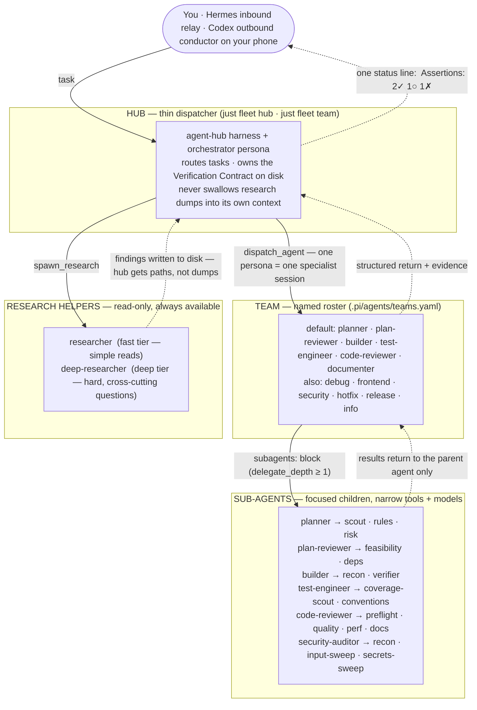
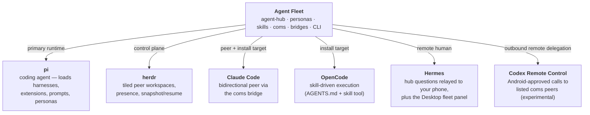

# Agent Fleet Architecture

Agent Fleet is a Pi-centered multi-agent orchestration system. This page maps
the runtime responsibilities and where each module lives in the repository.

## Runtime layers

| Layer | Role | Implementation |
| --- | --- | --- |
| **Pi Coding Agent** | Primary local runtime — runs the dispatcher and specialist subagents | `.pi/harnesses/`, `.pi/extensions/`, `.pi/agents/`, `.pi/prompts/` |
| **agent-hub** | Thin-context multi-agent harness: dispatcher + specialists + research helpers + Verification Contract | `.pi/harnesses/agent-hub/` |
| **Herdr** | Fleet/workspace control plane — spawns peer teams as tiled workspaces, presence via push events, snapshot/resume | [herdr.dev](https://herdr.dev); client in `.pi/harnesses/lib/herdr-client.ts`, layout in `scripts/lib/herdr-layout.ts` |
| **coms** | Peer communication protocol/data plane — envelope-based P2P messaging between agents | `.pi/harnesses/coms/`, `scripts/lib/coms-envelope.ts`, `scripts/coms-cli.ts` |
| **Claude Code bridge** | Makes an interactive Claude Code pane a bidirectional coms peer | `scripts/coms-claude-bridge.ts`, `hooks/coms-stop-hook.mjs`, `skills/peer-coms/` — see [claude-code-coms-bridge.md](claude-code-coms-bridge.md) |
| **Hermes bridge** | Remote human control — relays hub questions to Telegram, races phone vs. local answers, conductor/liaison skills | `scripts/coms-hermes-bridge.ts`, `.pi/harnesses/ask-user-remote/`, `hermes/skills/` — see [coms-hermes-bridge.md](coms-hermes-bridge.md) |
| **Hermes local monitor transport** | Local, authenticated monitor contract for Hub-owned task generations; consumers supply their own presentation | `.pi/harnesses/agent-hub/monitor-*.ts`, `.pi/harnesses/lib/hermes-monitor-{model,store,registry,socket}.ts` (with compatibility re-exports under `scripts/lib/`) — see [Hermes artifacts](../hermes/README.md#local-agent-hub-monitor-integration) and [watchdog limits](hermes-watchdog-supervisor.md) |
| **Hermes Desktop plugin** (`agent-fleet-herdr`) | Fleet observability surface — read-only panel of every live session joined from the coms registry, herdr presence, agent transcripts, and the monitor transport; `focus` and subagent `cancel` are its only write doors | `hermes/desktop-plugins/agent-fleet-herdr/` (Electron pane), `hermes/plugins/agent-fleet-herdr/dashboard/` (FastAPI backend), installed by `scripts/install-hermes-plugin.sh` — see [hermes-desktop-plugins.md](hermes-desktop-plugins.md) |
| **Codex remote-control conductor** | Experimental outbound-only, user-systemd-managed Android conductor; verified on Codex CLI 0.144.x | `scripts/codex-remote-control.ts`, `scripts/codex-conductor.ts`, `codex/CONDUCTOR.md`, `systemd/user/`; runtime under `~/.local/state/agent-fleet/codex-conductor/` — see [codex-remote-conductor.md](codex-remote-conductor.md) |
| **Skill library** | Lifecycle workflows and quality gates every agent follows | `skills/` (native) + `vendor/agent-skills-upstream/skills/` (vendored) — see [UPSTREAM-SKILLS.md](UPSTREAM-SKILLS.md) |
| **Personas** | Reusable specialist definitions, transformed per harness | `agents/`, `bin/lib/transform-persona.js` |

## Fleet hierarchy

Agent Fleet is layered on purpose. Work flows **down** (delegate); evidence and status flow **up** — as compact structured returns, never raw dumps.



Every specialist session is one persona from [`agents/`](../agents/) — *skills* tell each agent **how** to work; *personas* define **who** they are (see [agents.md](agents.md)).

The same idea as a tree:

```text
hub (orchestrator)
├── team: default
│   ├── planner            → scout · rules · risk
│   ├── plan-reviewer      → feasibility · deps
│   ├── builder            → recon · verifier
│   ├── test-engineer      → coverage-scout · conventions
│   ├── code-reviewer      → preflight · quality · perf · docs
│   └── documenter
├── research helpers (spawn_research, any time)
│   ├── researcher
│   └── deep-researcher
└── optional fleet peers (herdr + coms)
    ├── architect / releaser / web-debugger panes
    ├── Claude Code peer (coms bridge)
    ├── Hermes (phone human · inbound ask_user)
    └── Codex Remote Control (Android · outbound coms delegation)
```

Composition rule: **the hub (or a slash command) orchestrates; personas do not invoke other personas as peers.** Specialists may only fan out to their configured **sub-agents**. Research helpers write findings to disk; the hub resumes specialists with paths, not raw dumps.

### Research search supervision

The shared `spawnPiAgent` seam supervises every `read`/`grep`/`find`/`ls` call from native
research helpers and nested delegate children. The supervisor tracks JSONL `toolCallId` values
independently, with a default 120-second deadline (`recon-search-timeout-s: 1..3600|off` under
`## agent-hub`). It is a per-tool watchdog; the whole-run bound is separate — the execution
mode's per-run deadline (`agent-turn-timeout-s`), which terminates a hung run as `turn_timeout`.
On timeout or caller cancellation it owns and terminates the child's process group (SIGTERM,
then SIGKILL after a bounded grace), has a separate settlement timer for missing `close`/pipe
drain, and reports timeout separately from cancellation. Research helpers and nested delegates
are each given safe process-group ownership; delegates forward parent termination so no detached
child is orphaned. Full pattern catalog: [references/orchestration-patterns.md](../references/orchestration-patterns.md).

### Execution modes & turn budgets

The hub enforces per-user-turn budgets in code (`run-budget.js`): `fast`/`standard`/`strict`
modes cap `dispatch_agent` calls, `spawn_research` calls, and wall clock per turn, set the
per-run deadline above, and control nested delegation. Exhausted budgets make the dispatch
tools refuse with "summarize and ask the user"; a new user message opens a fresh window.
Specialist context pressure is measured over input + cacheRead + cacheWrite against **that
agent's own** model window, resolved from pi's model registry with the source recorded
(`context-window.js`) — measuring a 49k local model against the dispatcher's window is what
made readings like "315%" unactionable; anything over 100% now emits a one-time diagnostic
naming the window and where it came from. Specialist sessions are recycled (fresh spawn
instead of `-c` resume) after `session-recycle-runs` runs, at ≥60% measured context, and
unconditionally at a full window; a resumed session whose *projected* prompt would overflow
is recycled before the spawn rather than after the run. Requests to one provider are capped
per process (`provider-semaphore.js`: 2 in flight for `custom/*` by default, unlimited
elsewhere, `AGENT_HUB_PROVIDER_LIMITS` to override) — the cap is per level of the delegation
tree, and a nested spawn reuses its parent's permit so it can never wait on its own ancestor.
Configured under `## agent-hub` (`mode`, `max-dispatches-per-turn`,
`max-research-per-turn`, `turn-wall-time-s`, `agent-turn-timeout-s`, `session-recycle-runs`);
switched live with `/af-hub-mode`.

On top of the mode sit three qualitative guardrails. **Task triage**: the dispatcher
classifies each turn via the `set_task_tier` tool (`trivial`/`small`/`feature`/`project`)
and the caps drop to min(mode, tier); a duplicate-dispatch guard refuses near-identical
re-dispatches within a turn. **Drift watchdog** (`drift-watchdog.js`): armed dispatches are
observed in-flight from the JSON event stream — deterministic rules (out-of-scope writes
against the declared `scope` globs, tool-call loops, consecutive failures, tool-call cap)
escalate to a one-shot cheap LLM judge whose DRIFTING/STUCK verdict terminates the run as
`drift_stop` (exit 125, partial output preserved); enabled per hub/agent/dispatch
(`watchdog` key, `/af-watchdog`, `watchdog` param). Two rules about scope: the session's
own `artifacts/`, `findings/`, and `delegations/` subtrees are implicitly in scope (the
deliverable protocol *orders* specialists to write there, and the judge is told so), and the
`scope` rule is non-terminal — it reports a drift advisory on the result and never stops a
run by itself, matching the post-run scope gate, which reverts nothing. **Dynamic teams**: `/af-agents-add`,
`/af-agents-drop`, `/af-agents-save` restructure the roster live (the system prompt rebuilds
every turn), and the gated `team_adjust` tool lets the dispatcher itself adjust the roster
outside fast mode, with user notification. `/af-hub-report` accounts each turn's dispatches,
tokens (billed = input + cacheRead + cacheWrite), recycles, drift stops, and refusals.

## Runtime stack (tools the fleet sits on)



### External dependencies

These are the external systems Agent Fleet assumes or integrates with — not npm packages, but the **runtime stack** the fleet operates on top of.

| Dependency | Role | Required? |
| --- | --- | --- |
| **[pi](https://github.com/badlogic/pi-mono)** (or your pi install) | Primary coding-agent runtime; loads harnesses, extensions, prompts, and personas | Yes for full fleet mode (`just fleet hub`) |
| **[herdr](https://herdr.dev)** | Workspace control plane: tiled peer panes, presence push events, team snapshot/resume | Yes for team mode (`just fleet team`); optional for `just fleet hub` |
| **[Claude Code](https://docs.anthropic.com/en/docs/claude-code)** | First-class peer via the [coms bridge](claude-code-coms-bridge.md); also a supported install target for skills/personas | Optional peer / alternate harness |
| **[OpenCode](https://opencode.ai)** | Skill-driven execution target (`AGENTS.md` + `skill` tool); `af-*` slash commands | Optional alternate harness |
| **Hermes** | Remote human-in-the-loop (Telegram relay for hub questions — [coms-hermes-bridge](coms-hermes-bridge.md)) and the Desktop fleet panel ([hermes-desktop-plugins](hermes-desktop-plugins.md), needs v0.19.0+ and the Desktop app) | Optional |
| **Codex CLI + ChatGPT Android** | Experimental outbound remote-control conductor on supported `0.144.x`; requires Node `22.6+`, user systemd, interactive pairing, and per-command mobile approvals — [runbook](codex-remote-conductor.md) | Optional / revalidate after minor-version or mobile-client changes |
| **[addyosmani/agent-skills](https://github.com/addyosmani/agent-skills)** | Upstream skill library (manually vendored) | Bundled (vendored) |
| **[disler/pi-vs-claude-code](https://github.com/disler/pi-vs-claude-code)** | Source inspiration / MIT port origin for pi harnesses | Design lineage (ported in-repo) |
| **LLM providers** | Models per persona (`model:` / `models:` in agent frontmatter) — e.g. OpenAI Codex, GitHub Copilot, Ollama, … | Yes (at least one provider your agents can call) |
| **Chrome DevTools MCP** / **Playwright Agent CLI** | Browser verify (`browser-testing-with-devtools`) and headless automation (`bowser`) | Optional, feature-specific |
| **Node.js + npm** | CLI (`npx @chankov/agent-fleet`), package install, `just` recipes | Yes for install & tooling |

## Repository module map

```text
.pi/                          # Pi runtime: harnesses, extensions, agents config, prompts
skills/                       # Agent Fleet-native skills (shadow vendored names)
agents/                       # Personas/subagents used by Agent Fleet
scripts/                      # CLI helpers, bridges, team + one-off peer launchers (pure logic in scripts/lib/)
hermes/                       # Hermes-facing skills/integration assets
codex/                        # Canonical Codex conductor contract (runtime copy lives outside checkout)
systemd/user/                 # Owned user-unit template for Codex remote control
vendor/agent-skills-upstream/ # Manually imported upstream skills (pinned SHA)
bin/                          # npm CLI: init/update/doctor/transform-persona
hooks/                        # Session lifecycle + coms Stop hooks
references/                   # Supplementary checklists (see fleet-coordination-patterns.md)
docs/                         # This file, setup guides, bridge references, vendoring policy
```

Reserved for future modules (do not repurpose these paths):

```text
apps/dashboard/               # future dashboard: Kanban state, Herdr workspaces, peer status
packages/fleet-core/          # future extracted core orchestration library
packages/herdr-bridge/        # future Herdr integration package
packages/hermes-bridge/       # future Hermes integration package
```

## Design rules

- **Thin dispatcher context.** Nothing lands persistently in the dispatcher's
  context if it can live on disk or in a one-line status. Research findings,
  the Verification Contract ledger, and team snapshots are all disk-first.
- **A harness fault must never look like a specialist fault.** The hub passes
  `--session <file>` on every run, so one corrupt session file used to fail a
  persona in ~1s with no output — indistinguishable from a bad agent, and
  unrecoverable by drop + re-add. Unusable session files are now validated and
  quarantined (`session-health.js`) with the reset named in the result. Same rule
  for the return contract: a report the parser cannot read gets one cheap
  read-only extraction pass (`return-extract.js`) before its assertions are
  written off as unproven, and extracted evidence is always labelled as weaker
  than declared evidence. The converse also holds: a run that errored or timed
  out writes to `artifacts/failures/`, never `returns/` — an error stub filed
  as a return reads as a specialist verdict and gets acted on as one.
- **A pool status field beats reading the screen.** `coms_list` publishes each
  peer's `pane_id` and `status` (`idle`/`working`/`booting`), and
  `herdr_spawn_peer` waits for the peer to register and returns `peer_ready`
  rather than a bare pane id. A spawned peer boots idle and does nothing until
  addressed, so peers spawned and never sent to are named at turn end and in
  `/af-hub-report` (`spawned-peers.js`); closing stays the human's call.
- **A declared requirement carries its origin.** Every assertion in the ledger
  names its source (`assertion-ledger.js`), and the open ledger is soft-capped
  at 8 — an id nobody can trace back to a plan line costs a dispatch and an
  ASK_USER cycle to re-derive.
- **Pre-flight validation is free.** Anything the hub can reject before spawning
  — an unresolvable artifact path, an unknown research persona — is refused
  without spending a turn-budget slot. Artifact paths also resolve across
  artifact kinds when the name is unique, since the hub writes every auto-return
  under `returns/` while dispatchers reasonably guess `reviews/`.
- **Herdr owns panes, presence, and lifecycle; coms owns messages.** Fleet
  recipes hard-require a running herdr server and refuse with an actionable
  message otherwise; non-fleet recipes never touch herdr.
- **External agents are peers, not plugins.** Claude Code (and future CLI
  agents) join the fleet through bridge adaptors that speak coms envelopes —
  the fleet core stays agent-agnostic. Hermes remains the inbound `ask_user`/
  Telegram route; the experimental Codex conductor is outbound-initiated only,
  approval-gated, and restricted to listed peers through the validated wrapper.
- **Hermes monitor presentation is outside the fleet core.** Agent Fleet exposes owner-only
  local monitor operations for Hub-owned state; a consumer owns its UI and lifecycle. The
  worktree contains additive monitor/event/invoke code, but that implementation and its local
  tests are not proof of a durable external identity or live delivery contract. `invoke`, where
  available, is Hub-owned and queues dispatcher work rather than exposing tools directly.
- **Packaged Hermes source is opt-in, never auto-installed.** The npm tarball carries the
  `hub-watchdog` skill (`hermes/skills/`) plus the backend and Desktop monitor plugin source
  (`hermes/plugins/`, `hermes/desktop-plugins/`) as runtime-only source. Shipping that source
  makes it available to an operator; installing it into a Hermes profile is always an explicit
  action through `agent-fleet set-hermes-watchdog` (skill) or the consumer's own flow (plugins).
  Nothing is enabled, launched, or configured by installing the package.
- **Watchdog delivery is capability-gated and currently unproven.** No checked-in
  Gate O live artifact proves Hermes origin identity, updates, reconnect, or two-chat isolation,
  so its supported posture is journal-only/dormant: no delivery, steering, or surgical use. It
  never manages services, gateways, Herdr, or shell commands. Local runtime evidence — including
  a real foreground watcher against a disposable Hub UDS — is `synthetic-local` and proves none of
  those capabilities; see [the watchdog runbook](hermes-watchdog-supervisor.md).
- **External conductor contracts are advisory.** Pi damage-control wraps Pi
  tool calls, not Hermes or Codex processes; human approvals and their
  contracts reduce risk but do not provide an OS command allowlist.
- **Destructive fleet verbs are damage-control-guarded.** Specialists cannot
  spawn/close herdr panes; the human confirms destructive actions.
- **Native-over-vendored skills.** The skill catalogue resolves `skills/`
  first, then the vendored upstream import; upstream updates are explicit
  maintainer actions ([UPSTREAM-SKILLS.md](UPSTREAM-SKILLS.md)).

## History

Agent Fleet began as a fork of `addyosmani/agent-skills` and was split into a
standalone repository in July 2026, with upstream demoted to vendored content.
The one-time migration record, including the history-filtering commands, lives
in [MIGRATION-agent-fleet.md](MIGRATION-agent-fleet.md); the product
requirements that drove the split are in
[prd-agent-fleet-split.md](prd-agent-fleet-split.md).
