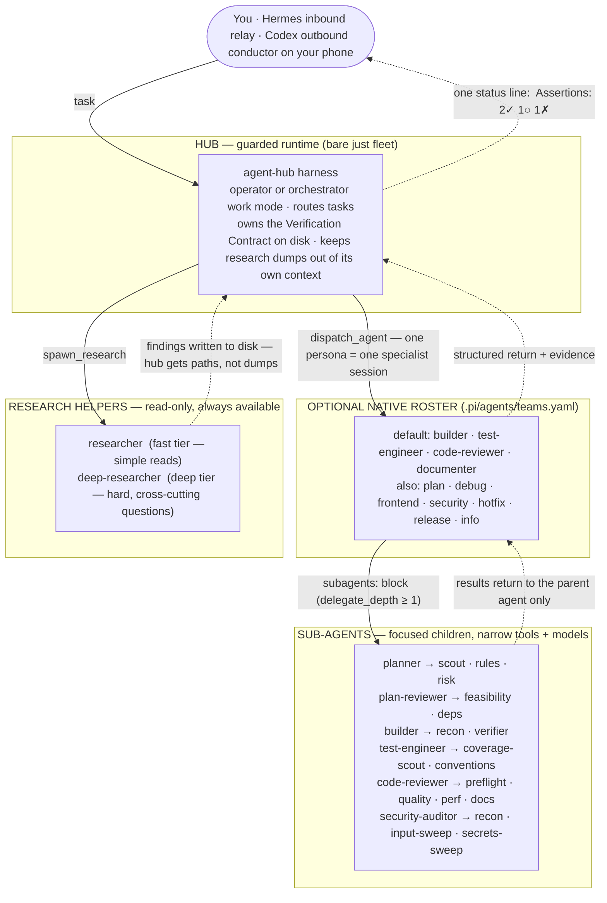
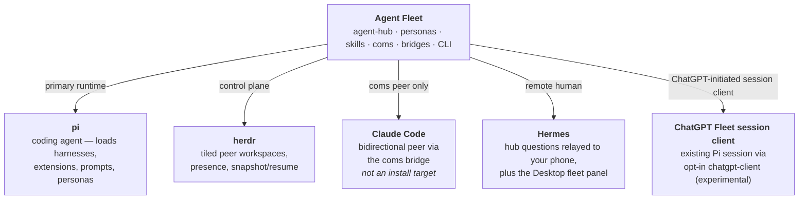

# Agent Fleet Architecture

Agent Fleet is a Pi-centered multi-agent orchestration system. This page maps
the runtime responsibilities and where each module lives in the repository.

For the principles governing future plans and design decisions, read the
[project philosophy](PHILOSOPHY.md). That document states the intended direction;
this page describes the current architecture.

## Runtime layers

| Layer | Role | Implementation |
| --- | --- | --- |
| **Pi Coding Agent** | Primary local runtime — runs the dispatcher and specialist subagents | `.pi/harnesses/`, `.pi/extensions/`, `.pi/agents/`, `.pi/prompts/` |
| **agent-hub** | Thin-context multi-agent harness: dispatcher + specialists + research helpers + Verification Contract | `.pi/harnesses/agent-hub/` |
| **Workflows** | Headless, code-owned phase order, retries, gates, writes enforcement, and acceptance through `just flow` | `.pi/agent-fleet/scripts/flow.ts`, `.pi/agent-fleet/scripts/workflows/` — see [workflows.md](workflows.md) |
| **Herdr** | Fleet/workspace control plane — spawns peer teams as tiled workspaces, presence via push events, snapshot/resume | [herdr.dev](https://herdr.dev); client in `.pi/harnesses/lib/herdr-client.ts`, layout in `.pi/agent-fleet/scripts/lib/herdr-layout.ts` |
| **coms** | Peer communication protocol/data plane — envelope-based P2P messaging between agents | Shared peer lifecycle in `.pi/harnesses/lib/coms-core.ts` and `coms-core-io.ts`; Pi registrations in `.pi/harnesses/coms/` and `agent-hub/`; wire helpers in `.pi/agent-fleet/scripts/lib/coms-envelope.ts` and `.pi/agent-fleet/scripts/coms-cli.ts` |
| **Claude Code bridge** | Makes an interactive Claude Code pane a bidirectional coms peer | `.pi/agent-fleet/scripts/coms-claude-bridge.ts`, `.pi/agent-fleet/hooks/coms-stop-hook.mjs`, `skills/peer-coms/` — see [claude-code-coms-bridge.md](claude-code-coms-bridge.md) |
| **Hermes bridge** | Remote human control — relays hub questions to Telegram, races phone vs. local answers, conductor/liaison skills | `.pi/agent-fleet/scripts/coms-hermes-bridge.ts`, `.pi/harnesses/ask-user-remote/`, `.pi/agent-fleet/hermes/skills/` — see [coms-hermes-bridge.md](coms-hermes-bridge.md) |
| **Hermes local monitor transport** | Local, authenticated monitor contract for Hub-owned task generations; consumers supply their own presentation | `.pi/harnesses/agent-hub/monitor-*.ts`, `.pi/harnesses/lib/hermes-monitor-{model,store,registry,socket}.ts` (with compatibility re-exports under `.pi/agent-fleet/scripts/lib/`) — see [Hermes artifacts](../.pi/agent-fleet/hermes/README.md#local-agent-hub-monitor-integration) and [watchdog limits](hermes-watchdog-supervisor.md) |
| **Hermes Desktop plugin** (`agent-fleet-herdr`) | Fleet observability surface — read-only panel of every live session joined from the coms registry, herdr presence, agent transcripts, and the monitor transport; `focus` and subagent `cancel` are its only write doors | `.pi/agent-fleet/hermes/desktop-plugins/agent-fleet-herdr/` (Electron pane), `.pi/agent-fleet/hermes/plugins/agent-fleet-herdr/dashboard/` (FastAPI backend), installed by `.pi/agent-fleet/scripts/install-hermes-plugin.sh` — see [hermes-desktop-plugins.md](hermes-desktop-plugins.md) |
| **ChatGPT Fleet session client** | Experimental ChatGPT-initiated client for an existing Pi session; no daemon or idle wake | `.pi/agent-fleet/scripts/fleet-codex-client.ts`, `.pi/agent-fleet/scripts/lib/fleet-codex-*`, opt-in feature `chatgpt-client` — see [codex-session-bridge.md](codex-session-bridge.md) |
| **Skill library** | Lifecycle workflows and quality gates every agent follows | `skills/` (native) + `vendor/agent-skills-upstream/skills/` (vendored) — see [UPSTREAM-SKILLS.md](UPSTREAM-SKILLS.md) |
| **Personas** | Reusable specialist definitions, installed verbatim | `agents/` in the package → `.pi/agents/personas/` in a workspace; `bin/lib/personas.js` |

## One Hub runtime, independent axes

Every public Pi launch through `just fleet` loads Fleet Core and the `agent-hub`
harness. Three independent choices shape that runtime:

| Axis | Choices | What it controls |
| --- | --- | --- |
| **Work Mode** | `operator`, `orchestrator` | Whether the main agent may use direct coding tools. Operator retains the captured `read`/`bash`/`edit`/`write` and approved extension surface; orchestrator removes direct coding tools and keeps dispatch, research, assertions, `ask_user`, and available coms/Herdr tools. `/af-work-mode` and **Alt+M** switch this axis. |
| **Native roster** | empty or one entry from `.pi/agents/teams.yaml` | Which in-process Pi specialist personas `dispatch_agent` may start. Roster changes do not change work mode in a live session. |
| **Peer topology** | current terminal, Hub-only Herdr workspace, or Hub plus a `.pi/agents/peers.yaml` preset | Which separate, addressable Pi/Claude processes occupy sibling panes. Starting or spawning peers does not change work mode or the native roster. |

Bare `just fleet` therefore means operator work mode, an empty native roster, and
the current terminal. At startup an explicit `--work-mode` wins; otherwise
`--agents <roster>` implies orchestrator; otherwise operator is used. An
orchestrator startup requires a roster. `/af-work-mode` and **Alt+M** switch
only work mode in the live session, and `/af-agents-*` changes
only the native roster. Dispatch, research, nested delegation, and Verification
Contract rigor follow the **task tier** (`trivial`/`small`/`feature`/`project`),
not a session execution mode.

All Hub-owned slash commands remain registered in both work modes. Capability packs are resolved automatically from explicit task intent, work mode, tier, pending work, and compaction state—there is no activation command. Runtime **readiness** (a coms or Herdr connection) is not model-visible capability: ready-but-unrequested peer/workspace packs remain inactive. Ambiguous fleet, peer, and workspace requests are provisionally visible but require one `ask_user` confirmation before their first side effect; a rejection removes the provisional pack. Task packs persist across follow-ups and reset only through `set_task_tier(new_task: true)`, while mandatory work mode and pending-operation leases remain.

`/af-context` is a standalone, read-only full-screen budget diagnostic; it separates stable prompt cost, volatile state, active schemas, and zero-cost inactive/loaded-excluded inputs. Provider totals and cache read/write fields are authoritative where Pi supplies them; it never fabricates provider usage or combines capacity percentages across Hub, child, and peer planes. `/af-audit` is a separate read-only session audit over existing runtime-owned records: it reports allowlisted T1 recovery categories, T2 result states, T3 protocol failures, and T8 permission correlations while keeping root, child, compaction snapshot, and repeated-record identities distinct. It never copies prompts, model text, tool payloads, environment values, or transcript content, and unavailable evidence stays explicit rather than becoming a zero count. Managed specialists and research children use explicit replacement prompts/context manifests with selected persona, policy, and skill paths instead of inherited global skills/context files. Runtime gates control whether an action can proceed: without coms, Herdr, a visible target, or an active roster, the corresponding command refuses with an actionable message rather than disappearing. `--browser` and `--all-extensions` expand the captured operator surface only when those optional extensions are installed.

T12 diagnostics have been withdrawn by user decision; there is no command, runner, or replacement entry point. Historical results and accounting remain unchanged. `diagnostic-series-budget.ts` retains the shared v2 ledger, stage/per-unit ceilings, conservative input preflight, migration refusal for ambiguous history, ownership locks, and cancellation fences used by benchmark consumers. `diagnostic-probe-extension.ts` is now a side-effect-free compatibility library exposing only provider/API output-cap mapping, its types, and the transport refusal exit constant. It preserves the reviewed 2048 cap and rejects unsupported payload semantics; it does not register an extension or tool. Existing sessions must be reloaded after updating. The installer retires unchanged managed command/runner files; user-modified obsolete files are preserved and reported for manual review, never deleted automatically. Such retained files are not imported by the current Hub.

### Context pressure and recovery

Standing prompt ceilings constrain the repeatable replacement prompt and active schemas; they do not
bound conversation messages or results accumulated inside a long tool loop. The Hub therefore has a
second, runtime pressure guard. It samples provider usage, projects a finalized tool result at
`message_end`, warns and exposes transient compaction support at **80%**, then at **90%** aborts the
pre-model continuation and waits for `agent_settled` before requesting one Pi compaction. This
ordering ensures the result is persisted before summarization and prevents an ordinary provider call
from escaping between pressure detection and recovery.

Recovery is single-flight. High-context startup or concurrent input is retained in memory and
replayed exactly once after success; failure retains it for `/compact` or a larger-context model.
`/af-context` and the status line report phase, usage, thresholds, episode, and last outcome. Session
entries store only numeric/enumerated pressure metadata, never prompts, tool payloads, credentials,
error bodies, or summaries.

A persisted native roster is also metadata, not copied configuration: only its team name is stored
and it is re-resolved against current teams and persona definitions. A stale or absent roster in a
resumed orchestrator session fails closed—work mode remains orchestrator, direct tools remain removed,
and model input is blocked until `/af-agents-team`, an explicit `--agent-team <name>` restart, or an
explicit operator selection resolves it. Explicit CLI work mode and roster selections retain
precedence.

Pi's session JSONL is the authoritative append-only record for rebuilding a session, including
compaction and Hub metadata. Pressure and roster recovery operate through Pi/Hub lifecycle APIs;
they never rewrite prior entries. Operators must not edit, truncate, reorder, or synthesize JSONL to
recover a session.

The project selected by `--project <name>` is the coms namespace for the Hub
and every standing or dynamically spawned peer. The Hub-facing peer spawn API
cannot override it. Native subagents remain children of that Hub and inherit
its repository context; peers are separate processes in their own panes.

At dispatch time, `backend: "auto"` applies
`.pi/agents/dispatch-policy.yaml`; `backend: "native"` bypasses same-name peer
substitution; and `backend: "coms"` requires a visible same-name peer and never
falls back to a native child. `.pi/agents/peers.yaml` owns how a peer runs
(`runner`, persona, model, extensions, and declared `env_file`), not whether a
dispatch uses it.

## Fleet hierarchy

Agent Fleet is layered on purpose. Work flows **down** (delegate); evidence and status flow **up** — as compact structured returns, never raw dumps.



Every specialist session is one persona from [`agents/`](../agents/) (installed to `.pi/agents/personas/`) — *skills* tell each agent **how** to work; *personas* define **who** they are (see [agents.md](agents.md)).

The same idea as a tree:

```text
hub (operator by default; orchestrator when selected)
├── optional native roster (empty by default; example: default)
│   ├── builder            → recon · verifier
│   ├── test-engineer      → coverage-scout · conventions
│   ├── code-reviewer      → preflight · quality · perf · docs
│   └── documenter
├── research helpers (spawn_research, any time)
│   ├── researcher
│   └── deep-researcher
└── optional fleet peers (herdr + coms)
    ├── architect / releaser / web-debugger panes
    ├── Claude Code peer (coms bridge)
    ├── Hermes (phone human · inbound ask_user)
    └── ChatGPT Fleet session client (Desktop/Android · existing Pi session)
```

Composition rule: **the hub (or a slash command) orchestrates; personas do not invoke other personas as peers.** Specialists may only fan out to their configured **sub-agents**. Research helpers write findings to disk; the hub resumes specialists with paths, not raw dumps.

### Research search supervision

The shared `spawnPiAgent` seam supervises every `read`/`grep`/`find`/`ls` call from native
research helpers and nested delegate children. The supervisor tracks JSONL `toolCallId` values
independently, with a default 120-second deadline (`recon-search-timeout-s: 1..3600|off` under
`## agent-hub`). It is a per-tool watchdog; the whole-run bound is separate — the task-tier
per-run deadline (`agent-turn-timeout-s`), which terminates a hung run as `turn_timeout`.
On timeout or caller cancellation it owns and terminates the child's process group (SIGTERM,
then SIGKILL after a bounded grace), has a separate settlement timer for missing `close`/pipe
drain, and reports timeout separately from cancellation. Research helpers and nested delegates
are each given safe process-group ownership; delegates forward parent termination so no detached
child is orphaned. Full pattern catalog: [references/orchestration-patterns.md](../references/orchestration-patterns.md).

### Task-tier budgets

The hub enforces per-user-turn budgets in code (`run-budget.js`): the current **task tier**
caps `dispatch_agent` calls, `spawn_research` calls, and active time per turn, sets the
per-run deadline above, and controls nested delegation (`off` at trivial/small). Exhausted
budgets make the dispatch tools refuse and request one Yes/No `ask_user` confirmation; Yes
renews the turn in the same tool loop. A normal new user message also opens a fresh turn
window.
Specialist context pressure is measured over input + cacheRead + cacheWrite against **that
agent's own** model window, resolved from pi's model registry with the source recorded
(`context-window.js`) — measuring a 49k local model against the dispatcher's window is what
made readings like "315%" unactionable; anything over 100% now emits a one-time diagnostic
naming the window and where it came from. Specialist sessions are recycled (fresh spawn
instead of `-c` resume) after `session-recycle-runs` runs, at ≥60% measured context, and
unconditionally at a full window; a resumed session whose *projected* prompt would overflow
is recycled before the spawn rather than after the run. Requests to one provider are capped
per process (`provider-semaphore.js`: 2 in flight for `custom/*` by default, unlimited
elsewhere, `AGENT_HUB_PROVIDER_LIMITS` to override) — the cap is per level of the delegation
tree, and a nested spawn reuses its parent's permit so it can never wait on its own ancestor.
Configured under `## agent-hub` (`max-dispatches-per-turn`,
`max-research-per-turn`, `turn-wall-time-s`, `agent-turn-timeout-s`, `session-recycle-runs`,
`run-history-keep`) as ceilings (`min` with the tier). A leftover `mode:` key is ignored with
a warning.

A per-message allowance cannot bound a task, so a second envelope sits above the turn one:
the **task budget** (`run-budget.js`, `3×` the turn envelope) counts dispatches, research
runs and **active** time across the WHOLE task and is *not* reset by a user message. Both turn
and task active time exclude `ask_user` waits — billing human idle false-stops a normal steered
session and teaches people to reset reflexively. The auto-research pipe is exempt from the turn
budget but charged against the task envelope, so it cannot smuggle 8 helpers per dispatch past
the outer bound.

Either envelope stops before another dispatch/research call and asks one localized Yes/No
`ask_user` question. A confirmed turn continuation renews its counters/clock in the same tool
loop. A confirmed task continuation opens one audited tranche, also renews the turn, and
preserves task tier, assertions, capability packs, label, blockers, and progress. No typed
`continue` message or slash command is required. `set_task_tier` with `new_task: true` is only
for genuinely different work and clears task identity/state. This is the guardrail the
post-mortem run never hit: every steering message reopened the turn window,
so one workspace stayed open 47 hours on a change that took 13 minutes in a narrow one.

### Runtime acceptance and recovery

Writable specialist operations (`write`, `edit`, or `bash`) receive the same T2 minimal
acceptance contract at every task tier. The trigger is the actual operation/tool contract and
current assertion ledger, not user-language matching or the model's tier label. Read-only
operations remain lightweight. Language heuristics only expose the fuller verification pack;
they are supplementary and do not decide whether changed work needs evidence. Pending
capability leases survive a new-task transition, while stale task packs and assertion state
reset through the explicit lifecycle path.

The runtime-owned result schema is `agent-fleet.runtime-result/v1`. It records orthogonal
`execution` (`completed | failed | pending`), `changes` (`changed | unchanged | unknown`, with
`certain | uncertain | not_observed` attribution), `verification`
(`passed | failed | missing | stale | unsupported`), and `acceptance`
(`accepted | not_accepted`) dimensions, bound to task identity, before/after revision, command,
integer exit status, and evidence references. A changed result and failed verification can
therefore both be true. Compatibility presentation remains
`not_available | deliverable_failed | needs_verification | accepted` for the Hub and
`accepted | rejected` for flows.

Only native Pi children support trusted runtime checks. The Hub injects the code-owned
`runtime-test-check.ts` observer only when the native persona has `bash`; the observer wraps the
existing bash implementation and preserves the normal damage-control `tool_call` approval and
bash error-event semantics. The parent accepts a check only when producer schema, observed bash
start, exact declared command, task, coverage metadata, exit status, and unchanged inspected
revision agree. This proves exact command execution, not semantic adequacy: even a declared
`true` command can pass, so test quality remains subject to independent or human review.
Coms peers cannot produce trusted checks, and `manual`/`runtime-ui` requirements currently have
no trusted producer; all three paths fail closed as missing or unsupported.

The observer and trusted event-correlation path have an observed compatibility dependency on
`@earendil-works/pi-coding-agent@0.84.2`: they rely on its `createBashToolDefinition`, `tool_result`
hook, `args.path`, and JSON-event passthrough contracts. This records the currently verified API
surface rather than changing or independently pinning the package version; Pi upgrades must
re-verify these integration points.

Native runs also retain a bounded record of actual tool starts/ends by tool-call identity. T3
uses those code-owned events only to correlate a terminal, unfenced pseudo-write claim with the
readback of an explicitly declared deliverable. It never executes tool-shaped text. Fenced
XML/JSON documentation examples are excluded; a real matching write event with failed readback
remains a T2 verification/effect failure rather than being relabelled as a protocol failure.

A mismatch emits `agent-fleet.tool-protocol-diagnostic/v1` with category
`tool_protocol_error`, task-or-controlled-probe origin, effective backend/model/tool
configuration, the claimed effect, matching-event and deliverable facts, `none | partial`
effects, this-run-only conclusion, and evidence references. The T2 runtime-result dimensions
remain unchanged and orthogonal. For a real task, the retained diagnostic artifact is the only
input accepted by the task-generation-bound `establishEffects` recovery port; it records what
already happened so unchanged retries cannot replay partial effects. It does not authorize a
retry by itself and does not turn a task failure into a probe result or a universal model
judgment. The withdrawn T12 runner is not part of this path; historical evidence remains archived.

T5's opt-in `filesystem` tool performs deterministic inventory, byte excerpts, artifact readback, and
local-file-only source snapshots without another model run. It is registered in the Hub and native
children but appears in their effective tool surface only while the inherited complete profile has
`assist.deterministic-tools: true`; stale or forged calls are refused at execution too. Profile and
work-mode changes rebuild the truthful T4 catalog, and compaction reconciles that effective surface.
Orchestrator mode may use this narrow inspection/managed-snapshot exception, but still has no generic
bash, edit, or write tools. Native specialist, research, and nested-delegate explicit tool caps remain
authoritative: the assist flag cannot append `filesystem` outside a declared cap.
Opaque handles bind canonical paths,
content hashes/fingerprints, and offsets; continuation fails on stale bytes or directory state,
and canonical-root checks reject symlink escape. Snapshot bytes and provenance metadata are
stored separately under the owning current session, marked untrusted, and never interpreted as analysis
or fetched from a network origin. Snapshot destinations are runtime-owned and cannot be supplied by the
caller; this narrow artifact creation path grants no general write or shell authority. Every source
path—including the path resolved from a readback handle—passes through the existing damage-control
`zeroAccessPaths` hook before execution, preserving its exemptions and interactive/headless approval
semantics; a denial occurs before source bytes or snapshot artifacts are created. Handle decoding is
single-sourced in `.pi/harnesses/lib/deterministic-handle-path.ts`, so damage-control retains this guard
when installed with its declared shared-library companion but without agent-hub. Inventory names and
all other operation results are marked untrusted. Because snapshot has a managed artifact side effect,
`filesystem` is not classified as replay-safe for automatic mid-run model fallback.
`assist.deterministic-tools` and `assist.bounded-output` are independent. Enabling
`bounded-output` alone bounds read-only tool results inside native specialists, research helpers,
and nested delegates before the next model continuation, and bounds parent reply transport too;
`deterministic-tools` controls the deterministic filesystem assistance without being a prerequisite
for output bounds. The fixed bounds are 500 inventory entries per page, 64 KiB per content/reply,
and 180 Unicode characters per preview; truncation always names a retained full-output path and
retrieval handle. With `bounded-output` off, legacy transport is preserved regardless of the
`deterministic-tools` setting. Inventory records an escaping or unavailable symlink as a denied
entry without traversing it or disclosing its target outside the authorized inventory.
T5 does not consume `assist.write-isolation`; the separate T6c native launch boundary does.

Recovery remains the single T1 contract: no automatic retry, queue, model fallback, or new
numeric allowance. Busy work is refused before execution accounting or history mutation and is
not recorded as no-progress failure; indeterminate failures do not authorize retry. Operator
cancellation fences the same agent identity until a fresh, one-use authorization is consumed.
Other agent identities—including the anonymous, read-only research actor—remain independent,
and a task reset does not erase the cancellation fence. Native session reuse is bound to an exact,
normalized current-task contract (task identity, instructions, scope, deliverables, input artifacts,
effective model, and permissions). A different/narrower task starts with a fresh session and
replacement manifest; only an exact continuation, including the auto-research continuation path,
receives Pi resume transport. This remains context hygiene rather than confinement.

When `assist.write-isolation` is explicitly true, dispatch snapshots that effective setting before
routing and forces a native child. Explicit coms is refused because remote isolation cannot be
claimed. The complete Pi process and descendants run under Linux bubblewrap or macOS Seatbelt;
the repository/root view is read-only except for existing exact relative files, expressly allowed
existing recursive directories, and separate current-run runtime/artifact/temp roots. Glob scope,
absolute/escaping scope, symlinked grants, an empty writable grant set, absent or wrong-platform
backends, and sandbox launch failure all fail closed without an unsandboxed retry. Damage-control remains the policy/audit/
approval overlay, but an approval cannot widen the OS boundary already created for a run; a wider
path requires a new explicitly authorized dispatch contract. Network, model, and read access are
otherwise unchanged. Turning the profile flag off does not dismantle an
active process boundary; the next run takes a new snapshot. Opt-out retains the legacy spawn path.
The sandbox never rolls back or deletes user edits, and it cannot protect an allowlisted file from
a concurrent writer. Exact-file grants support direct writes to the existing inode but intentionally
block temp-file-plus-rename atomic saves; callers must explicitly grant the containing directory for
that behavior, and the runtime never widens the grant automatically. Sandboxed spawn uses exactly
three pipe stdio entries and rejects extra inherited descriptors, closing the known writable-FD
bypass. Linux deliberately preserves the Hub-owned process group instead of adding a PID namespace,
and `/dev/tty` remains narrowly available; confinement therefore assumes host ptrace and terminal
injection controls prevent same-uid cross-process escape (for example Linux Yama ptrace restrictions
and disabled legacy TIOCSTI). Linux enforcement is exercised on a real bubblewrap host. Seatbelt
canonicalizes only trusted runtime/artifact/temp aliases such as `/tmp` → `/private/tmp`, while user
scope grants retain strict symlink rejection; its only device write exceptions are literal
`/dev/null` and `/dev/tty`, never a blanket `/dev` grant. The Seatbelt profile has contract coverage
but still requires a Darwin runtime check before T6c is fully verified.

T4 adds a code-owned effective-tool catalog without creating another recovery policy. Every
application of work-mode tools compares the actual active catalog before and after
`setActiveTools` and can emit `agent-fleet.tool-catalog-delta/v1`: removed, added/available,
active substitutes with explicit limitations, `permissionExpansion: false`, and SHA-256 catalog
identities. The delta is persisted as a trusted session entry and included in the next system
prompt. Orchestrator mode still excludes direct `write`, `edit`, and `bash`; a substitute is only
an already-active path such as `dispatch_agent` or read-only inspection, and is never invoked by
the catalog machinery.

The runtime latches the effective catalog at `before_agent_start`. Actual assistant tool-call
blocks are compared to that originating-turn catalog on the real `message_end` path, so a
next-turn mode switch cannot charge an unknown-tool refusal for a call that was legal when the
turn began; text blocks are ignored and no pseudo-tool text is executed. On `session_compact`,
the runtime reconciles the restored `agent-fleet.tool-catalog-state/v1` identity with Pi's current
active tools, persists restore evidence, and retains the task-scoped unknown-tool counter. Catalog
errors are recorded fail-closed but cannot skip the existing compaction settlement/deferred-input
lifecycle.

Each unavailable tool refusal is keyed by normalized task and tool, while normalized arguments
and catalog identity record whether the request or availability was reevaluated. The
operator-approved limit is exactly three counted refusals, including the first. Mode switches,
compaction, prose, and real catalog changes never refill it; only the explicit new-task lifecycle
resets it. A real `unknown_tool` dispatch failure is stamped by the Hub with the latched,
code-owned catalog identity; a result-supplied identity is ignored. A later successfully persisted
effective-catalog event can establish `toolStateChanged` evidence for the existing T1
`unknown_tool` `recoveryDecision`, but still requires explicit reinvocation and existing general
budgets; it never schedules an automatic retry.

On top of the tier envelope sit several qualitative guardrails. **Task triage**: the dispatcher
classifies the current TASK via the `set_task_tier` tool (`trivial`/`small`/`feature`/`project`)
and that classification *is* the budget. The tier is task-scoped and **ratcheted** — it survives
the user's next message, lowering is free, raising needs a stated `reason` — because a
turn-scoped tier reset to `feature` on every correction. Three refusals enforce
proportionality in code rather than prose: a duplicate-dispatch guard (near-identical
re-dispatches within a turn), a **tier persona gate** (`planner`, `plan-reviewer`,
`architect`, `security-auditor`, `deep-researcher` are refused at trivial/small — each opens
a document/finding loop), and a **review round cap** (review dispatches per task, by tier).
Skipping triage assumes `small`, not `feature`: the tier latches for the task, and the case
where it was never declared is exactly the case where proportionality was not being
considered. The review **finding** budget is the one thing deliberately left advisory — the
hub counts blocking findings (`review-findings.js`) and reports an over-budget return, but
never reclassifies one, because no rule it can evaluate separates an invented manifest from
a leaked credential; the round cap is what carries the enforcement.
**Process obligations (T11)** are task-scoped and independent of that budget tier. The
`set_task_tier` tool accepts explicit `risk` (`unknown | low | high`) and process `scope`
(`read-only | small | wide`); neither is inferred from task prose. Legacy/omitted risk is
`unknown`, risk changes require a reason, and scope expansion requires a reason plus an
explicit risk reassessment. Unknown permits read-only research but cannot accept changed
work. Confirmed low-risk small work uses the existing T2 minimal acceptance path; high risk
adds a separate review stage, while wide work adds plan and review stages. These obligations
ratchet within a task, so lowering spend cannot erase them. Completed stage records name an
artifact and revision but only prove that the stage occurred—not that model-authored review
is semantically adequate.

The same code-owned state is consumed by dispatch acceptance in operator and orchestrator
modes, appended as `agent-hub-process-state`, restored from the session log, and retained
through compaction and mode changes. Only `set_task_tier(new_task: true)` creates fresh
unknown-risk process state. `/af-audit` exports allowlisted satisfied/open/unsupported
obligation statuses and explains that the budget tier limits spend rather than correctness;
reasons and task prose are not copied. This extends the existing task/acceptance/audit paths
and is not a second workflow engine.

**Docs lane** (`docs-lane.js`): a dispatch whose whole declared `scope` is documentation
refuses review personas (overridable with `review_reason`) and tells the dispatcher not to
open a review gate; an absent scope is never the lighter lane. **External-blocker stop**
(`external-blocker.js`): a specialist emits `EXTERNAL_BLOCKED: …` when it needs something
outside the fleet's reach (account, permission, credential, telemetry destination), and the
hub refuses the next dispatch with an owner-escalation packet until the human is addressed —
the alternative, observed, is hours spent approximating the missing fact with scripts,
manifests and fixtures while the assertion still ends UNPROVEN. **Drift watchdog**
(`drift-watchdog.js`): armed dispatches are
observed in-flight from the JSON event stream — deterministic rules (out-of-scope writes
against the declared `scope` globs, tool-call loops, consecutive failures, tool-call cap)
escalate to a one-shot cheap LLM judge whose DRIFTING/STUCK verdict terminates the run as
`drift_stop` (exit 125, partial output preserved); enabled per hub/agent/dispatch
(`watchdog` key, `/af-watchdog`, `watchdog` param). Orchestrator work mode auto-arms the
watchdog when the hub setting is `auto`/`on`; a dispatch `watchdog: false` cannot disarm it
there. Hub or per-agent `off` remains the opt-out. Two rules about scope: the session's
own `artifacts/`, `findings/`, and `delegations/` subtrees are implicitly in scope (the
deliverable protocol *orders* specialists to write there, and the judge is told so), and the
`scope` rule is non-terminal — it reports a drift advisory on the result and never stops a
run by itself, matching the post-run scope gate, which reverts nothing. **Dynamic teams**: `/af-agents-add`,
`/af-agents-drop`, `/af-agents-save` restructure the roster live (the system prompt rebuilds
every turn), and the gated `team_adjust` tool lets the dispatcher itself adjust the roster
when nested delegation is on (feature/project), with user notification. `/af-hub-report` accounts each turn's dispatches,
tokens (billed = input + cacheRead + cacheWrite), recycles, drift stops, and refusals.

## Runtime stack (tools the fleet sits on)



### External dependencies

These are the external systems Agent Fleet assumes or integrates with — not npm packages, but the **runtime stack** the fleet operates on top of.

| Dependency | Role | Required? |
| --- | --- | --- |
| **[pi](https://github.com/badlogic/pi-mono)** (or your pi install) | Primary coding-agent runtime; loads harnesses, extensions, prompts, and personas | Yes for `just fleet` |
| **[herdr](https://herdr.dev)** | Workspace control plane: Hub/peer panes, presence push events, team snapshot/resume | Required for `--herdr` or `--peers`; optional for bare `just fleet` |
| **[Claude Code](https://docs.anthropic.com/en/docs/claude-code)** | First-class coms peer via the [coms bridge](claude-code-coms-bridge.md) — cross-model review and analysis. Never an install target: it hosts no skills, commands, or personas | Optional peer |
| **Hermes** | Remote human-in-the-loop (Telegram relay for hub questions — [coms-hermes-bridge](coms-hermes-bridge.md)) and the Desktop fleet panel ([hermes-desktop-plugins](hermes-desktop-plugins.md), needs v0.19.0+ and the Desktop app) | Optional |
| **ChatGPT Desktop/Android** | Experimental opt-in Fleet session client for an existing Pi session; Node 22.18+, Python 3.10+, local herdr/coms access — [runbook](codex-session-bridge.md) | Optional experimental feature `chatgpt-client` |
| **[addyosmani/agent-skills](https://github.com/addyosmani/agent-skills)** | Upstream skill library (manually vendored) | Bundled (vendored) |
| **[disler/pi-vs-claude-code](https://github.com/disler/pi-vs-claude-code)** | Source inspiration / MIT port origin for pi harnesses | Design lineage (ported in-repo) |
| **LLM providers** | Models per persona (`model:` / `models:` in agent frontmatter) — e.g. OpenAI Codex, GitHub Copilot, Ollama, … | Yes (at least one provider your agents can call) |
| **Chrome DevTools MCP** / **Playwright Agent CLI** | Browser verify (`browser-testing-with-devtools`) and headless automation (`bowser`) | Optional, feature-specific |
| **Node.js + npm** | CLI (`npx @chankov/agent-fleet`), package install, `just` recipes | Yes for install & tooling |

The existing `agent-fleet doctor` command also performs a read-only manifest preflight. It reports exact selected installation files and manifest-declared tool probes as environment readiness, distinguishes missing installation from unknown or unavailable platforms, and names the existing explicit remediation path. Bare doctor never repairs or installs; `doctor --fix` remains the only repair activation, and package/tool installation remains behind its existing explicit consent path.

## Repository module map

### Agent Hub composition

`.pi/harnesses/agent-hub/index.ts` owns mutable Hub state and composes the extracted concerns without merging their context contracts:

```text
agent-hub/
├── index.ts                  # bounded composition root; constructs root-owned mutable ports
├── types.ts                  # shared Hub agent/state contracts
├── config/                   # agent/frontmatter, teams, profiles, dispatch policy, overrides
├── context/                  # state, budgets, assertions/artifacts, session-health factories
├── commands/                 # 21 typed /af-* command registrars
├── tools/                    # 16 tools plus dispatch/research execution orchestration
├── dispatch-core.ts          # facade over native, coms, and observability dispatch
├── dispatch-*.ts             # native preparation/spawn/completion and backend adapters
├── acceptance.ts             # agent-fleet.runtime-result/v1 and minimal acceptance evaluation
├── runtime-test-check.ts     # code-owned native bash observer for trusted runtime checks
├── tool-protocol.ts          # T3 event/readback correlation and shared diagnostic schema
├── recovery-contract.ts      # shared typed failure/recovery policy
├── policy/                   # model, roster, capability, and work-mode decisions
├── research/                 # helper runtime, spawn transitions, and controls
├── ui/                       # grid, dashboard, detail, context, pool, zoom, and history
├── input/                    # shortcuts and completion derivation
├── lifecycle/                # turn, pressure, monitor, session, and shutdown orchestration
├── prompts/                  # data-oriented system/session templates + HubPromptContext
├── session-start.ts          # typed ordered session_start step runner
├── presentation.ts           # marker, name, thinking, and delegate-path helpers
├── timeline.ts               # bounded transcript/timeline append helpers
├── monitor-*.ts              # local monitor transport and recovery primitives
└── *.test.{ts,js}            # registration, loader, parity, and behavior contracts
```

Cross-harness coms lifecycle remains shared in `.pi/harnesses/lib/coms-core.ts` and `coms-core-io.ts`; it is not owned by the Hub composition root.

```text
.pi/                          # Pi runtime: harnesses, extensions, agents config, prompts
.pi/agent-fleet/              # The fleet runtime, mirrored verbatim into a workspace:
  scripts/                    #   CLI helpers, bridges, team + one-off peer launchers (pure logic in scripts/lib/)
  scripts/workflows/          #   deterministic flow graphs + phase/gate/permission/quality runtime
  hermes/                     #   Hermes-facing skills/integration assets
  hooks/                      #   the coms bridge Stop hook
  docs/                       #   the one doc that installs into a workspace (workflows.md)
skills/                       # Agent Fleet-native skills (shadow vendored names)
agents/                       # Personas/subagents; installed to a workspace's .pi/agents/personas/
codex/                        # Canonical Codex conductor contract (runtime copy lives outside checkout)
systemd/user/                 # Owned user-unit template for Codex remote control
vendor/agent-skills-upstream/ # Manually imported upstream skills (pinned SHA)
bin/                          # npm CLI: init/update/doctor + the installer engine
references/                   # Supplementary checklists, installed with the skills that cite them
docs/                         # This file, setup guides, bridge references, vendoring policy
```

The fleet runtime keeps its *source* layout identical to its *installed* layout.
That is not cosmetic: `companion:harness-runtime-closure` and its siblings copy
with `preserveLayout`, so a relative import written here resolves the same way in
a workspace — including the ones reaching from the stationary `.pi/harnesses/`
into the movable `.pi/agent-fleet/scripts/`. `bin/test/path-boundaries.test.js`
holds that invariant.

Reserved for future modules (do not repurpose these paths):

```text
apps/dashboard/               # future dashboard: Kanban state, Herdr workspaces, peer status
packages/fleet-core/          # future extracted core orchestration library
packages/herdr-bridge/        # future Herdr integration package
packages/hermes-bridge/       # future Hermes integration package
```

## Design rules

- **Workflow engine remains single-sourced.** `just flow` owns deterministic phase order, retries, executable gates, post-hoc writes enforcement, and one flow acceptance decision. It uses the clean spawn/context seams and keeps its existing clean-tree/branch defaults; normal traces live under `.pi/flow-sessions/`. Flow branches retain source/result metadata, while reserved `cleanup` and `merge` delegate safe removal and squash integration to Worktrunk. The initial Hub `run_flow` adapter calls the same exported dispatcher directly and permits only read-only `scout`: it runs in a stable detached snapshot with no flow branch, stores trace/manifest in the current Hub session, and has one Hub budget/cancellation owner. Snapshot overlay operations validate plain parents before mutation and never follow a HEAD symlink leaf. The native process and descendants use `confineNativeChild`, with only the session-owned phase directory writable; the actual `read`/`grep`/`find`/`ls` data paths are separately limited to the snapshot while damage-control remains loaded. Runtime/model libraries and provider configuration remain readable for Pi startup, so this is intentionally not a global no-read claim. Duplicate identity is idempotent; stale/busy calls are uncharged. All setup/result exceptions settle as structured failures, release active ownership, and preserve honest charged/started state. Flow acceptance never promotes parent assertions or closes T11 obligations. Writable/committing flows remain outside this adapter pending a separate review.
- **Thin dispatcher context.** Nothing lands persistently in the dispatcher's
  context if it can live on disk or in a one-line status. Research findings,
  the Verification Contract ledger, and team snapshots are all disk-first.
- **A harness fault must never look like a specialist fault.** The hub passes
  `--session <file>` on every run, so one corrupt session file used to fail a
  persona in ~1s with no output — indistinguishable from a bad agent, and
  unrecoverable by drop + re-add. Unusable session files are now validated and
  quarantined (`session-health.js`) with the reset named in the result. Same rule
  for the return contract: a report the parser cannot read gets one cheap
  read-only extraction pass (`return-extract.js`) before its assertions are
  written off as unproven, and extracted evidence is always labelled as weaker
  than declared evidence. The converse also holds: a run that errored or timed
  out writes to `artifacts/failures/`, never `returns/` — an error stub filed
  as a return reads as a specialist verdict and gets acted on as one.
- **A pool status field beats reading the screen.** `coms_list` publishes each
  peer's `pane_id` and `status` (`idle`/`working`/`booting`), and
  `herdr_spawn_peer` waits for the peer to register and returns `peer_ready`
  rather than a bare pane id. A spawned peer boots idle and does nothing until
  addressed, so peers spawned and never sent to are named at turn end and in
  `/af-hub-report` (`spawned-peers.js`); closing stays the human's call.
- **A declared requirement carries its origin.** Every assertion in the ledger
  names its source (`assertion-ledger.js`), and the open ledger is soft-capped
  at 8 — an id nobody can trace back to a plan line costs a dispatch and an
  ASK_USER cycle to re-derive.
- **Pre-flight validation is free.** Anything the hub can reject before spawning
  — an unresolvable artifact path, an unknown research persona, a heavy persona
  at a low tier, a reviewer on a docs-only scope — is refused without spending a
  budget slot. Artifact paths also resolve across artifact kinds when the name is
  unique, since the hub writes every auto-return under `returns/` while
  dispatchers reasonably guess `reviews/`.
- **Evidence is archived, never overwritten.** Session start moves the previous
  session's `artifacts/` into an immutable `.pi/agent-sessions/runs/<runId>/`
  namespace with a read-only `meta.json` and an appended `runs/index.json`
  (`run-namespace.js`), retained per `run-history-keep` (default 10). The old
  behaviour — delete `artifacts/` at start, name returns by a per-session counter
  — collided two ways at once and made a post-mortem record eleven specialist
  returns and two reviews as NOT RECOVERABLE. A failed archive leaves the
  artifacts in place: a stale tree is recoverable, a deleted one is not.
- **Herdr owns panes, presence, and lifecycle; coms owns messages.** Herdr
  topology recipes (`--herdr` or `--peers`) require a running server and refuse
  with an actionable message otherwise. Bare Fleet does not require Herdr.
  `--no-coms` leaves direct/native execution available but disables peer
  messaging, peer-backed dispatch, and handoff from the Hub.
- **External agents are peers, not plugins.** Claude Code (and future CLI
  agents) join the fleet through bridge adaptors that speak coms envelopes —
  the fleet core stays agent-agnostic. Hermes remains the inbound `ask_user`/
  Telegram route; the experimental Codex conductor is outbound-initiated only,
  approval-gated, and restricted to listed peers through the validated wrapper.
- **Hermes monitor presentation is outside the fleet core.** Agent Fleet exposes owner-only
  local monitor operations for Hub-owned state; a consumer owns its UI and lifecycle. The
  worktree contains additive monitor/event/invoke code, but that implementation and its local
  tests are not proof of a durable external identity or live delivery contract. `invoke`, where
  available, is Hub-owned and queues dispatcher work rather than exposing tools directly.
- **Packaged Hermes source is opt-in, never auto-installed.** The npm tarball carries the
  `hub-watchdog` skill (`.pi/agent-fleet/hermes/skills/`) plus the backend and Desktop monitor plugin source
  (`.pi/agent-fleet/hermes/plugins/`, `.pi/agent-fleet/hermes/desktop-plugins/`) as runtime-only source. Shipping that source
  makes it available to an operator; installing it into a Hermes profile is always an explicit
  action through `agent-fleet set-hermes-watchdog` (skill) or the consumer's own flow (plugins).
  Nothing is enabled, launched, or configured by installing the package.
- **Watchdog delivery is capability-gated and currently unproven.** No checked-in
  Gate O live artifact proves Hermes origin identity, updates, reconnect, or two-chat isolation,
  so its supported posture is journal-only/dormant: no delivery, steering, or surgical use. It
  never manages services, gateways, Herdr, or shell commands. Local runtime evidence — including
  a real foreground watcher against a disposable Hub UDS — is `synthetic-local` and proves none of
  those capabilities; see [the watchdog runbook](hermes-watchdog-supervisor.md).
- **External conductor contracts are advisory.** Pi damage-control wraps Pi
  tool calls, not Hermes or Codex processes; human approvals and their
  contracts reduce risk but do not provide an OS command allowlist.
- **Destructive fleet verbs are damage-control-guarded.** Specialists cannot
  spawn/close herdr panes; the human confirms destructive actions.
- **Native-over-vendored skills.** The skill catalogue resolves `skills/`
  first, then the vendored upstream import; upstream updates are explicit
  maintainer actions ([UPSTREAM-SKILLS.md](UPSTREAM-SKILLS.md)).

## History

Agent Fleet began as a fork of `addyosmani/agent-skills` and was split into a
standalone repository in July 2026, with upstream demoted to vendored content.
The one-time migration record, including the history-filtering commands, lives
in [MIGRATION-agent-fleet.md](MIGRATION-agent-fleet.md). The product
requirements that drove the split were a one-off planning document and are no
longer maintained.
