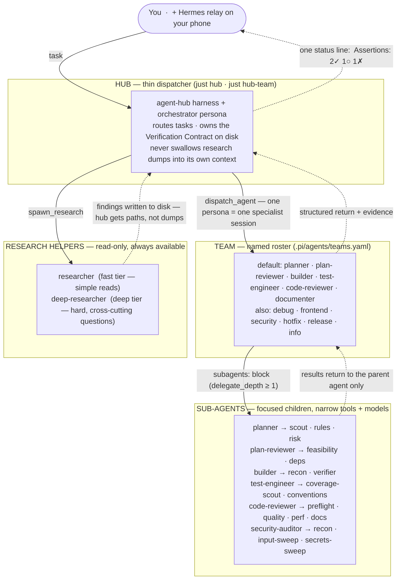
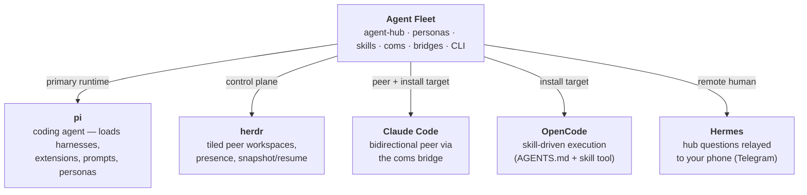
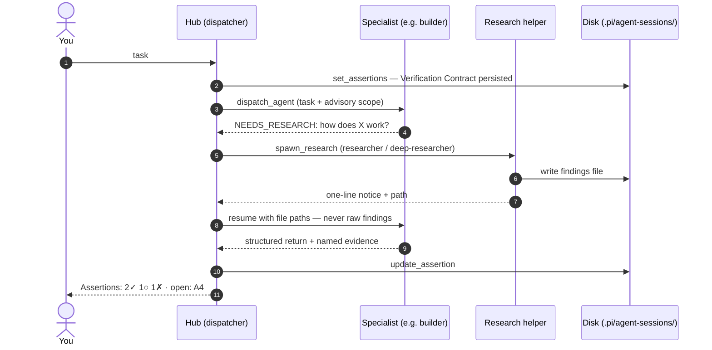

# Agent Fleet

[](https://www.npmjs.com/package/@chankov/agent-fleet)
[](LICENSE)
[](#quick-start)

**Operate a coding-agent *fleet* — not just one chat session.**

Agent Fleet is a **Pi-centered multi-agent orchestration system**. Its main job is to turn a single coding agent into a managed team: a thin dispatcher routes work to specialist agents, those agents can fan out to focused sub-agents, peer sessions talk over a shared messaging plane, and whole teams can be spawned, snapshot, and resumed as tiled workspaces.

```text
  You  ──▶  Hub (dispatcher)  ──▶  Team agents  ──▶  Sub-agents
                │                      │
                ├── herdr (workspace)  ├── skills (how to work)
                ├── coms (messages)    └── Verification Contract
                └── Hermes (phone)
```

**What you get:**

| Layer | Job |
| --- | --- |
| **[agent-hub](#agent-hub-a-multi-agent-harness-for-pi)** | Thin-context dispatcher on **pi** — drives specialists under a Verification Contract |
| **[herdr](https://herdr.dev)** | Fleet control plane — tiled peer workspaces, presence, snapshot/resume |
| **coms** | Peer data plane — bidirectional messaging between agents (including Claude Code panes) |
| **Hermes** | Remote human control — relay hub questions to your phone |
| **Skills + personas** | Lifecycle discipline — how to spec, plan, build, verify, review, and ship |

Supported coding agents: **pi** (primary runtime), **Claude Code**, and **OpenCode**.

```
  DEFINE          PLAN           BUILD          VERIFY         REVIEW          SHIP
 ┌──────┐      ┌──────┐      ┌──────┐      ┌──────┐      ┌──────┐      ┌──────┐
 │ Idea │ ───▶ │ Spec │ ───▶ │ Code │ ───▶ │ Test │ ───▶ │  QA  │ ───▶ │  Go  │
 │Refine│      │  PRD │      │ Impl │      │Debug │      │ Gate │      │ Live │
 └──────┘      └──────┘      └──────┘      └──────┘      └──────┘      └──────┘
  /spec          /plan          /build        /test         /review       /ship
```

<details>
<summary><b>Table of contents</b></summary>

- [Origins: from skill library to fleet](#origins-from-skill-library-to-fleet)
- [Fleet hierarchy](#fleet-hierarchy)
- [Quick Start](#quick-start)
- [agent-hub: a multi-agent harness for pi](#agent-hub-a-multi-agent-harness-for-pi)
- [Commands](#commands)
- [All 29 Skills](#all-29-skills)
- [Agent Personas](#agent-personas)
- [Reference Checklists](#reference-checklists)
- [How Skills Work](#how-skills-work)
- [Per-Project Overrides](#per-project-overrides)
- [Project Structure](#project-structure)
- [Why Agent Fleet?](#why-agent-fleet)
- [How it compares](#how-it-compares)
- [Credits & inspiration](#credits--inspiration)
- [Built on (dependencies & tools)](#built-on-dependencies--tools)
- [Contributing](#contributing)

</details>

---

## Origins: from skill library to fleet

Agent Fleet started life as a customized fork of [Addy Osmani](https://github.com/addyosmani)'s [`agent-skills`](https://github.com/addyosmani/agent-skills) — a library of production-grade lifecycle skills — with pi session-harness patterns from [IndyDevDan](https://github.com/disler)'s [`pi-vs-claude-code`](https://github.com/disler/pi-vs-claude-code) growing alongside it. As the orchestration layer became the center of gravity, the project **split from the fork lineage and rebranded as Agent Fleet**, and the aim inverted:

- **Then:** a skill library you install into one coding agent, with orchestration as an add-on.
- **Now:** an *operable multi-agent fleet* — dispatcher (`agent-hub`), control plane (herdr), messaging plane (coms), remote control (Hermes) — with the skill library as its **discipline layer**.

The split kept the upstream relationship honest instead of severing it: Addy's library is vendored **pristine at a pinned SHA** under [`vendor/agent-skills-upstream/`](vendor/agent-skills-upstream/) and updated deliberately (policy: [docs/UPSTREAM-SKILLS.md](docs/UPSTREAM-SKILLS.md)), while Agent Fleet-native and customized skills in [`skills/`](skills/) shadow same-named vendored ones. The one-time split record lives in [docs/MIGRATION-agent-fleet.md](docs/MIGRATION-agent-fleet.md); full attribution in [Credits](#credits--inspiration).

---

## Fleet hierarchy

Agent Fleet is layered on purpose. Work flows **down** (delegate); evidence and status flow **up** — as compact structured returns, never raw dumps.

### Hub → team → agents → sub-agents



Every specialist session is one persona from [`agents/`](agents/) — *skills* tell each agent **how** to work; *personas* define **who** they are.

### Same idea as a tree

```text
hub (orchestrator)
├── team: default
│   ├── planner
│   │   ├── scout
│   │   ├── rules
│   │   └── risk
│   ├── plan-reviewer
│   │   ├── feasibility
│   │   └── deps
│   ├── builder
│   │   ├── recon
│   │   └── verifier
│   ├── test-engineer
│   │   ├── coverage-scout
│   │   └── conventions
│   ├── code-reviewer
│   │   ├── preflight
│   │   ├── quality
│   │   ├── perf
│   │   └── docs
│   └── documenter
├── research helpers (spawn_research, any time)
│   ├── researcher
│   └── deep-researcher
└── optional fleet peers (herdr + coms)
    ├── architect / releaser / web-debugger panes
    ├── Claude Code peer (coms bridge)
    └── Hermes (phone human)
```

### Runtime stack (tools the fleet sits on)



Composition rule: **the hub (or a slash command) orchestrates; personas do not invoke other personas as peers.** Specialists may only fan out to their configured **sub-agents**. Research helpers write findings to disk; the hub resumes specialists with paths, not raw dumps. Full pattern catalog: [references/orchestration-patterns.md](references/orchestration-patterns.md).

---

## Quick Start

```bash
# In the workspace you want to configure:
npx @chankov/agent-fleet init
# Then open your coding agent in this directory and run:
#   /setup-agent-fleet
```

That's it for guided setup. `npx` fetches the package, the CLI detects your coding agent
(Claude Code, OpenCode, or pi), and `/setup-agent-fleet` runs the full guided install —
analysing the workspace, showing grouped menus, and confirming everything
before writing a single file.

Main CLI commands:

| Command | What it does |
|---|---|
| `npx @chankov/agent-fleet init` | Materialize the package + hand off to `/setup-agent-fleet` |
| `npx @chankov/agent-fleet doctor` | Scan for broken symlinks and stale persona refs |
| `npx @chankov/agent-fleet update` | Surface the version delta + hand off to `/setup-agent-fleet` for the per-artifact diff |
| `npx @chankov/agent-fleet transform-persona` | Generate per-agent subagent files from the canonical personas (used by setup during apply) |

Versioned with [semver](https://semver.org); changelog in
[CHANGELOG.md](CHANGELOG.md); full docs in [docs/npm-install.md](docs/npm-install.md).

### Other install paths

<details>
<summary><b>Claude Code plugin marketplace</b> — best UX inside Claude Code</summary>

```
/plugin marketplace add chankov/agent-fleet
/plugin install agent-fleet@nc-agent-fleet
```

> **SSH errors?** The marketplace clones repos via SSH. If you don't have SSH keys set up on GitHub, either [add your SSH key](https://docs.github.com/en/authentication/connecting-to-github-with-ssh/adding-a-new-ssh-key-to-your-github-account) or use the full HTTPS URL to force the HTTPS cloning:
> ```bash
> /plugin marketplace add https://github.com/chankov/agent-fleet.git
> /plugin install agent-fleet@nc-agent-fleet
> ```

</details>

<details>
<summary><b>Git clone + symlinks</b> — best for skill authors and contributors</summary>

```bash
git clone https://github.com/chankov/agent-fleet.git
cd agent-fleet
# In Claude Code:
claude --plugin-dir .
# Then run /setup-agent-fleet in your target workspace and pick "symlink" in Step 8.
```

Updates flow through `git pull`. Symlinks need Developer Mode on Windows.

</details>

<details>
<summary><b>OpenCode</b></summary>

Uses agent-driven skill execution via `AGENTS.md` and the `skill` tool.

The repo also ships **optional** OpenCode slash commands in `.opencode/commands/` using an `af-` prefix as explicit lifecycle entry points (the agent will still invoke the same skills automatically from natural-language requests):

- `/af-spec`
- `/af-plan`
- `/af-build`
- `/af-test`
- `/af-review`
- `/af-orchestrate`
- `/af-code-simplify`
- `/af-ship`
- `/af-design-agent`

See [docs/opencode-setup.md](docs/opencode-setup.md).

</details>

<details>
<summary><b>pi</b></summary>

First-class pi package install:

```bash
pi install -l npm:@chankov/agent-fleet
```

This includes the bundled `pi-ask-user` package, so the interactive `ask_user` tool and `ask-user` skill are available without a separate install.

Optional suggested npm/pi extension package: `pi-codex-image-gen` adds image-generation support and can be selected during guided setup when pi package installation is available, or installed manually with `pi install -l npm:pi-codex-image-gen`. It is not bundled or required; minimal setup works without it. Upstream: <https://github.com/jvm/pi-mono>.

pi has native Agent Fleet support via `AGENTS.md` and discoverable skill directories like `.agents/skills/`. It can also expose the lifecycle commands (`/spec`, `/plan`, `/build`, `/test`, `/review`, `/code-simplify`, `/ship`) from `.pi/prompts/`, and repo-provided pi extensions from `.pi/extensions/` (currently: `mcp-bridge`, `chrome-devtools-mcp`, `compact-and-continue`, and `pi-voice-stt` for push-to-talk STT/dictation; one-time `npm ci` required — see setup doc). For clone/symlink setup, install `pi-ask-user` separately with `pi install -l npm:pi-ask-user` unless it is already listed by `pi list`; guided setup may also offer the optional `pi-codex-image-gen` package. See [docs/pi-setup.md](docs/pi-setup.md).

The repo also ships selectable pi session *harnesses* — agent orchestration, safety auditing, and Pi-to-Pi messaging — ported or consolidated from [@disler](https://github.com/disler)'s [`pi-vs-claude-code`](https://github.com/disler/pi-vs-claude-code) project (MIT); see [Credits](#credits--inspiration). The flagship is [`agent-hub`](#agent-hub-a-multi-agent-harness-for-pi), the multi-agent dispatcher (`just hub`). See the [pi extension catalog](docs/pi-extensions.md) for the full list, setup, and how to run each one.

</details>

---

## agent-hub: a multi-agent harness for pi

`agent-hub` turns a single **pi** session into a **dispatcher that drives a live team of specialist subagents** — planner, builder, reviewer, test-engineer, documenter — with read-only research helpers fanning out beneath them, peer-to-peer `coms` messaging embedded, and a `damage-control` guardrail on every tool call.


What makes it different is what it **doesn't** put in front of the dispatcher LLM.

### Thin dispatcher context

Multi-agent setups usually drown the orchestrator: every subagent's output, every research dump, every verification note flows back into one context window until it compacts and forgets. `agent-hub` is built the other way around:

- **Research never enters the dispatcher context.** A specialist that lacks information ends its turn with `NEEDS_RESEARCH:` lines; the hub fans out read-only helpers, writes their findings to disk (`.pi/agent-sessions/findings/`), and resumes the specialist with the file paths. The dispatcher sees a one-line notice — never the raw findings.
- **The Verification Contract lives on disk.** The dispatcher owns a ledger of checkable acceptance assertions, built from the request *before* any builder runs and persisted to disk, rendered as a single status line (`Assertions: 2✓ 1○ 1✗ · open: A4`). A stated requirement is never silently dropped, and the contract survives compaction without re-flooding the context.
- **Specialists run `--no-extensions`.** Tools and credentials stay scoped to the subagent that needs them instead of leaking up into the dispatcher.

The whole loop, end to end:



Every borrowed idea from another harness passes one test before it lands: *does this persistently enter the dispatcher context?* If yes, it goes to disk or a one-line status instead.

### What's in the box

- **Dispatcher grid** — a live dashboard of the fixed specialist team from `.pi/agents/teams.yaml`; `Alt+A` toggles the full dashboard and the compact view.
- **Specialist delegation** — `dispatch_agent` sends writable tasks to configured specialists; `/zoom` inspects a live timeline, and kill/restart manage running children.
- **Research helpers** — `spawn_research` / `/research` launch read-only recon: `researcher` on the fast tier for simple reads, `deep-researcher` on the deep-reasoning tier for hard, cross-cutting questions.
- **Verification Contract** — `set_assertions` / `update_assertion` / `get_assertions`, driven by the [`orchestrator`](agents/orchestrator.md) persona per the [orchestration-verification](skills/orchestration-verification/SKILL.md) skill.
- **Multi-model, multi-provider** — per-agent `model:` plus a `models:` switch list (`/agent-model <persona>`), with named fleet-wide profiles (`/models <profile>`). See [Model tiers](#model-tiers) below.
- **Peer-to-peer coms** — the dispatcher is itself a `coms` node: hand a session off to another main agent, or use a peer as a subagent.
- **herdr fleet layer** — [herdr](https://herdr.dev) is the fleet control plane: `just team-up` / `just hub-team` boot whole peer teams as tiled herdr workspaces, coms presence rides herdr's push events (no ping loops), `just team-down` / `team-resume` snapshot and restore teams **with their conversations**, and inside a herdr pane the dispatcher gets fleet tools (`herdr_spawn_peer` / `herdr_read_pane` / `herdr_close_pane` with human confirmation / `herdr_notify`) — all destructive fleet verbs are damage-control-blocked for specialists.
- **Claude Code as a peer** — the [coms bridge](docs/claude-code-coms-bridge.md) makes an interactive Claude Code pane a first-class bidirectional coms peer: pi agents reach it via `coms_send`, and Claude Code asks pi peers questions mid-task via `coms-cli` (`runner: claude-code` in peers.yaml spawns Claude + bridge with one command).


### Model tiers

Personas don't hardcode one frontier model. Each declares a default `model:` plus a `models:` switch list, and the defaults follow a **three-tier policy** (current lineup: the OpenAI Codex `gpt-5.6` line, with Ollama cloud models in every switch list as local fallbacks):

| Tier | Current default | Used for | Default personas |
|---|---|---|---|
| **Deep reasoning** | `gpt-5.6-sol` | planning, architecture, security, hard recon | planner, plan-reviewer, architect, security-auditor, orchestrator, deep-researcher |
| **Workhorse** | `gpt-5.6-terra` | building, testing, review, docs, release, web audits | builder, test-engineer, code-reviewer, documenter, releaser, web-debugger, web-performance-auditor |
| **Fast recon** | `gpt-5.6-luna` | light read-only sweeps | researcher, bowser, most delegate sub-agents (scout, preflight, …) |

Switch per persona at runtime with `/agent-model <persona>[.<role>]`, or re-point the whole core team in one command with `/models <profile>` — the named profiles live in [.pi/agents/model-profiles.yaml](.pi/agents/model-profiles.yaml) (`max` → core team on the deep-reasoning tier, `budget` → core team on the workhorse tier). Herdr-spawned peers pin the same tiers in [.pi/agents/peers.yaml](.pi/agents/peers.yaml), where `plan-reviewer` and `code-reviewer` run as **Claude Code peers** (`runner: claude-code`) for cross-model review.

### Run it

```bash
just hub            # guarded dispatcher + research + coms + orchestrator persona
just hub-solo       # same, without the coms layer

# fleet recipes (need a running herdr server — https://herdr.dev)
just team-up full     # spawn addressable peers into a tiled herdr workspace
just hub-team docs    # hub + a whole team in ONE workspace (hub in the main pane)
just team-snapshot docs  # capture session refs while the team runs (crash insurance)
just team-down docs      # snapshot + close the workspace cleanly
just team-resume docs    # rebuild the grid; pi peers continue their conversations

# scope a team to its own coms pool (isolates it from teams in other repos);
# the flag form matters: `project=af` is a just variable override and is IGNORED
just hub-team review --project af
just team-down review --project af
```

`just hub` stacks the `damage-control-continue` guardrail (blocked calls feed back so the dispatcher adapts and keeps going) before `agent-hub`, and re-loads the hard-stop `damage-control` variant into spawned specialists. Fleet recipes refuse with an actionable message when no herdr server answers (`--dry-run` variants work without one). See the [pi extension catalog](docs/pi-extensions.md) for every harness, its setup, and the selective-load model.

---

## Commands

10 slash commands that map to the development lifecycle. Each one activates the right skills automatically.

| What you're doing | Command | Key principle |
|-------------------|---------|---------------|
| Define what to build | `/spec` | Spec before code |
| Plan how to build it | `/plan` | Small, atomic tasks |
| Build incrementally | `/build` | One slice at a time |
| Prove it works | `/test` | Tests are proof |
| Review before merge | `/review` | Improve code health |
| Audit web performance | `/webperf` | Measure before you optimize |
| Simplify the code | `/code-simplify` | Clarity over cleverness |
| Ship to production | `/ship` | Faster is safer |
| Orchestrate a team | `/orchestrate` | Main session drives subagents |
| Capture session lessons | `/compound` | Every session improves the next |

`/orchestrate` turns the main session into an **orchestrator** that drives a config-defined team of subagents (default `planner` + `builder`, no reviewer), routing them as a runtime roster and handling the `NEEDS_RESEARCH` / `PLAN_FILE` handoffs. The named teams live in `.claude/orchestrate-teams.yaml` (mirroring pi's `.pi/agents/teams.yaml`) and are switchable at runtime: `/orchestrate <team> "<task>"`. It ships for **claude-code** and **opencode** (`/af-orchestrate`); pi orchestrates via the `agent-hub` harness instead.

`/compound` is the **compound-engineering step**: at the end of a session it extracts the lessons worth keeping (corrections, recurring review findings, root causes), dedupes them against the project's own rule tree, and lands them as minimal diffs on the `rules:`/`docs:` targets declared in `.ai/agent-fleet-overrides.md` — so each session makes the next one better. It ships for **claude-code** and **opencode** (`/af-compound`); on pi the `agent-hub` harness provides its own `/compound` command, which gates the lesson list on the user and dispatches the `documenter` persona to apply it. The process is defined by [compound-learning](skills/compound-learning/SKILL.md).

Want fewer manual steps once the spec exists? **`/build auto`** generates the plan and implements every task in a single approved pass — you approve the plan once, then it runs autonomously. It removes the human stepping *between* tasks, not the verification: every task is still test-driven and committed individually, and it pauses on failures or risky steps.

Skills also activate automatically based on what you're doing — designing an API triggers `api-and-interface-design`, building UI triggers `frontend-ui-engineering`, and so on.

---

## All 29 Skills

The commands above are the entry points. Under the hood, they activate these 29 skills — each one a structured workflow with steps, verification gates, and anti-rationalization tables. You can also reference any skill directly.

Skills live in **two roots**: fleet-native and customized skills in [`skills/`](skills/), and the pristine upstream import in [`vendor/agent-skills-upstream/skills/`](vendor/agent-skills-upstream/). When a name exists in both, the native copy wins — see [docs/UPSTREAM-SKILLS.md](docs/UPSTREAM-SKILLS.md).

### Meta - Discover which skill applies

| Skill | What It Does | Use When |
|-------|-------------|----------|
| [using-agent-skills](skills/using-agent-skills/SKILL.md) | Maps incoming work to the right skill workflow and defines shared operating rules | Starting a session or deciding which skill applies |

### Define - Clarify what to build

| Skill | What It Does | Use When |
|-------|-------------|----------|
| [interview-me](skills/interview-me/SKILL.md) | One-question-at-a-time interview that extracts what the user actually wants instead of what they think they should want, until ~95% confidence | The ask is underspecified, or the user invokes "interview me" / "grill me" |
| [idea-refine](skills/idea-refine/SKILL.md) | Structured divergent/convergent thinking to turn vague ideas into concrete proposals | You have a rough concept that needs exploration |
| [spec-driven-development](skills/spec-driven-development/SKILL.md) | Write a PRD covering objectives, commands, structure, code style, testing, and boundaries before any code | Starting a new project, feature, or significant change |

### Plan - Break it down

| Skill | What It Does | Use When |
|-------|-------------|----------|
| [planning-and-task-breakdown](skills/planning-and-task-breakdown/SKILL.md) | Decompose specs into small, verifiable tasks with acceptance criteria and dependency ordering | You have a spec and need implementable units |

### Build - Write the code

| Skill | What It Does | Use When |
|-------|-------------|----------|
| [incremental-implementation](skills/incremental-implementation/SKILL.md) | Thin vertical slices - implement, test, verify, commit. Feature flags, safe defaults, rollback-friendly changes | Any change touching more than one file |
| [test-driven-development](vendor/agent-skills-upstream/skills/test-driven-development/SKILL.md) | Red-Green-Refactor, test pyramid (80/15/5), test sizes, DAMP over DRY, Beyonce Rule, browser testing | Implementing logic, fixing bugs, or changing behavior |
| [context-engineering](skills/context-engineering/SKILL.md) | Feed agents the right information at the right time - rules files, context packing, MCP integrations | Starting a session, switching tasks, or when output quality drops |
| [source-driven-development](vendor/agent-skills-upstream/skills/source-driven-development/SKILL.md) | Ground every framework decision in official documentation - verify, cite sources, flag what's unverified | You want authoritative, source-cited code for any framework or library |
| [doubt-driven-development](vendor/agent-skills-upstream/skills/doubt-driven-development/SKILL.md) | Adversarial fresh-context review of every non-trivial decision in-flight - CLAIM → EXTRACT → DOUBT → RECONCILE → STOP, with optional user-authorized cross-model escalation | Stakes are high (production, security, irreversible), working in unfamiliar code, or a confident output is cheaper to verify now than to debug later |
| [frontend-ui-engineering](skills/frontend-ui-engineering/SKILL.md) | Component architecture, design systems, state management, responsive design, WCAG 2.1 AA accessibility | Building or modifying user-facing interfaces |
| [api-and-interface-design](vendor/agent-skills-upstream/skills/api-and-interface-design/SKILL.md) | Contract-first design, Hyrum's Law, One-Version Rule, error semantics, boundary validation | Designing APIs, module boundaries, or public interfaces |

### Verify - Prove it works

| Skill | What It Does | Use When |
|-------|-------------|----------|
| [browser-testing-with-devtools](skills/browser-testing-with-devtools/SKILL.md) | Chrome DevTools MCP for live runtime data - DOM inspection, console logs, network traces, performance profiling | Building or debugging anything that runs in a browser |
| [debugging-and-error-recovery](vendor/agent-skills-upstream/skills/debugging-and-error-recovery/SKILL.md) | Five-step triage: reproduce, localize, reduce, fix, guard. Stop-the-line rule, safe fallbacks | Tests fail, builds break, or behavior is unexpected |

### Review - Quality gates before merge

| Skill | What It Does | Use When |
|-------|-------------|----------|
| [code-review-and-quality](skills/code-review-and-quality/SKILL.md) | Five-axis review, change sizing (~100 lines), severity labels (Nit/Optional/FYI), review speed norms, splitting strategies | Before merging any change |
| [code-simplification](vendor/agent-skills-upstream/skills/code-simplification/SKILL.md) | Chesterton's Fence, Rule of 500, reduce complexity while preserving exact behavior | Code works but is harder to read or maintain than it should be |
| [security-and-hardening](skills/security-and-hardening/SKILL.md) | OWASP Top 10 prevention, auth patterns, secrets management, dependency auditing, three-tier boundary system | Handling user input, auth, data storage, or external integrations |
| [performance-optimization](skills/performance-optimization/SKILL.md) | Measure-first approach - Core Web Vitals targets, profiling workflows, bundle analysis, anti-pattern detection | Performance requirements exist or you suspect regressions |

### Ship - Deploy with confidence

| Skill | What It Does | Use When |
|-------|-------------|----------|
| [git-workflow-and-versioning](skills/git-workflow-and-versioning/SKILL.md) | Trunk-based development, atomic commits, change sizing (~100 lines), the commit-as-save-point pattern | Making any code change (always) |
| [ci-cd-and-automation](vendor/agent-skills-upstream/skills/ci-cd-and-automation/SKILL.md) | Shift Left, Faster is Safer, feature flags, quality gate pipelines, failure feedback loops | Setting up or modifying build and deploy pipelines |
| [deprecation-and-migration](skills/deprecation-and-migration/SKILL.md) | Code-as-liability mindset, compulsory vs advisory deprecation, migration patterns, zombie code removal | Removing old systems, migrating users, or sunsetting features |
| [documentation-and-adrs](vendor/agent-skills-upstream/skills/documentation-and-adrs/SKILL.md) | Architecture Decision Records, API docs, inline documentation standards - document the *why* | Making architectural decisions, changing APIs, or shipping features |
| [observability-and-instrumentation](vendor/agent-skills-upstream/skills/observability-and-instrumentation/SKILL.md) | Structured logging, RED metrics, OpenTelemetry tracing, symptom-based alerting - instrument as you build | Adding telemetry, or shipping anything that runs in production |
| [shipping-and-launch](vendor/agent-skills-upstream/skills/shipping-and-launch/SKILL.md) | Pre-launch checklists, feature flag lifecycle, staged rollouts, rollback procedures, monitoring setup | Preparing to deploy to production |

### Orchestrate - Keep multi-agent runs honest

| Skill | What It Does | Use When |
|-------|-------------|----------|
| [orchestration-verification](skills/orchestration-verification/SKILL.md) | The Verification Contract — dispatcher-owned acceptance assertions, a parity/touchpoint inventory for "behave like X" requests, structured upward returns with named evidence, and a requirement-regression reset | Orchestrating specialists through a dispatcher (the `agent-hub` harness / `orchestrator` persona), a "make X behave like existing Y" change, or a requirement that keeps coming back wrong |
| [peer-coms](skills/peer-coms/SKILL.md) | Makes Claude Code a first-class peer in the local coms pool — discover pi colleagues with `coms-cli list`, ask/delegate with `send --await`, answer inbound peer questions, never drive panes itself | Claude Code runs in a bridged herdr pane (see the [coms bridge](docs/claude-code-coms-bridge.md)), or an inbound `[coms message from …]` arrives |

This skill is the single canonical source for the four Verification-Contract artifacts. It is referenced — never restated — by the [`orchestrator`](agents/orchestrator.md) persona (which drives the [agent-hub harness](.pi/harnesses/agent-hub/), loaded by default via `just hub`), and conditionally by the [`builder`](agents/builder.md), [`test-engineer`](agents/test-engineer.md), and [`code-reviewer`](agents/code-reviewer.md) personas, whose structured returns report assertion status with evidence when the skill is installed.

### Learn - Compound the session's lessons

| Skill | What It Does | Use When |
|-------|-------------|----------|
| [compound-learning](skills/compound-learning/SKILL.md) | End-of-session compound pass — extracts lessons from session evidence (corrections, recurring findings, root causes), dedupes them index-first against the project's rule tree, and lands them as minimal, capped diffs on existing rules/docs files | A session ends with something worth keeping, the user says "compound", or the `documenter` persona receives a `/compound` dispatch |

This is the compound-engineering loop: the `/compound` command (claude-code, opencode, and the agent-hub harness on pi) runs this skill against the `rules:`/`docs:` targets from `.ai/agent-fleet-overrides.md`, with an approval gate and hard caps so the rule tree gets sharper instead of longer.

---

## Agent Personas

15 pre-configured specialist personas live in [agents/](agents/) — reusable subagent definitions your coding agent can delegate work to. Each persona is one Markdown file with YAML frontmatter; the canonical format is pi-flavored, and the setup commands transform it per target agent on install (see [Installing personas](#installing-personas)).

| Persona | Role | Access | Primary skill | Agents |
|---|---|---|---|---|
| [planner](agents/planner.md) | Architect — writes dependency-ordered PLAN files with acceptance criteria | rw (plan file only) | [planning-and-task-breakdown](skills/planning-and-task-breakdown/SKILL.md) | all |
| [plan-reviewer](agents/plan-reviewer.md) | Plan critic — stress-tests plans for gaps, ordering, feasibility | read-only | [planning-and-task-breakdown](skills/planning-and-task-breakdown/SKILL.md) | all |
| [builder](agents/builder.md) | Implementer — lands changes in small verifiable increments | rw | [incremental-implementation](skills/incremental-implementation/SKILL.md) | all |
| [code-reviewer](agents/code-reviewer.md) | Senior staff engineer — five-axis review before merge | read-only | [code-review-and-quality](skills/code-review-and-quality/SKILL.md) | all |
| [test-engineer](agents/test-engineer.md) | QA — test strategy, coverage analysis, the Prove-It pattern | rw | [test-driven-development](vendor/agent-skills-upstream/skills/test-driven-development/SKILL.md) | all |
| [security-auditor](agents/security-auditor.md) | Security engineer — vulnerability detection, threat modeling, OWASP | read-only | [security-and-hardening](skills/security-and-hardening/SKILL.md) | all |
| [web-performance-auditor](agents/web-performance-auditor.md) | Web performance engineer — Core Web Vitals, loading, rendering, network audits (via `/webperf`) | read-only | [performance-optimization](skills/performance-optimization/SKILL.md) | all |
| [documenter](agents/documenter.md) | Tech writer — READMEs, inline docs, usage examples | rw | [documentation-and-adrs](vendor/agent-skills-upstream/skills/documentation-and-adrs/SKILL.md) | all |
| [architect](agents/architect.md) | System architect — design decisions and migration strategy | rw | [api-and-interface-design](vendor/agent-skills-upstream/skills/api-and-interface-design/SKILL.md) | all |
| [releaser](agents/releaser.md) | Release owner — changeset → version-bump → tag flow | rw | [git-workflow-and-versioning](skills/git-workflow-and-versioning/SKILL.md), [shipping-and-launch](vendor/agent-skills-upstream/skills/shipping-and-launch/SKILL.md) | all |
| [researcher](agents/researcher.md) | Fast read-only recon — reports findings with file:line citations | read-only | — | all |
| [deep-researcher](agents/deep-researcher.md) | Deep recon for hard, cross-cutting questions | read-only | — | all |
| [bowser](agents/bowser.md) | Headless browser automation via Playwright CLI | rw | — | pi only |
| [web-debugger](agents/web-debugger.md) | Interactive headful Chrome debugging via Chrome DevTools MCP (coms peer) | rw | [browser-testing-with-devtools](skills/browser-testing-with-devtools/SKILL.md) | pi only |
| [orchestrator](agents/orchestrator.md) | Verification-Contract agent-hub dispatcher — owns acceptance assertions, parity inventory, runtime-proof gate | — | [orchestration-verification](skills/orchestration-verification/SKILL.md) | pi only |

### How personas connect to skills

Personas are the *who*, skills are the *how*. Each working persona carries a conditional hook to its primary skill: if `skills/<skill-name>/SKILL.md` exists in the repo it is working on, the persona reads it before starting and follows its process and output format. Install the matching skill alongside the persona to get the full structured workflow — without it, the persona still works on its built-in rules. The research personas and `bowser` deliberately carry no skill hook (recon must stay lean; the orchestration prompt is built by agent-hub). The single `orchestrator` is the exception: it references [`orchestration-verification`](skills/orchestration-verification/SKILL.md) for the acceptance-assertion, parity-inventory, and structured-return formats of the Verification Contract it enforces. Several personas also honour the per-project overrides in `.ai/agent-fleet-overrides.md` — e.g. `planner` writes its plan where `## planning-and-task-breakdown` says, and reviewers validate against the project's `rules:` folders.

### Installing personas

`/setup-agent-fleet` offers every persona available for the chosen agent and installs it to the right place, transforming the frontmatter deterministically (via `npx @chankov/agent-fleet transform-persona`):

| Agent | Installed to | Transformation |
|---|---|---|
| Claude Code | `.claude/agents/<name>.md` | tools renamed (`read→Read`, `find/ls→Glob`, …), model mapped to `opus`/`sonnet`/`haiku`, agent-hub keys dropped |
| OpenCode | `.opencode/agent/<name>.md` | `mode: subagent` added, write-capable tools denied per persona, agent-hub keys dropped |
| pi | `agents/<name>.md` | none — the canonical format is the pi format |

When this repo is installed as a Claude Code plugin, the `agents/` directory is auto-discovered — every non-pi-only persona is immediately available as a subagent without a separate install.

### Teams of subagents

The personas are designed to be composed, not used one at a time. For the full hub → team → agent → sub-agent picture, see [Fleet hierarchy](#fleet-hierarchy).

- **pi (agent-hub harness)** — the dispatcher spawns personas as specialist agents on a named team from [.pi/agents/teams.yaml](.pi/agents/teams.yaml): `default` (plan → build → review → document), `debug`, `frontend`, `security`, `hotfix`, `release`, `info`. `just team-up <name>` instead spawns [peers.yaml](.pi/agents/peers.yaml) personas (e.g. `architect`, `releaser`) as standalone, addressable peers in a tiled [herdr](https://herdr.dev) workspace (requires a running herdr server). Personas with a `subagents:` block (e.g. `code-reviewer`'s `preflight`/`quality`/`perf`/`docs`) additionally delegate slices of their own job to pre-configured children.
- **Claude Code** — installed personas are native subagents: the main agent delegates to them automatically based on their `description`, or you invoke one explicitly ("use the code-reviewer subagent on this diff"). Chain them along the lifecycle: `/plan` work goes to `planner`, then `plan-reviewer` critiques, `builder` implements, and `code-reviewer` + `security-auditor` gate the merge. `/orchestrate` runs a config-defined roster (see `.claude/orchestrate-teams.yaml`).
- **OpenCode** — installed personas are subagents (`mode: subagent`): mention one with `@<name>` to invoke it directly, or let the primary agent delegate to it by description. `/af-orchestrate` mirrors the Claude Code roster pattern.

---

## Reference Checklists

Quick-reference material that skills pull in when needed:

| Reference | Covers |
|-----------|--------|
| [definition-of-done.md](references/definition-of-done.md) | Project-wide standing bar every change clears, contrasted with per-task acceptance criteria |
| [testing-patterns.md](references/testing-patterns.md) | Test structure, naming, mocking, React/API/E2E examples, anti-patterns |
| [security-checklist.md](references/security-checklist.md) | Pre-commit checks, auth, input validation, headers, CORS, OWASP Top 10 |
| [performance-checklist.md](references/performance-checklist.md) | Core Web Vitals targets, frontend/backend checklists, measurement commands |
| [accessibility-checklist.md](references/accessibility-checklist.md) | Keyboard nav, screen readers, visual design, ARIA, testing tools |
| [observability-checklist.md](references/observability-checklist.md) | On-call questions, structured logging, RED/USE metrics, tracing, symptom-based alerting, pre-launch gate |
| [orchestration-patterns.md](references/orchestration-patterns.md) | Endorsed multi-persona orchestration patterns, anti-patterns, and the "personas don't invoke personas" rule |
| [fleet-coordination-patterns.md](references/fleet-coordination-patterns.md) | Runtime coordination protocols between running agents: sentinels, push over polling, barriers, fan-out/fan-in digests, racing with cancellation |
| [prompting-patterns.md](references/prompting-patterns.md) | Prompt-engineering best practices for authoring personas, commands, skills, pi harnesses, and rule files (Anthropic/OpenAI sourced) |

---

## How Skills Work

Every skill follows a consistent anatomy:

```
┌─────────────────────────────────────────────────┐
│  SKILL.md                                       │
│                                                 │
│  ┌─ Frontmatter ─────────────────────────────┐  │
│  │ name: lowercase-hyphen-name               │  │
│  │ description: Guides agents through [task].│  │
│  │              Use when…                    │  │
│  └───────────────────────────────────────────┘  │
│  Overview         → What this skill does        │
│  When to Use      → Triggering conditions       │
│  Process          → Step-by-step workflow       │
│  Rationalizations → Excuses + rebuttals         │
│  Red Flags        → Signs something's wrong     │
│  Verification     → Evidence requirements       │
└─────────────────────────────────────────────────┘
```

**Key design choices:**

- **Process, not prose.** Skills are workflows agents follow, not reference docs they read. Each has steps, checkpoints, and exit criteria.
- **Anti-rationalization.** Every skill includes a table of common excuses agents use to skip steps (e.g., "I'll add tests later") with documented counter-arguments.
- **Verification is non-negotiable.** Every skill ends with evidence requirements - tests passing, build output, runtime data. "Seems right" is never sufficient.
- **Progressive disclosure.** The `SKILL.md` is the entry point. Supporting references load only when needed, keeping token usage minimal.

---

## Per-Project Overrides

A few skills and the pi `agent-hub` harness need project-specific facts — where specs and plans are saved, how to start a dev server, whether the agent may create branches, or which user-facing language the dispatcher should use. Sensible defaults are built in, but any project can override them with a single file at `.ai/agent-fleet-overrides.md`:

| Reader | What you can override |
|--------|----------------------|
| `spec-driven-development` | Spec output directory and naming |
| `planning-and-task-breakdown` | Plan output directory, naming, embedded vs separate todo |
| `browser-testing-with-devtools` | Dev-server command, base URL, auth flow and roles (required — no default) |
| `git-workflow-and-versioning` | Whether the agent may create branches (default: never) |
| `agent-hub` (legacy alias: `## agent-team`) | Dispatcher user-facing language (default: English), per-persona models/thinking/delegation, project `rules:` folders (HOW — resolved index-first) and `docs:` entry points (WHAT/WHY orientation) |
| `agent-fleet doctor` (`## env`) | Env-var **names** the project expects; the doctor warns when one is unset |

See [docs/agent-fleet-setup.md](docs/agent-fleet-setup.md) for the file format and a copy-paste template. `agent-fleet doctor` also validates the whole file (unknown sections/keys, invalid values, missing `rules:` folders and `docs:` entry points) as advisory warnings — typos otherwise fall back to defaults silently.

---

## Project Structure

```
agent-fleet/
├── skills/                            # 19 Agent Fleet-native + customized skills (SKILL.md per directory)
│   ├── orchestration-verification/    #   Orchestrate: the Verification Contract
│   ├── peer-coms/                     #   Orchestrate: Claude Code as a coms peer
│   ├── compound-learning/             #   Learn: land session lessons on the rule tree
│   ├── guided-workspace-setup/        #   Onboard: the LLM-driven installer
│   ├── designing-agents/              #   Meta: author skills/personas/harnesses
│   ├── spec-driven-development/       #   … + 14 upstream-derived skills customized for
│   ├── git-workflow-and-versioning/   #     Agent Fleet (agent operating rules, review
│   └── …                              #     gates); these shadow their vendored originals
├── vendor/agent-skills-upstream/      # Pristine upstream import (24 skills + LICENSE)
│                                      #   at a pinned SHA — see docs/UPSTREAM-SKILLS.md
├── agents/                            # 15 reusable agent personas
├── references/                        # 9 supplementary checklists
├── hooks/                             # Session lifecycle hooks + the coms Stop hook
├── scripts/                           # Fleet tooling: team-up, hub-team, team-snapshot/resume,
│                                      #   coms-cli, coms-claude-bridge, coms-hermes-bridge
│                                      #   (+ pure modules in scripts/lib/)
├── hermes/                            # Hermes-facing skills (hub-conductor, hub-liaison)
├── .claude/commands/                  # 12 Claude slash commands
├── .pi/prompts/                       # 7 pi prompt-template commands
├── .pi/agents/                        # teams.yaml · peers.yaml · model-profiles.yaml ·
│                                      #   chains + dispatch policy for the orchestration harnesses
├── .pi/harnesses/                     # Selectable pi session harnesses (agent-hub, coms,
│                                      #   damage-control, ask-user-remote)
│                                      #   + the shared herdr client/presence lib (.pi/harnesses/lib/)
└── docs/                              # Architecture, setup guides, coms/Hermes bridges,
                                       #   upstream vendoring policy
```

---

## Why Agent Fleet?

**Main purpose:** make multi-agent coding *operable* — a hub team you can run, inspect, and resume — while keeping engineering discipline in the loop.

One coding agent is an assistant; a *fleet* is a team you operate. Agent Fleet exists for the moment a single session stops being enough — when you want a dispatcher driving specialists under a Verification Contract, whole peer teams you can snapshot and resume, Claude Code panes that answer pi agents mid-task, and a phone-reachable human in the loop. Pi is the primary runtime, herdr the control plane, coms the data plane, and Hermes the remote-control layer — with room reserved for Kanban/dashboard modules on top.

Discipline is the other half. AI coding agents default to the shortest path — which often means skipping specs, tests, security reviews, and the practices that make software reliable. The skill library (fleet-native plus vendored upstream from [@addyosmani](https://github.com/addyosmani)) gives every agent in the fleet structured workflows that enforce the same discipline senior engineers bring to production code: *when* to write a spec, *what* to test, *how* to review, and *when* to ship.

Skills bake in best practices from Google's engineering culture — including concepts from [Software Engineering at Google](https://abseil.io/resources/swe-book) and Google's [engineering practices guide](https://google.github.io/eng-practices/). You'll find Hyrum's Law in API design, the Beyonce Rule and test pyramid in testing, change sizing and review speed norms in code review, Chesterton's Fence in simplification, trunk-based development in git workflow, Shift Left and feature flags in CI/CD, and a dedicated deprecation skill treating code as a liability. These aren't abstract principles — they're embedded directly into the step-by-step workflows agents follow.

---

## How it compares

Wondering how this stacks up against [Superpowers](https://github.com/obra/superpowers) or [Matt Pocock's skills](https://github.com/mattpocock/skills)? See **[docs/comparison.md](docs/comparison.md)** for an honest, side-by-side look at how the three are shaped differently and when to reach for each — including a link to a controlled [head-to-head experiment](https://www.linkedin.com/pulse/superpowers-vs-agent-skills-faster-shipping-safer-reasoning-om-mishra-dzakf/).

---

## Credits & inspiration

Agent Fleet stands on excellent open work. Huge shoutout to:

| Person | Handle | What we draw from |
| --- | --- | --- |
| **IndyDevDan** | [@disler](https://github.com/disler) | Pi session harness patterns from [`pi-vs-claude-code`](https://github.com/disler/pi-vs-claude-code) (MIT) — foundation for `agent-hub`, `coms`, `damage-control`, and related harnesses under `.pi/harnesses/`. See [docs/pi-extensions.md](docs/pi-extensions.md). |
| **Addy Osmani** | [@addyosmani](https://github.com/addyosmani) | Production-grade lifecycle skills from [`agent-skills`](https://github.com/addyosmani/agent-skills) — vendored at a pinned SHA in `vendor/agent-skills-upstream/`, with Agent Fleet-native and customized skills layered on top. See [docs/UPSTREAM-SKILLS.md](docs/UPSTREAM-SKILLS.md). |

Thank you both for the inspiration and for shipping work others can build on.

---

## Built on (dependencies & tools)

These are the external systems Agent Fleet assumes or integrates with — not npm packages, but the **runtime stack** the fleet operates on top of.

| Dependency | Role | Required? |
| --- | --- | --- |
| **[pi](https://github.com/badlogic/pi-mono)** (or your pi install) | Primary coding-agent runtime; loads harnesses, extensions, prompts, and personas | Yes for full fleet mode (`just hub`) |
| **[herdr](https://herdr.dev)** | Workspace control plane: tiled peer panes, presence push events, team snapshot/resume | Yes for fleet recipes (`just team-up`, `just hub-team`, …); optional for solo hub |
| **[Claude Code](https://docs.anthropic.com/en/docs/claude-code)** | First-class peer via the [coms bridge](docs/claude-code-coms-bridge.md); also a supported install target for skills/personas | Optional peer / alternate harness |
| **[OpenCode](https://opencode.ai)** | Skill-driven execution target (`AGENTS.md` + `skill` tool); `af-*` slash commands | Optional alternate harness |
| **Hermes** | Remote human-in-the-loop (Telegram relay for hub questions) — [coms-hermes-bridge](docs/coms-hermes-bridge.md) | Optional |
| **[addyosmani/agent-skills](https://github.com/addyosmani/agent-skills)** | Upstream skill library (manually vendored) | Bundled (vendored) |
| **[disler/pi-vs-claude-code](https://github.com/disler/pi-vs-claude-code)** | Source inspiration / MIT port origin for pi harnesses | Design lineage (ported in-repo) |
| **LLM providers** | Models per persona (`model:` / `models:` in agent frontmatter) — e.g. OpenAI Codex, GitHub Copilot, Ollama, … | Yes (at least one provider your agents can call) |
| **Chrome DevTools MCP** / **Playwright Agent CLI** | Browser verify (`browser-testing-with-devtools`) and headless automation (`bowser`) | Optional, feature-specific |
| **Node.js + npm** | CLI (`npx @chankov/agent-fleet`), package install, `just` recipes | Yes for install & tooling |

Architecture map: [docs/ARCHITECTURE.md](docs/ARCHITECTURE.md).

---

## Contributing

Skills should be **specific** (actionable steps, not vague advice), **verifiable** (clear exit criteria with evidence requirements), **battle-tested** (based on real workflows), and **minimal** (only what's needed to guide the agent).

See [docs/skill-anatomy.md](docs/skill-anatomy.md) for the format specification and [CONTRIBUTING.md](CONTRIBUTING.md) for guidelines.

---

## License

MIT - use these skills in your projects, teams, and tools.
