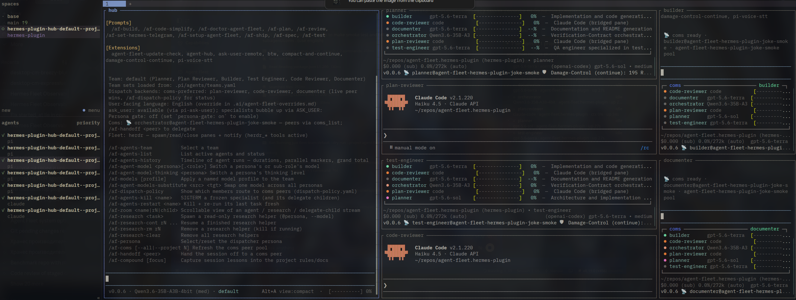
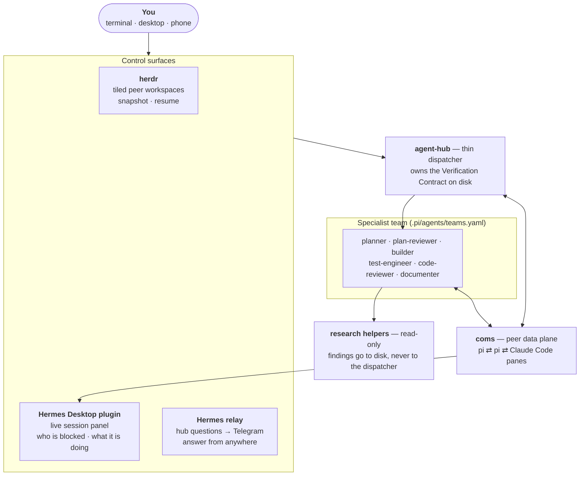
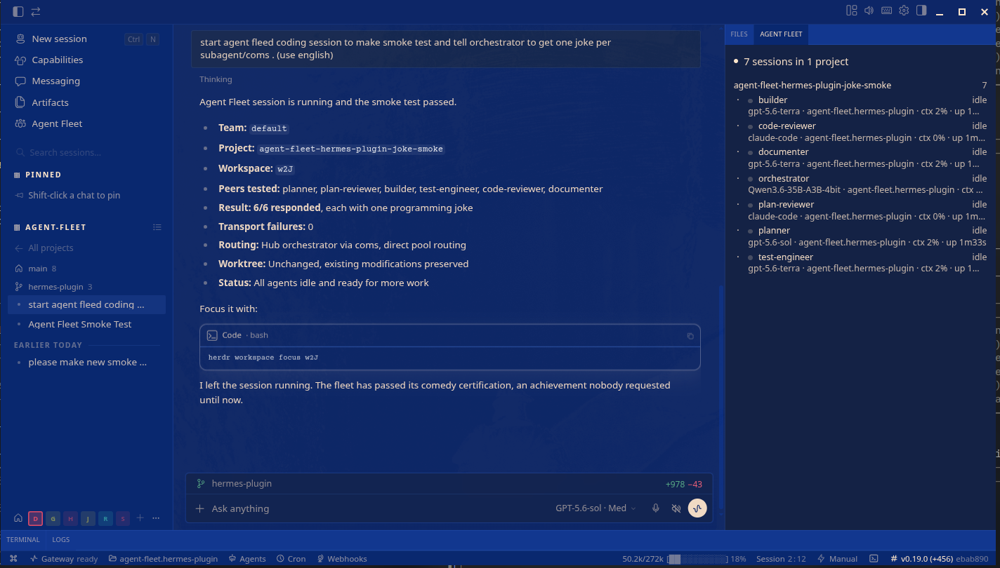
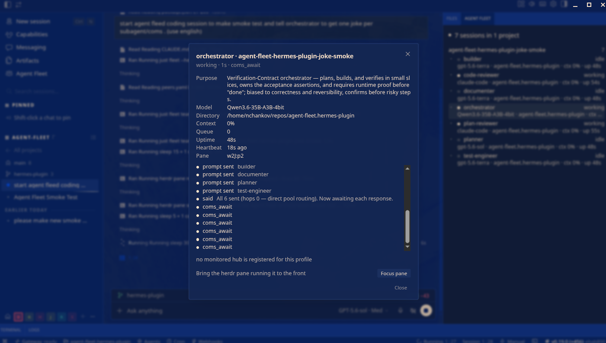
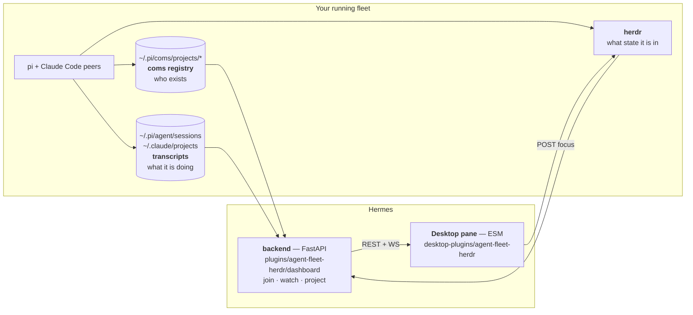
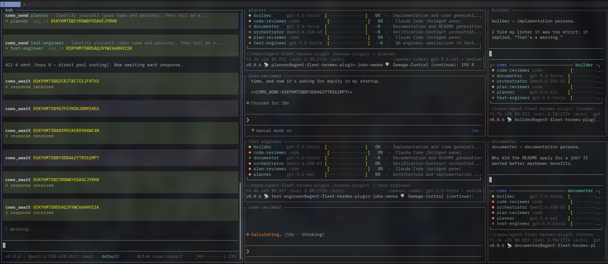
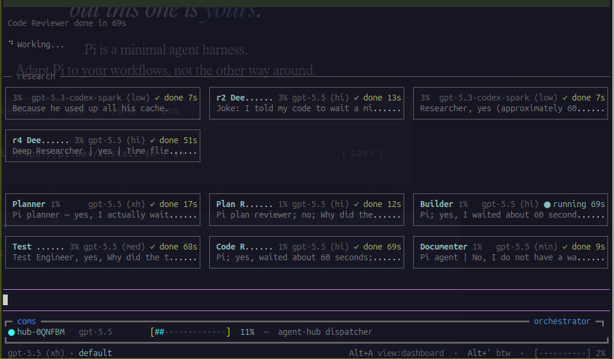

# Agent Fleet

[](https://www.npmjs.com/package/@chankov/agent-fleet)
[](LICENSE)
[](#quick-start)
[](#bring-your-own-subscriptions--and-your-own-gpus)
[](#watch-the-fleet-from-your-desktop--the-hermes-plugin)

**Operate a coding-agent *fleet* — not just one chat session.**

Agent Fleet is a **multi-agent orchestration system for AI coding agents**, built pi-first: a thin dispatcher routes work to specialist agents under a Verification Contract, whole teams spawn as tiled workspaces you can snapshot and resume, agents message each other over a shared coms plane, a **Hermes Desktop panel** shows you the whole fleet at a glance — and a library of **29 production-grade lifecycle skills** and **15 personas** keeps every agent disciplined.

Three things make it unusual:

1. **You run it on the subscriptions you already pay for** — Codex/ChatGPT, GitHub Copilot, Claude, Ollama — mixed *inside one fleet*, alongside models running locally on your own GPU. [How ↓](#bring-your-own-subscriptions--and-your-own-gpus)
2. **The dispatcher never drowns.** Research output, subagent dumps and specialist chatter stay *out* of the orchestrator's context window — on disk, behind file paths. [How ↓](#agent-hub-a-thin-context-dispatcher-for-pi)
3. **You can actually see it.** Tiled panes in [herdr](https://herdr.dev), a live session panel in **Hermes Desktop**, and questions relayed to your **phone** when an agent needs a human. [How ↓](#watch-the-fleet-from-your-desktop--the-hermes-plugin)

> **One coding agent: pi.** Everything installs for pi and nothing else. Claude Code appears throughout this README as a **coms peer** — a real Claude pane bridged into the fleet to answer other agents' questions and run cross-model review. That is its whole role; it is not an install target. [The bridge ↓](docs/claude-code-coms-bridge.md)



---

## The fleet at a glance


```mermaid
flowchart TD
    You(["<b>You</b><br/>terminal · desktop · phone"])

    subgraph Control["Control surfaces"]
        Herdr["<b>herdr</b><br/>tiled peer workspaces<br/>snapshot · resume"]
        Desktop["<b>Hermes Desktop plugin</b><br/>live session panel<br/>who is blocked · what it is doing"]
        Phone["<b>Hermes relay</b><br/>hub questions → Telegram<br/>answer from anywhere"]
    end

    Hub["<b>agent-hub</b> — thin dispatcher<br/>owns the Verification Contract on disk"]

    subgraph Team["Specialist team (.pi/agents/teams.yaml)"]
        Specialists["planner · plan-reviewer · builder<br/>test-engineer · code-reviewer · documenter"]
    end

    Research["<b>research helpers</b> — read-only<br/>findings go to disk, never to the dispatcher"]
    Coms["<b>coms</b> — peer data plane<br/>pi ⇄ pi ⇄ Claude Code panes"]

    You --> Control
    Control --> Hub
    Hub --> Specialists
    Specialists --> Research
    Hub <--> Coms
    Specialists <--> Coms
    Coms --> Desktop
```

| Layer | Job |
| --- | --- |
| **[agent-hub](#agent-hub-a-thin-context-dispatcher-for-pi)** | One **pi** runtime — direct operator work or thin-context orchestration under a Verification Contract |
| **[herdr](https://herdr.dev)** | Fleet control plane — tiled peer workspaces, presence, snapshot/resume |
| **coms** | Peer data plane — bidirectional messaging between agents (including Claude Code panes) |
| **[Hermes Desktop plugin](#watch-the-fleet-from-your-desktop--the-hermes-plugin)** | Live fleet panel in the Hermes desktop app — every session, its state, what it is doing, and who is waiting on you |
| **[Hermes relay](docs/coms-hermes-bridge.md)** | Remote human control — relay hub questions to your phone and answer them there |
| **Codex conductor (experimental)** | Android-initiated, approval-gated delegation to live coms peers through a user-systemd service |
| **[Skills](docs/skills-catalog.md) + [personas](docs/agents.md)** | Lifecycle discipline — how to spec, plan, build, verify, review, and ship |

---

## Quick Start

### Install into a repository

From the **target repository**. The first install goes through `npx` — `just
fleet` does not exist yet, because the managed justfile region is one of the
things setup writes:

```bash
cd ~/projects/my-app
npx @chankov/agent-fleet@latest setup
```

In a real TTY that opens the installer: pick the **Default** or **Full** preset
and optional comma-separated features, read the exact reconciliation plan, then
confirm once. For automation, name the selection and consent:

```bash
npx @chankov/agent-fleet@latest setup --preset default --features none --yes
```

**Default** is a launchable stable Fleet Core; it creates neither `.claude/` nor
voice configuration. **Full** selects all stable platform-applicable catalogue
roots and may install the recorded Claude Code coms bridge. The lifecycle
requires no coding agent or model.

Setup writes files but never runs commands, so finish with the two npm steps it
deliberately skipped — the workspace is not launchable until they run:

```bash
just fleet deps     # npm install in .pi/extensions and .pi/harnesses
just fleet doctor   # exit 0 = nothing to repair
```

Then start a fleet:

```bash
just fleet                                      # Hub/operator; direct tools; empty native roster
just fleet --agents frontend                    # Hub/orchestrator + native specialists
just fleet --agents frontend --peers frontend --project af
                                                # same Hub + standing peers in Herdr
```

### Updating

A pi session prints a banner when a newer version is published. Your preset and
features live in `.ai/agent-fleet.json`, so a plain `setup` reconciles to the
selection you already made:

```bash
just fleet setup --dry-run    # preview: what changes, what gets overwritten
just fleet setup              # apply; shows the plan and asks once
just fleet deps               # if the plan skipped the npm steps
just fleet doctor
```

> **`setup` reconciles toward the package.** A shipped artifact you edited in
> place is refreshed and your edit is overwritten — no prompt. Customize through
> `.ai/agent-fleet-overrides.md`, which no lifecycle command touches. If *both*
> you and the new version changed the same file, setup exits `3` having written
> nothing; re-run with `--on-conflict theirs` or `--on-conflict ours`.

`pi update --extensions` updates pi's own extensions only — never this installer
or what it wrote. `just fleet install` was removed; use `setup` or `deps`.

| Lifecycle command | What it does |
|---|---|
| `npx @chankov/agent-fleet setup` | Reconcile to the Default/Full desired state and named features |
| `npx @chankov/agent-fleet doctor` | Read-only diagnostics; `--fix` repairs explicit findings |
| `npx @chankov/agent-fleet uninstall --all --yes` | Remove unchanged recorded artifacts while preserving human configuration |

`just fleet setup`/`doctor`/`uninstall` are thin wrappers over
`npx @chankov/agent-fleet@latest` for a workspace that already has the justfile.
`just fleet uninstall --yes` removes its own launcher last, so reinstall
afterwards with the package CLI.

Full reference: [docs/npm-install.md](docs/npm-install.md) and the
[major-release migration matrix](docs/MIGRATION-agent-fleet.md).

<details>
<summary><b>Other install paths</b> — git clone, pi details</summary>

**Git clone** — best for skill authors and contributors:

```bash
git clone https://github.com/chankov/agent-fleet.git && cd agent-fleet
node bin/cli.js setup --workspace ~/projects/foo --preset default --features none --yes
```

`setup` reconciles the workspace to the recorded desired state. This
`node bin/cli.js` command is for source-checkout development; use the
`npx @chankov/agent-fleet@latest setup` package command above for a new
repository. CLI selections are ephemeral over an existing
`.ai/agent-fleet.json` unless `--save-desired` is explicit. Symlink installs
exist only inside an agent-fleet checkout, where editing an artifact is meant
to edit the source.

**pi details** — the package bundles `pi-ask-user` (interactive `ask_user` + skill); lifecycle commands load from `.pi/prompts/`, and Fleet Core explicitly loads its deterministic utility extensions from `.pi/extensions/`. Browser and voice remain opt-in: select the setup feature, then use `just fleet --browser` or `just fleet --voice`; the selectable harnesses live under `.pi/harnesses/`. See [docs/pi-setup.md](docs/pi-setup.md) and the [pi extension catalog](docs/pi-extensions.md).

</details>

Versioned with [semver](https://semver.org) — [CHANGELOG.md](CHANGELOG.md) · [docs/npm-install.md](docs/npm-install.md).

---

## Bring your own subscriptions — and your own GPUs

**There is no Agent Fleet API key.** Every agent in the fleet declares which model it wants, and pi resolves that against whatever providers *you* are already signed in to. A single fleet routinely mixes several at once — that is the normal configuration, not an edge case.

| Where the tokens come from | Looks like | Who uses it in a fleet |
|---|---|---|
| **ChatGPT / Codex subscription** | `openai-codex/gpt-5.6-terra`, `…-sol`, `…-luna`, `…-codex-spark` | Default for most shipped personas |
| **GitHub Copilot subscription** | `github-copilot/claude-sonnet-4.6`, `github-copilot/claude-haiku-4.5` | Common override for `builder` / reviewers |
| **Claude subscription** | a real **Claude Code pane**, bridged in as a first-class coms peer | `plan-reviewer` and `code-reviewer` — cross-model review |
| **Ollama — cloud *or* local** | `ollama/glm-5.2:cloud`, `ollama/minimax-m3:cloud`, or a model on your own box | Overflow capacity and cost control |
| **Anything else pi can address** | local MLX / llama.cpp / LM Studio weights, e.g. a 4-bit `Qwen3.8-27B-Uncensored-MLX-4bit` orchestrator | Cheap always-on roles: dispatcher, recon, docs |

Two consequences worth spelling out:

- **Cross-model review is the point, not a party trick.** A `builder` on one lab's model and a `code-reviewer` on another's catches what a single model rationalizes past. `plan-reviewer` and `code-reviewer` ship ready to run as **Claude Code peers** for exactly this.
- **Cost lives on a ladder, not a switch.** Each persona declares a default plus a switch list over a three-tier policy — *deep reasoning / workhorse / fast recon* — swappable at runtime per persona (`/af-agent-model`) or fleet-wide (`/af-models <profile>`). From Fleet Detail (`Alt+A`, Enter), **`m`** can choose any model Pi currently reports as available for that local specialist, research helper, or nested delegate's next run. From Fleet Dashboard itself, **`m`** opens a source/target picker that saves a session-wide substitution for current and future spawns; bare `/af-agent-models-substitute` opens that same flow. Recon sweeps run on the cheap tier or on your own hardware; only synthesis and verdicts spend the expensive one.

```bash
/af-models fast                                   # move the whole team down a tier
/af-agent-model builder github-copilot/claude-sonnet-4.6
/af-agent-models-substitute                         # visually pick a session-wide source → target mapping
/af-agent-models-substitute openai-codex/gpt-5.6-sol ollama/glm-5.2:cloud   # same operation, direct form
```

Per-project defaults live in `.ai/agent-fleet-overrides.md` — see [docs/agent-fleet-setup.md](docs/agent-fleet-setup.md).

---

## Watch the fleet from your desktop — the Hermes plugin

Once a fleet is more than two agents, "is anything waiting on me?" stops being answerable by looking at panes. **`agent-fleet-herdr`** is an in-repo **Hermes Desktop** plugin that answers it: a live panel of every Agent Fleet session, grouped by project, sorted so that **the agent blocked on a human is at the top**.



**What the panel gives you**

- **Every session, not every pane.** The list is built from the coms registry, so an agent that left its herdr pane still shows up — as `detached`, which is a different fact from "gone".
- **A toast when something needs you.** `needs_answer` (an agent blocked on a human for more than 20s), `vanished` (a session that died mid-work), `stale`, `finished` — pushed over a WebSocket, with a poll underneath that never switches off. Optional [Telegram fan-out](docs/hermes-desktop-plugins.md#being-told-instead-of-watching) for alerts that must survive a closed window.
- **What an agent is doing *right now*.** Select a row and the modal reads that agent's own transcript — `bash git rev-list…`, `dispatch_agent builder`, `update_assertion` — projected through a per-tool allowlist, never forwarded wholesale.
- **The subagents underneath it.** A hub whose own transcript is idle while three specialists work is exactly the case a naive status panel renders as "nothing happening". Each live child carries a tail of its stdout and a **Cancel** button.
- **One action, and honest disabled states.** `Focus pane` brings the workspace hosting that agent to the front. An action that cannot work right now stays visible with its reason beside it.



### How it connects to Agent Fleet

The plugin reads what the fleet already writes. It adds no daemon to your agents and holds no write door into them.


```mermaid
flowchart LR
    subgraph Fleet["Your running fleet"]
        Agents["pi + Claude Code peers"]
        Registry[("~/.pi/coms/projects/*<br/><b>coms registry</b><br/>who exists")]
        Transcripts[("~/.pi/agent/sessions<br/>~/.claude/projects<br/><b>transcripts</b><br/>what it is doing")]
        HerdrD["<b>herdr</b><br/>what state it is in"]
        Agents --> Registry
        Agents --> Transcripts
        Agents --> HerdrD
    end

    subgraph Hermes["Hermes"]
        API["<b>backend</b> — FastAPI<br/>plugins/agent-fleet-herdr/dashboard<br/>join · watch · project"]
        Pane["<b>Desktop pane</b> — ESM<br/>desktop-plugins/agent-fleet-herdr"]
        API -->|"REST + WS"| Pane
    end

    Registry --> API
    Transcripts --> API
    HerdrD --> API
    Pane -->|"POST focus"| HerdrD
```

- **The coms registry is the filter and the source of truth for *who exists*.** A herdr pane with no registry entry is not an Agent Fleet session and is not shown.
- **herdr says what state each one is in**, joined by the `(project, name)` pair a pane advertises — not by cwd, which a pi pane and a Claude Code pane in the same repo would collide on.
- **The agent's own transcript says what it is doing.** That file is written whether or not anybody is watching, which is why the activity tail also works for a `detached` session no pane hosts.
- **Reads only, except two doors.** `focus` and subagent `cancel` — both re-derived server-side from a fresh snapshot, so a renderer cannot name a target it was not given.

### Install it

**Prerequisites:** Hermes v0.19.0+ (the `hermes` CLI on `PATH`, plus the Desktop app), this repo checked out, and a fleet that has run at least once (so `~/.pi/coms/projects/` exists). [herdr](https://herdr.dev) is optional — without it every row reads `unknown` instead of a live state.

```bash
scripts/install-hermes-plugin.sh agent-fleet-herdr
```

That one command backs up `config.yaml`, symlinks **both halves** into the profile (`plugins/` for the FastAPI backend, `desktop-plugins/` for the pane), runs `hermes plugins enable`, and verifies the result — then **prints** the restart steps instead of performing them, because restarting a live gateway is your call:

```bash
# 1. restart the Hermes Desktop app  ← the pane talks to the gateway Desktop spawns for itself
# 2. hermes gateway restart          ← only if the web dashboard / TUI needs the routes too
```

Then start a fleet and open the **Agent Fleet** tab:

```bash
just fleet --agents default --peers default    # monitored Hub + peers; nothing extra to configure
```

<details>
<summary><b>Options and verification</b></summary>

```bash
scripts/install-hermes-plugin.sh agent-fleet-herdr --profile dev   # a non-default profile
scripts/install-hermes-plugin.sh agent-fleet-herdr --copy          # no symlinks
scripts/install-hermes-plugin.sh agent-fleet-herdr --dry-run       # print, change nothing
scripts/install-hermes-plugin.sh agent-fleet-herdr --uninstall
```

Working install: `~/.hermes/logs/gui.log` contains `Mounted plugin API routes: /api/plugins/agent-fleet-herdr/` at Desktop start, and `/capabilities` reports both sources. An empty panel with no error means the enable gate 404'd — that is documented, along with every other failure mode that looks identical from the outside, in the runbook.

</details>

**Deep dive:** [docs/hermes-desktop-plugins.md](docs/hermes-desktop-plugins.md) — the plugin contract, the four rules that cost the most to learn, the full API, and the deliberate limits.

### And on your phone

Separately from the panel, the **Hermes relay** pipes an agent's `ask_user` question — choices intact, not flattened into a message — to Telegram, and races your phone's answer against a local one. Whichever arrives first wins; the fleet keeps working meanwhile.

See [docs/coms-hermes-bridge.md](docs/coms-hermes-bridge.md) and the [screenshots](hermes/README.md#integration-in-action).

<details>
<summary><b>Experimental: delegate to live peers from ChatGPT Android</b></summary>

The optional Codex Remote-Control conductor is verified on Linux with Codex CLI `0.144.x`. Hermes remains the inbound `ask_user` route; Codex is outbound-only and delegates one confirmed task at a time to peers already visible in the same coms project.

```bash
cd /path/to/agent-fleet
just fleet conductor codex setup docs --project af  # once per configured context
just fleet conductor codex pair                     # interactive; never capture the code
just fleet conductor codex start
just fleet --agents default --peers docs --project af # Hub + peers Codex can reach
```

In ChatGPT Android, open the paired Remote Control host and use the managed external workspace at `$HOME/.local/state/agent-fleet/codex-conductor/workspace`. Do not start a local `codex` process for the Android flow, and do not also launch `just fleet conductor codex docs` when `just fleet --agents default --peers docs` already owns the same peers.

Lifecycle, approval flow, examples, recovery, and security boundaries: **[Codex Remote-Control conductor runbook](docs/codex-remote-conductor.md)**.

</details>

---

## agent-hub: a thin-context dispatcher for pi

Every public Pi Fleet session is now one `agent-hub` runtime with two postures. Bare `just fleet` starts in **operator** posture: direct `read`/`bash`/`edit`/`write`, orchestration tools, embedded `coms`, and an empty native roster. **Orchestrator** posture removes direct coding tools and drives specialist subagents — planner, builder, reviewer, test-engineer, documenter — under the Verification Contract. Both postures keep the same Hub commands, research helpers, peer collaboration, and `damage-control-continue` guardrails.



What makes it different is what it **doesn't** put in front of the dispatcher LLM. Multi-agent setups usually drown the orchestrator: every subagent's output, every research dump flows back into one context window until it compacts and forgets. `agent-hub` is built the other way around:

- **Research never enters the dispatcher context.** Specialists end their turn with `NEEDS_RESEARCH:` lines; the hub fans out read-only helpers, writes findings to disk, and resumes the specialist with file paths. The dispatcher sees a one-line notice — never the raw findings. Each local-disk research tool call has a parent-side 120-second watchdog (configurable as `recon-search-timeout-s` in `.ai/agent-fleet-overrides.md`), not a whole-agent deadline.
- **The Verification Contract lives on disk.** A ledger of checkable acceptance assertions, built from the request *before* any builder runs, rendered as one status line (`Assertions: 2✓ 1○ 1✗ · open: A4`). A stated requirement is never silently dropped, and the contract survives compaction.
- **Capability surfaces are automatic and bounded.** No activation command is needed: explicit task intent selects the needed pack, while a ready coms/Herdr runtime alone remains hidden from the model. Ambiguous fleet, peer, or workspace work asks once before its first side effect; packs persist for a task and reset only with `set_task_tier(new_task: true)`.
- **Budget continuation is one click.** Turn and task exhaustion ask one localized Yes/No `ask_user` question. Yes renews the relevant budget and resumes in the same tool loop; task continuation preserves tier, assertions, capability packs, blockers, and progress. Human wait time is not charged. Genuinely different work uses `set_task_tier(new_task: true)`.
- **Specialists run `--no-extensions`.** Managed children receive replacement prompts with selected persona, policy, and skill paths instead of inherited global skills/context; research helpers additionally run `--no-skills` and `--no-context-files`.



```bash
just fleet                                      # operator; empty native roster
just fleet --agents frontend                    # native roster; orchestrator inferred
just fleet --posture operator --agents frontend # direct work plus the same roster
just fleet --no-coms                            # direct/native work; no peer messaging

# live posture and roster changes preserve the session
/af-agents-add code-reviewer
/af-work-mode orchestrator      # Alt+M picker
/af-posture operator

# Herdr topology (requires a running server — https://herdr.dev)
just fleet --herdr --project af
just fleet --agents frontend --peers frontend --project af
```

Native specialists are local headless Pi subprocesses; standing peers are separate Pi or Claude Code processes in sibling Herdr panes. They can share a name without ambiguity: `dispatch_agent(..., backend: "native")` always starts the local Pi specialist, `backend: "coms"` requires the live peer, and `backend: "auto"` follows `.pi/agents/dispatch-policy.yaml`.

From a Hub pane, add a declared Claude reviewer with `herdr_spawn_peer({ name: "code-reviewer" })`, then use `coms_send` + `coms_await`; the peer is locked to the Hub's project. `/af-handoff code-reviewer` works in either posture when that peer is visible in the coms pool. Herdr operations require a live Herdr server; peer messaging/handoff require coms readiness. All Hub slash commands remain registered in both postures and unavailable capabilities refuse with remediation instead of disappearing.

Compatibility forms (`just fleet hub`, `just fleet team <preset>`, and `--solo`) remain accepted during migration and print canonical replacements; use `--no-coms` instead of `--solo`.

Deep dive: [agent-hub harness README](.pi/harnesses/agent-hub/README.md) (the full dispatch loop, coms layer, configuration) · [fleet hierarchy](docs/ARCHITECTURE.md#fleet-hierarchy) · [pi extension catalog](docs/pi-extensions.md) · [Claude Code coms bridge](docs/claude-code-coms-bridge.md) · [Hermes bridge](docs/coms-hermes-bridge.md).

---

## The lifecycle: commands and skills

```
  DEFINE          PLAN           BUILD          VERIFY         REVIEW          SHIP
 ┌──────┐      ┌──────┐      ┌──────┐      ┌──────┐      ┌──────┐      ┌──────┐
 │ Idea │ ───▶ │ Spec │ ───▶ │ Code │ ───▶ │ Test │ ───▶ │  QA  │ ───▶ │  Go  │
 │Refine│      │  PRD │      │ Impl │      │Debug │      │ Gate │      │ Live │
 └──────┘      └──────┘      └──────┘      └──────┘      └──────┘      └──────┘
  spec           plan           build         test          review        ship
```

Slash commands map to the development lifecycle; each activates the right skills automatically. They install into `.pi/prompts/` under the `/af-*` namespace, so they never collide with a command your workspace already defines.

| What you're doing | Command | Key principle |
|-------------------|---------|---------------|
| Define what to build | `/af-spec` | Spec before code |
| Plan how to build it | `/af-plan` | Small, atomic tasks |
| Build incrementally | `/af-build` | One slice at a time (`auto` runs the whole plan in one approved pass) |
| Prove it works | `/af-test` | Tests are proof |
| Review before merge | `/af-review` | Improve code health |
| Audit web performance | *invoke the `web-performance-auditor` persona* | Measure before you optimize |
| Simplify the code | `/af-code-simplify` | Clarity over cleverness |
| Ship to production | `/af-ship` | Faster is safer |
| Orchestrate a team | *agent-hub harness* | The hub drives a config-defined roster |
| Capture session lessons | `/af-compound` *(agent-hub)* | Every session improves the next |

Under the hood are **29 skills** — each a structured workflow with steps, verification gates, and anti-rationalization tables (never vague advice). Skills also activate automatically from what you're doing: designing an API triggers `api-and-interface-design`, building UI triggers `frontend-ui-engineering`.

- **Define:** [interview-me](skills/interview-me/SKILL.md) · [idea-refine](skills/idea-refine/SKILL.md) · [spec-driven-development](skills/spec-driven-development/SKILL.md)
- **Plan:** [planning-and-task-breakdown](skills/planning-and-task-breakdown/SKILL.md)
- **Build:** [incremental-implementation](skills/incremental-implementation/SKILL.md) · [test-driven-development](vendor/agent-skills-upstream/skills/test-driven-development/SKILL.md) · [context-engineering](skills/context-engineering/SKILL.md) · [source-driven-development](vendor/agent-skills-upstream/skills/source-driven-development/SKILL.md) · [doubt-driven-development](vendor/agent-skills-upstream/skills/doubt-driven-development/SKILL.md) · [frontend-ui-engineering](skills/frontend-ui-engineering/SKILL.md) · [api-and-interface-design](vendor/agent-skills-upstream/skills/api-and-interface-design/SKILL.md)
- **Verify:** [browser-testing-with-devtools](skills/browser-testing-with-devtools/SKILL.md) · [debugging-and-error-recovery](vendor/agent-skills-upstream/skills/debugging-and-error-recovery/SKILL.md)
- **Review:** [code-review-and-quality](skills/code-review-and-quality/SKILL.md) · [code-simplification](vendor/agent-skills-upstream/skills/code-simplification/SKILL.md) · [security-and-hardening](skills/security-and-hardening/SKILL.md) · [performance-optimization](skills/performance-optimization/SKILL.md)
- **Ship:** [git-workflow-and-versioning](skills/git-workflow-and-versioning/SKILL.md) · [ci-cd-and-automation](vendor/agent-skills-upstream/skills/ci-cd-and-automation/SKILL.md) · [deprecation-and-migration](skills/deprecation-and-migration/SKILL.md) · [documentation-and-adrs](vendor/agent-skills-upstream/skills/documentation-and-adrs/SKILL.md) · [observability-and-instrumentation](vendor/agent-skills-upstream/skills/observability-and-instrumentation/SKILL.md) · [shipping-and-launch](vendor/agent-skills-upstream/skills/shipping-and-launch/SKILL.md)
- **Orchestrate:** [orchestration-verification](skills/orchestration-verification/SKILL.md) · [peer-coms](skills/peer-coms/SKILL.md)
- **Learn:** [compound-learning](skills/compound-learning/SKILL.md) · **Meta:** [using-agent-skills](skills/using-agent-skills/SKILL.md) · [designing-agents](skills/designing-agents/SKILL.md)

Workspace onboarding uses the deterministic `setup`, `doctor`, and `uninstall` CLI lifecycle.

Full catalog with descriptions and triggers: **[docs/skills-catalog.md](docs/skills-catalog.md)**. Format spec: [docs/skill-anatomy.md](docs/skill-anatomy.md).

---

## Agent personas

15 pre-configured specialist personas live in [`agents/`](agents/) — reusable subagent definitions your coding agent delegates work to: `planner`, `plan-reviewer`, `builder`, `code-reviewer`, `test-engineer`, `security-auditor`, `web-performance-auditor`, `documenter`, `architect`, `releaser`, `researcher`, `deep-researcher`, plus the pi-only `bowser`, `web-debugger`, and `orchestrator`.

Each persona is one Markdown file in pi's own frontmatter dialect, installed verbatim — there is no per-agent translation step. Personas are the *who*, skills are the *how* — each carries a conditional hook to its primary skill, and they compose into teams under the hub.

Full roster, skill hooks, install matrix, and team composition: **[docs/agents.md](docs/agents.md)**.

---

## Why Agent Fleet?

One coding agent is an assistant; a *fleet* is a team you operate. Agent Fleet exists for the moment a single session stops being enough — when you want a dispatcher driving specialists under a Verification Contract, whole peer teams you can snapshot and resume, Claude Code panes that answer pi agents mid-task, a desktop panel that tells you which agent is stuck, and a phone-reachable human in the loop.

Discipline is the other half. AI coding agents default to the shortest path — skipping specs, tests, and security reviews. The skill library gives every agent in the fleet the same discipline senior engineers bring to production code, baking in practices from [Software Engineering at Google](https://abseil.io/resources/swe-book) and Google's [engineering practices guide](https://google.github.io/eng-practices/): Hyrum's Law in API design, the test pyramid and Beyonce Rule in testing, change sizing in review, Chesterton's Fence in simplification, trunk-based development in git workflow.

**How it compares:** wondering how this stacks up against [Superpowers](https://github.com/obra/superpowers) or [Matt Pocock's skills](https://github.com/mattpocock/skills)? See **[docs/comparison.md](docs/comparison.md)** — an honest, side-by-side look, including a controlled [head-to-head experiment](https://www.linkedin.com/pulse/superpowers-vs-agent-skills-faster-shipping-safer-reasoning-om-mishra-dzakf/).

---

## Documentation

| Doc | Covers |
|---|---|
| [docs/ARCHITECTURE.md](docs/ARCHITECTURE.md) | Runtime layers, fleet hierarchy, module map, external dependencies |
| [docs/getting-started.md](docs/getting-started.md) | First session walkthrough |
| [docs/skills-catalog.md](docs/skills-catalog.md) | All 29 skills with descriptions and triggers |
| [docs/agents.md](docs/agents.md) | All 15 personas: roster, skill hooks, install matrix, teams |
| [docs/pi-setup.md](docs/pi-setup.md) · [docs/pi-extensions.md](docs/pi-extensions.md) | pi install paths, harnesses, and utility extensions |
| [docs/agent-fleet-setup.md](docs/agent-fleet-setup.md) | Per-project overrides (`.ai/agent-fleet-overrides.md`) — spec/plan paths, dev server, branch policy, per-persona models, dispatcher language, rules/docs targets |
| **[docs/hermes-desktop-plugins.md](docs/hermes-desktop-plugins.md)** | **The Hermes Desktop plugin: install, contract, API, failure modes, limits** |
| [docs/claude-code-coms-bridge.md](docs/claude-code-coms-bridge.md) · [docs/coms-hermes-bridge.md](docs/coms-hermes-bridge.md) · [docs/codex-remote-conductor.md](docs/codex-remote-conductor.md) | Claude Code as a coms peer · phone relay · experimental Codex remote-control operator runbook |
| [docs/npm-install.md](docs/npm-install.md) | CLI reference, versioning, update flow |
| [references/](references/) | 9 checklists skills pull in: testing, security, performance, accessibility, observability, orchestration + fleet-coordination + prompting patterns. Each installs automatically alongside the skills that cite it |

---

## Credits & origins

Agent Fleet started as a customized fork of [Addy Osmani](https://github.com/addyosmani)'s [`agent-skills`](https://github.com/addyosmani/agent-skills) library, with pi session-harness patterns from [IndyDevDan](https://github.com/disler)'s [`pi-vs-claude-code`](https://github.com/disler/pi-vs-claude-code) (MIT) growing alongside it. As orchestration became the center of gravity, it split into a standalone project — with the upstream relationship kept honest: Addy's library is vendored **pristine at a pinned SHA** under [`vendor/agent-skills-upstream/`](vendor/agent-skills-upstream/) ([policy](docs/UPSTREAM-SKILLS.md)), and the ported harnesses credit their origin in [docs/pi-extensions.md](docs/pi-extensions.md).

| Person | Handle | What we draw from |
| --- | --- | --- |
| **IndyDevDan** | [@disler](https://github.com/disler) | Pi session harness patterns — foundation for `agent-hub`, `coms`, `damage-control` |
| **Addy Osmani** | [@addyosmani](https://github.com/addyosmani) | Production-grade lifecycle skills — the vendored upstream skill library |

Thank you both for the inspiration and for shipping work others can build on.

---

## Contributing

Skills should be **specific** (actionable steps), **verifiable** (clear exit criteria with evidence), **battle-tested** (based on real workflows), and **minimal** (only what's needed to guide the agent). See [docs/skill-anatomy.md](docs/skill-anatomy.md) and [CONTRIBUTING.md](CONTRIBUTING.md).

## License

MIT - use these skills in your projects, teams, and tools.
