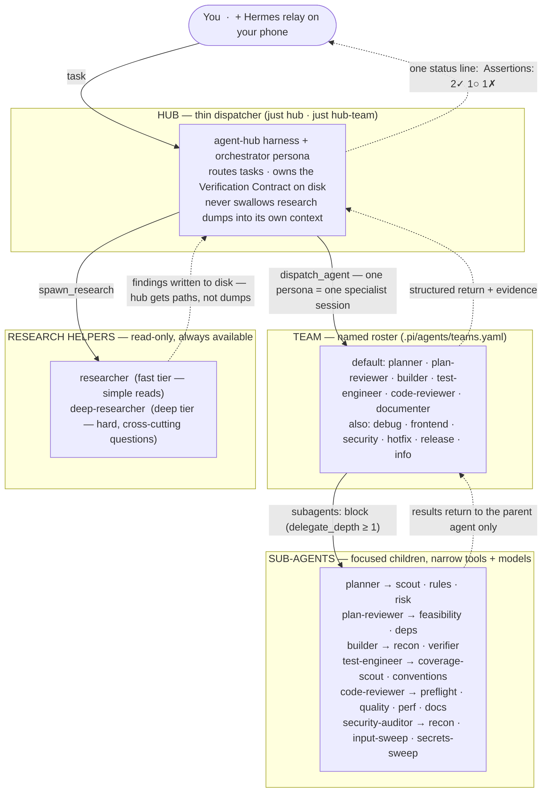
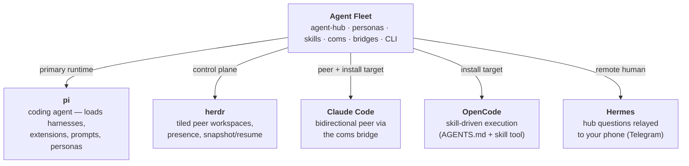

# Agent Fleet Architecture

Agent Fleet is a Pi-centered multi-agent orchestration system. This page maps
the runtime responsibilities and where each module lives in the repository.

## Runtime layers

| Layer | Role | Implementation |
| --- | --- | --- |
| **Pi Coding Agent** | Primary local runtime — runs the dispatcher and specialist subagents | `.pi/harnesses/`, `.pi/extensions/`, `.pi/agents/`, `.pi/prompts/` |
| **agent-hub** | Thin-context multi-agent harness: dispatcher + specialists + research helpers + Verification Contract | `.pi/harnesses/agent-hub/` |
| **Herdr** | Fleet/workspace control plane — spawns peer teams as tiled workspaces, presence via push events, snapshot/resume | [herdr.dev](https://herdr.dev); client in `.pi/harnesses/lib/herdr-client.ts`, layout in `scripts/lib/herdr-layout.ts` |
| **coms** | Peer communication protocol/data plane — envelope-based P2P messaging between agents | `.pi/harnesses/coms/`, `scripts/lib/coms-envelope.ts`, `scripts/coms-cli.ts` |
| **Claude Code bridge** | Makes an interactive Claude Code pane a bidirectional coms peer | `scripts/coms-claude-bridge.ts`, `hooks/coms-stop-hook.mjs`, `skills/peer-coms/` — see [claude-code-coms-bridge.md](claude-code-coms-bridge.md) |
| **Hermes bridge** | Remote human control — relays hub questions to Telegram, races phone vs. local answers, conductor/liaison skills | `scripts/coms-hermes-bridge.ts`, `.pi/harnesses/ask-user-remote/`, `hermes/skills/` — see [coms-hermes-bridge.md](coms-hermes-bridge.md) |
| **Skill library** | Lifecycle workflows and quality gates every agent follows | `skills/` (native) + `vendor/agent-skills-upstream/skills/` (vendored) — see [UPSTREAM-SKILLS.md](UPSTREAM-SKILLS.md) |
| **Personas** | Reusable specialist definitions, transformed per harness | `agents/`, `bin/lib/transform-persona.js` |

## Fleet hierarchy

Agent Fleet is layered on purpose. Work flows **down** (delegate); evidence and status flow **up** — as compact structured returns, never raw dumps.



Every specialist session is one persona from [`agents/`](../agents/) — *skills* tell each agent **how** to work; *personas* define **who** they are (see [agents.md](agents.md)).

The same idea as a tree:

```text
hub (orchestrator)
├── team: default
│   ├── planner            → scout · rules · risk
│   ├── plan-reviewer      → feasibility · deps
│   ├── builder            → recon · verifier
│   ├── test-engineer      → coverage-scout · conventions
│   ├── code-reviewer      → preflight · quality · perf · docs
│   └── documenter
├── research helpers (spawn_research, any time)
│   ├── researcher
│   └── deep-researcher
└── optional fleet peers (herdr + coms)
    ├── architect / releaser / web-debugger panes
    ├── Claude Code peer (coms bridge)
    └── Hermes (phone human)
```

Composition rule: **the hub (or a slash command) orchestrates; personas do not invoke other personas as peers.** Specialists may only fan out to their configured **sub-agents**. Research helpers write findings to disk; the hub resumes specialists with paths, not raw dumps. Full pattern catalog: [references/orchestration-patterns.md](../references/orchestration-patterns.md).

## Runtime stack (tools the fleet sits on)



### External dependencies

These are the external systems Agent Fleet assumes or integrates with — not npm packages, but the **runtime stack** the fleet operates on top of.

| Dependency | Role | Required? |
| --- | --- | --- |
| **[pi](https://github.com/badlogic/pi-mono)** (or your pi install) | Primary coding-agent runtime; loads harnesses, extensions, prompts, and personas | Yes for full fleet mode (`just hub`) |
| **[herdr](https://herdr.dev)** | Workspace control plane: tiled peer panes, presence push events, team snapshot/resume | Yes for fleet recipes (`just team-up`, `just hub-team`, …); optional for solo hub |
| **[Claude Code](https://docs.anthropic.com/en/docs/claude-code)** | First-class peer via the [coms bridge](claude-code-coms-bridge.md); also a supported install target for skills/personas | Optional peer / alternate harness |
| **[OpenCode](https://opencode.ai)** | Skill-driven execution target (`AGENTS.md` + `skill` tool); `af-*` slash commands | Optional alternate harness |
| **Hermes** | Remote human-in-the-loop (Telegram relay for hub questions) — [coms-hermes-bridge](coms-hermes-bridge.md) | Optional |
| **[addyosmani/agent-skills](https://github.com/addyosmani/agent-skills)** | Upstream skill library (manually vendored) | Bundled (vendored) |
| **[disler/pi-vs-claude-code](https://github.com/disler/pi-vs-claude-code)** | Source inspiration / MIT port origin for pi harnesses | Design lineage (ported in-repo) |
| **LLM providers** | Models per persona (`model:` / `models:` in agent frontmatter) — e.g. OpenAI Codex, GitHub Copilot, Ollama, … | Yes (at least one provider your agents can call) |
| **Chrome DevTools MCP** / **Playwright Agent CLI** | Browser verify (`browser-testing-with-devtools`) and headless automation (`bowser`) | Optional, feature-specific |
| **Node.js + npm** | CLI (`npx @chankov/agent-fleet`), package install, `just` recipes | Yes for install & tooling |

## Repository module map

```text
.pi/                          # Pi runtime: harnesses, extensions, agents config, prompts
skills/                       # Agent Fleet-native skills (shadow vendored names)
agents/                       # Personas/subagents used by Agent Fleet
scripts/                      # CLI helpers, bridges, team launchers (pure logic in scripts/lib/)
hermes/                       # Hermes-facing skills/integration assets
vendor/agent-skills-upstream/ # Manually imported upstream skills (pinned SHA)
bin/                          # npm CLI: init/update/doctor/transform-persona
hooks/                        # Session lifecycle + coms Stop hooks
references/                   # Supplementary checklists (see fleet-coordination-patterns.md)
docs/                         # This file, setup guides, bridge references, vendoring policy
```

Reserved for future modules (do not repurpose these paths):

```text
apps/dashboard/               # future dashboard: Kanban state, Herdr workspaces, peer status
packages/fleet-core/          # future extracted core orchestration library
packages/herdr-bridge/        # future Herdr integration package
packages/hermes-bridge/       # future Hermes integration package
```

## Design rules

- **Thin dispatcher context.** Nothing lands persistently in the dispatcher's
  context if it can live on disk or in a one-line status. Research findings,
  the Verification Contract ledger, and team snapshots are all disk-first.
- **Herdr owns panes, presence, and lifecycle; coms owns messages.** Fleet
  recipes hard-require a running herdr server and refuse with an actionable
  message otherwise; non-fleet recipes never touch herdr.
- **External agents are peers, not plugins.** Claude Code (and future CLI
  agents) join the fleet through bridge adaptors that speak coms envelopes —
  the fleet core stays agent-agnostic.
- **Destructive fleet verbs are damage-control-guarded.** Specialists cannot
  spawn/close herdr panes; the human confirms destructive actions.
- **Native-over-vendored skills.** The skill catalogue resolves `skills/`
  first, then the vendored upstream import; upstream updates are explicit
  maintainer actions ([UPSTREAM-SKILLS.md](UPSTREAM-SKILLS.md)).

## History

Agent Fleet began as a fork of `addyosmani/agent-skills` and was split into a
standalone repository in July 2026, with upstream demoted to vendored content.
The one-time migration record, including the history-filtering commands, lives
in [MIGRATION-agent-fleet.md](MIGRATION-agent-fleet.md); the product
requirements that drove the split are in
[prd-agent-fleet-split.md](prd-agent-fleet-split.md).
