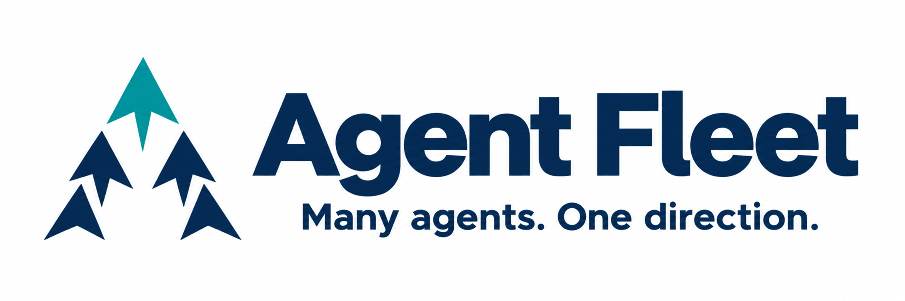

# Agent Fleet brand assets



The fleet emblem represents specialist agents moving in one shared direction.
The project slogan is **Many agents. One direction.**

| Asset | Use |
| --- | --- |
| [Logo on white](agent-fleet-logo-white-v1.png) | Default for documentation, GitHub, npm and the Pi package gallery; the opaque background keeps the dark lettering readable in light and dark page themes. |
| [Transparent logo](agent-fleet-logo-v1.png) | Presentations and layouts with a controlled light background. |

Both PNGs are 2172 × 724 pixels (3:1). Preserve their aspect ratio and clear
space. Use the full wordmark and slogan at a readable size.

## Distribution

The root README and installation guides use this absolute public image URL:

```text
https://raw.githubusercontent.com/chankov/agent-fleet/main/docs/assets/branding/agent-fleet-logo-white-v1.png
```

An absolute URL avoids depending on the host page's relative URL resolution.
The same URL is stored in `package.json#pi.image`, the
[Pi gallery preview field](https://pi.dev/docs/latest/packages#gallery-metadata).
The PNGs and this usage guide are included in the npm package through
`package.json#files`; generation prompts stay in the source repository.

When changing the public logo, add a new versioned filename and update all
consumers together. Push the image to `main` before publishing the package so
the URL resolves. Publish a new package version to update npm's README and Pi's
package metadata, then check the live pages after their caches refresh.
