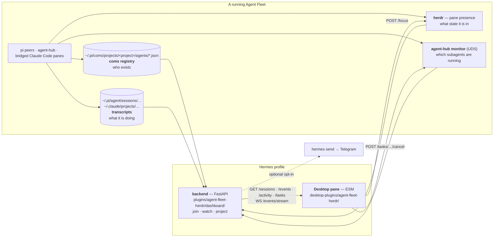
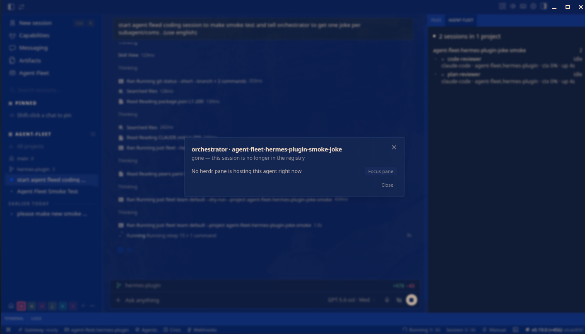
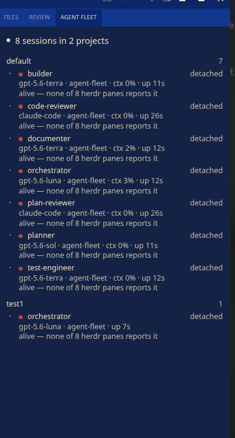

# Hermes Desktop plugins

How Agent Fleet's in-repo Hermes plugins are built, installed, and debugged.
Written against **Hermes v0.19.0**, install method `git`, source in
`~/.hermes/hermes-agent`.

The first plugin on this contract is [`agent-fleet-herdr`](#agent-fleet-herdr) —
a panel listing live Agent Fleet sessions grouped by project.


## How it connects to Agent Fleet

The plugin is a **reader of things the fleet already writes**. It installs no
agent, changes nothing about how a fleet is launched, and holds no persistent
handle into any agent process. Three independent sources, joined at request
time:



| Agent Fleet piece | What the plugin takes from it | Written by |
|---|---|---|
| **coms registry** | Which sessions exist, in which project, their model, purpose, cwd and liveness. Also the **filter**: a herdr pane with no registry entry is not shown. | `.pi/harnesses/lib/coms-registry-entry.ts` (both harnesses) |
| **herdr pane presence** | The live state of each session — `working` / `idle` / `blocked` — plus context use and queue depth, keyed by the `(project, name)` tokens a pane advertises. | `peerTokens()` in `.pi/harnesses/lib/herdr-presence.ts` |
| **agent transcripts** | What the agent is doing *right now*, projected through a per-tool allowlist. Works for `detached` pi sessions because the file is written whether or not anyone is watching. | pi and Claude Code themselves; the pairing id for bridged panes comes from [hooks/coms-stop-hook.mjs](../hooks/coms-stop-hook.mjs) |
| **agent-hub monitor** | The subagent tree under a hub, with a tail of each child's stdout and generation-safe cancel. | `.pi/harnesses/agent-hub/monitor-*.ts`, enabled by `scripts/lib/monitor-env.ts` |

Two consequences fall out of that shape and are worth stating plainly:

- **Nothing about launching a fleet changes.** `just fleet team default` already
  exports the monitor variables and already registers peers in coms; the panel
  attaches to that. There is no "start the plugin" step on the fleet side.
- **Reads only, with two exceptions.** `focus` (a herdr workspace) and subagent
  `cancel` are the sole write doors, and both re-derive their target from a
  fresh snapshot server-side — the renderer runs with the full privileges of the
  app, so it is never trusted with an id or an endpoint.

The one *related* piece that is deliberately **not** wired to this panel is the
Hermes ⇄ coms question bridge ([coms-hermes-bridge.md](coms-hermes-bridge.md)):
`needs_answer` here comes from herdr's `blocked` state, not from the bridge's
questions. The reason is in [Deliberate limits](#deliberate-limits).

## Three plugin surfaces — do not mix them up

| Surface | Path | Contract |
|---|---|---|
| **Desktop** (Electron) | `<profile>/desktop-plugins/<id>/plugin.js` | ESM, `export default { id, register(ctx) }` |
| **Dashboard** (web UI) | `<profile>/plugins/<id>/dashboard/dist/index.js` | IIFE, `window.__HERMES_PLUGINS__.register(name, component)` |
| **Agent** (Python) | `<profile>/plugins/<id>/{plugin.yaml,__init__.py}` | `register(ctx)` — tools/hooks/commands |

The backend (`dashboard/manifest.json` + `dashboard/plugin_api.py`) mounts at
`/api/plugins/<id>/` and serves **both** frontends: the Desktop plugin's
`ctx.rest()` and the Dashboard bundle's `fetchJSON` hit the same FastAPI router.

`<profile>` is what `hermes profile show <name>` prints as `Path:` — `~/.hermes`
for the `default` profile. The Desktop loader reads the same path from gateway
status.

## The four rules that cost the most to learn

**1. The enable gate answers 404 before routing.** `hermes_cli/web_server.py:576`
is middleware: for a user plugin whose name is not in `plugins.enabled` in
`config.yaml`, every request to `/api/plugins/<id>/*` returns
`404 {"detail": "Plugin not found"}`. So a backend needs three things at once,
and missing any one gives the identical 404:

1. `plugin.yaml` — so `hermes plugins enable <id>` has a name to accept
2. the `plugins.enabled` record in `config.yaml`
3. `dashboard/manifest.json` + the api file — so the routes mount at all

The frontend sees this through IPC as
`Error invoking remote method 'hermes:api': Error: 404: …`. **Fail closed on
it** — render an "unavailable" empty state, not a crash and not a red error.

**2. Symlink the whole directory, never a single file.**
`web_server.py:19755` requires `api_path.resolve()` to live inside
`dashboard_dir.resolve()`. Linking the directory keeps both sides in the repo
and passes; linking only `plugin_api.py` into a real directory leaves the base
in `~/.hermes` while the api resolves into the repo, `relative_to` throws, and
the plugin is skipped **silently**. `scripts/install-hermes-plugin.sh` links at
directory level for both halves.

**3. The two halves reload differently, and there are two gateways.**
`plugin.js` is rescanned every ~5s while the window is visible and fs-watched,
so saving the file hot-reloads it. Routers are included when the FastAPI app is
constructed (`web_server.py:19794`), so **every backend edit needs a gateway
restart** — and the Desktop pane does not talk to the gateway `hermes gateway
restart` restarts:

| Gateway | Process | Serves | Log | Restarted by |
|---|---|---|---|---|
| Desktop's own | `hermes_cli.main serve --port 0`, spawned by `hermes desktop` | `ctx.rest()` from the pane | `~/.hermes/logs/gui.log` | **restarting the Hermes Desktop app** |
| User service | `hermes_cli.main gateway run` | Telegram, TUI, the web dashboard | `~/.hermes/logs/gateway.log` | `hermes gateway restart` (and the in-app button, which shells out to it) |

Verified on v0.19.0: `Mounted plugin API routes:` only ever appears in
`gui.log`, at Desktop start. So after a backend change, **restart Hermes
Desktop** — restarting the service gateway alone leaves the pane talking to the
old router set.

The asymmetry has a signature worth recognising, because it looks like a bug in
the join rather than a stale process: the pane renders a **new** sentence built
from an **old** payload. A row reading `alive, but no herdr pane reports it` —
the fallback branch of `sessionNote()`, reached only when `herdr_panes` is
absent — while `herdr agent list` clearly shows an annotated pane for that peer
means the renderer hot-reloaded and the backend did not. Confirm with the mount
timestamp in `gui.log` against the mtime of the changed `.py` file, then restart
the app.

**4. The Desktop plugin has no module resolution.** It is evaluated as a blob:
only `@hermes/plugin-sdk`, `react`, `react/jsx-runtime` and
`react/jsx-dev-runtime` resolve, a **relative import cannot resolve at all**,
and there is no transpiler — so no JSX syntax, only `createElement`. The folder
name must equal `plugin.id` or the inventory shows a ghost row. The plugin runs
with the **full privileges of the app** in the renderer realm; `ContribBoundary`
is error isolation, not a capability boundary. Keep secrets and write doors on
the backend side.

## Install

### Prerequisites

| Need | Why | Check |
|---|---|---|
| **Hermes v0.19.0+**, `hermes` on `PATH` | the installer resolves the profile with `hermes profile show` and opens the enable gate with `hermes plugins enable` | `hermes profile show default` |
| **Hermes Desktop app** | the pane lives in the Electron renderer, and its gateway is the one that mounts the backend routes | it launches |
| **This repo, checked out** | both halves are symlinked out of the working tree; nothing is published to npm | `ls hermes/desktop-plugins/agent-fleet-herdr` |
| **A fleet that has run at least once** | the coms registry is the source of the session list — with no registry the panel is correctly empty | `ls ~/.pi/coms/projects` |
| **[herdr](https://herdr.dev)** *(optional but wanted)* | supplies the live state; without it every row is `unknown` and `focus` is unavailable | `herdr agent list` |

Not required: a running gateway service, a Telegram setup, or any change to how
you launch a fleet.

### Steps

```bash
# 1. link both halves into a profile and open the enable gate
scripts/install-hermes-plugin.sh agent-fleet-herdr            # symlink into the default profile
scripts/install-hermes-plugin.sh agent-fleet-herdr --profile dev
scripts/install-hermes-plugin.sh agent-fleet-herdr --copy     # no symlinks
scripts/install-hermes-plugin.sh agent-fleet-herdr --dry-run  # print, change nothing
scripts/install-hermes-plugin.sh agent-fleet-herdr --uninstall

# 2. restart the Hermes DESKTOP APP  (not `hermes gateway restart` — see rule 3)
# 3. start a fleet, then open the "Agent Fleet" tab in Desktop
just fleet team default
```

It backs up `config.yaml` into `<profile>/backups/agent-fleet/`, links both
halves, runs `hermes plugins enable <id> --no-allow-tool-override`, verifies the
result, and then **prints** the restart steps rather than performing them —
restarting a live gateway is the human's call.

An empty panel is a legitimate answer (no live sessions), which is why the
verification below matters more than the pane looking right.

Verification, without touching a running gateway:

```bash
cd ~/.hermes/hermes-agent && HERMES_HOME=~/.hermes ./venv/bin/python -c "
import sys; sys.path.insert(0, '.')
from hermes_cli.web_server import _discover_dashboard_plugins
from hermes_cli.plugins_cmd import _get_enabled_set
print([p for p in _discover_dashboard_plugins() if p['name'] == 'agent-fleet-herdr'])
print('agent-fleet-herdr' in _get_enabled_set())"
```

Wants `has_api: True` and `True`. A successful mount then shows up in
`~/.hermes/logs/gui.log` as
`Mounted plugin API routes: /api/plugins/agent-fleet-herdr/` — written when the
Desktop app starts its own gateway, not when the service gateway restarts.

Expected and harmless in `errors.log`:
`Failed to load plugin '<id>': No __init__.py in …/plugins/<id>`. That is the
**agent** plugin loader declining a manifest-only plugin that ships no tools;
the dashboard backend mounts independently of it. The probe logged the same
line while working correctly.

## agent-fleet-herdr

Live Agent Fleet sessions, grouped by project, with the one signal the panel
exists for: **which agent is waiting for a human** — raised as a toast rather
than waited for, and detailed in a modal when you select a row.

Scope is Agent Fleet, not herdr: only processes registered in the coms registry
are listed — that registry is both the filter and the source of the projects.
This plugin is separate from `agent-fleet-monitor`, which covers agent-hub tasks
(leases, generations, output cursors) over a UDS transport and has a different
lifecycle entirely.

```
Hermes Desktop (renderer)
  └─ desktop-plugins/agent-fleet-herdr/plugin.js
       │ ctx.rest('/sessions')                         ← 3s polling, paused on visibilitychange
       │ ctx.rest('/events?after=<seq>')               ← 5s, never paused → host.notify
       │ ctx.rest('/sessions/<p>/<n>/activity?after=…') ← 3s, only while a modal is open
       │ ctx.rest('/sessions/<p>/<n>/focus')           ← POST, from the row's modal
       ▼
Hermes gateway (FastAPI)
  └─ plugins/agent-fleet-herdr/dashboard/plugin_api.py
       ├─ coms_registry.py  → ~/.pi/coms/projects/*/agents/*.json   (who exists, in which project)
       ├─ herdr_source.py   → subprocess `herdr agent list`         (what they are doing)
       ├─ watch.py          → snapshot diff → ring buffer, hermes send  (what changed)
       ├─ activity.py       → ~/.pi/agent/sessions/, ~/.claude/projects/  (what it is doing right now)
       └─ coms_send.py      → the peer's own unix socket            (the ask — no caller today)
```

The registry is never written and never pruned: it is the authority on which
sessions exist, herdr on what they are doing.

### Selecting a row

A row opens a modal, not an inline form. It carries what a 300px column has to
truncate — purpose, model, directory, context, queue, uptime, heartbeat age and
the herdr pane hosting it — then the live
[activity tail](#what-it-is-doing-right-now), and below that the actions
available on that agent. Today there is exactly one, `Focus pane`.


An action that is currently impossible stays **visible and disabled with its
reason beside it**. Hiding it answers the wrong question: a `detached` row is a
live session that no pane hosts, which is a different fact from an agent that
cannot be reached, and the panel exists to tell the two apart. The row a modal
is about is re-found in every payload rather than remembered from the click, so
a session that dies while its modal is open reads `gone` instead of going blank.



The presenter is `presentSessionMenu()`, which returns `actions` as a **list**:
adding one is an entry there plus a door in the renderer's `doors` map, not a
new component. That is the seam sending will come back through.

### Asking an agent something — withdrawn from the pane

**There is no ask box.** The composer was removed deliberately; the pane is
read-only apart from `focus`. `POST /sessions/{project}/{name}/prompt`, the
`Dispatcher`, the reply sockets and the `Sent` list all still work and are still
tested — nothing in the renderer calls them, and the dispatch transcript is also
what produces the `dispatch_*` events below. The rest of this section describes
the endpoint as it stands for whoever turns it back on.

The caller POSTs `(project, name)` and a prompt. It is never told an endpoint:
`coms_send.resolve_endpoint()` re-reads the registry and produces the socket
path server-side, so a file running with the full privileges of the app is not
also holding write doors into other agents' processes. The registry is re-read
rather than trusted from the panel's snapshot, which can be 3 seconds stale — a
peer that died in that window fails with `422 peer … is no longer live` instead
of having a prompt written into a dead path.

Delivery is fire-and-forget. The POST returns as soon as the peer ACKs; the
answer arrives later on a reply socket opened for that one dispatch and shows up
in the pane's `Sent` list — which is therefore empty until something POSTs. A
panel that polls every 3s must not hold a request open for the minutes a real
turn takes.

Being in a herdr pane has nothing to do with being askable — coms goes to the
peer's own socket — so `detached` and `unknown` rows are valid targets.

| Dispatch status | Means |
|---|---|
| `pending` | ACKed by the peer, turn in progress |
| `answered` | the peer replied |
| `error` | the peer replied with an error |
| `failed` | never reached the peer (not listening, dead, refused) |
| `timeout` | ACKed, never answered within 30 minutes |

The transcript is in memory, bounded to 50, and per gateway process: a restart
loses it. The agent's own pane is where the conversation actually lives.

### Being told instead of watching

[`watch.py`](../hermes/plugins/agent-fleet-herdr/dashboard/watch.py) turns
consecutive `/sessions` payloads into a short list of things that **happened**.
Three layers, on purpose: `diff_snapshots(prev, next) -> [Event]` is pure (no
I/O, no clock — time comes from `collected_at`), `Watcher` is the memory around
it, and `collect_snapshot` / `run_forever` are the only parts that touch
anything.

| Event | Fires when |
|---|---|
| `needs_answer` | a row enters `blocked` **and is still there 20s later** |
| `unblocked` | it leaves `blocked`, having been announced |
| `finished` | a session that existed is gone; it was not working |
| `vanished` | a session disappears while `working` — the interesting failure |
| `stale` | the heartbeat stops while the process is still alive |
| `dispatch_answered` / `dispatch_failed` | a tracked dispatch reaches a terminal state |
| `throttled` | more than 12 events in a rolling minute; says how many were dropped |

Four rules do most of the work:

- **A herdr outage is not fleet news.** When herdr does not answer, every row
  degrades to `unknown`. Such a snapshot is discarded whole and `prev` is kept,
  so the fleet is not reported as having changed twice — once going blind, once
  coming back — and whatever really happened is reported once, on recovery,
  against evidence.
- **The first snapshot announces nothing.** A fleet that already exists is not
  news; otherwise every gateway restart replays the whole roster.
- **A question answered inside 20 seconds was never news** — and gets no
  `unblocked` either. Suppressing the pair together is why the debounce lives in
  the `Watcher` rather than in a filter on the way out.
- **Nothing leaves the machine without an explicit opt-in** (below).

`GET /api/plugins/agent-fleet-herdr/events?after=<seq>` →
`{ "events": [{ "seq": 7, "kind": "needs_answer", "project": "alpha", "name": "reviewer", "message": "reviewer · alpha needs an answer", "at": "…" }], "seq": 7 }`

Cursor-based, bounded to 200, per gateway process, lost on restart — the same
contract as the dispatch transcript. `seq` comes back even when `events` is
empty, so a client that fell further behind than the buffer resumes from the
present instead of replaying a truncated past as if it were new. The pane polls
this every 5s and **does not pause on `visibilitychange`** the way the list poll
does: a hidden window is exactly when a toast is worth raising, and the read is
an in-memory buffer, not a subprocess. Its first answer only sets the cursor —
events from before the pane existed are not replayed as toasts.

`needs_answer` raises a sticky `warning`, `vanished` an `error`, everything else
an ambient `info`; the toast id is `(kind, project, name)`, which the app treats
as a replace, so a flapping agent updates one toast instead of stacking a
column. The row for that agent already sorts to the top of the list
(`sessions.py`), which is where the toast points.

**Who is watching.** Every `/sessions` request feeds the watcher, and the first
one starts a background thread that keeps taking its own snapshots every 15s —
otherwise closing the pane would stop the fleet being watched. That thread dies
with its process, and the Desktop's gateway dies with the Desktop app, so for
alerts that must survive a closed window:

```bash
python3 hermes/plugins/agent-fleet-herdr/dashboard/watch.py --daemon
```

`--snapshot` prints the payload the watcher sees and exits — the first thing to
check when the pane and the phone disagree. `AGENT_FLEET_WATCH_INTERVAL=0`
switches the background thread off for one process without editing config.

#### The same events, pushed

`WS /api/plugins/agent-fleet-herdr/events/stream?after=<seq>` is the poll above
with the waiting removed. Same events, same sequence numbers, same cursor: the
first frame is the backlog past `after`, then one frame per batch as it happens,
and an empty `{"keepalive": true}` frame every 20s of silence.

**It is an accelerator, and the poll is the contract.** `ctx.socket` resolves to
nothing on an OAuth remote by design, and a socket can drop without telling its
caller, so the pane never stops polling — it steps `/events` down from every 5s
to every 30s while frames arrive and back up the moment they stop
(`shouldPollEvents`). Nothing has to detect the failure, because nothing was
switched off. The two feeds run through one handler and one cursor in the pane,
so an event delivered twice is a wasted frame rather than a duplicate toast
(`presentEvents(payload, primed, after)` filters by `seq`).

Three things about the server half are worth keeping in mind:

- **The route authenticates itself.** Every gateway middleware — the auth gate
  *and* the one that 404s a plugin that is not in `plugins.enabled` — is
  registered for the `http` scope, so a WebSocket upgrade arrives with nothing
  checked. `_socket_gate()` re-runs the gateway's own `_ws_request_is_allowed` /
  `_ws_auth_ok` (looked up in `sys.modules`, never re-imported) plus the enabled
  check. **Unresolvable means refused**: if a Hermes upgrade renames those, the
  socket stops opening and the pane keeps polling — the alternative is a Hermes
  upgrade quietly turning this into an unauthenticated event feed.
- **`EventStream` subscribes before it reads the backlog.** The other order can
  lose an event that lands between the two; this order can only duplicate one,
  and every frame is filtered against the cursor.
- **A client that falls behind loses frames, not the gateway.** The per-socket
  queue is bounded at 64 batches and drops rather than growing; the 30s poll is
  what picks those up, which is the second reason it never stops.

The connection is never read from — there is nothing a client may say — and the
keepalive doubles as the disconnect check, so a departed client is noticed at
the next send.

**The Telegram opt-in.** Default off, and absent config means the sink does not
exist. Create `$HERMES_HOME/agent-fleet-watch.json` (or point
`AGENT_FLEET_WATCH_CONFIG` at one):

```json
{
  "telegram": { "enabled": true, "target": "telegram", "kinds": ["needs_answer", "vanished"] },
  "interval_s": 15
}
```

`enabled: true` and a usable target are checked separately, so a half-written
file is off rather than aimed somewhere unintended; `target` and the optional
`profile` are validated against a character class before they reach argv, and
`hermes send` is spawned as a list, never a shell line — exactly as
[coms-hermes-bridge.ts](../scripts/coms-hermes-bridge.ts) does it. Omit `kinds`
to send everything. Sends run on their own thread behind a bounded queue, so a
slow `hermes send` can never hold up a `/sessions` request, and a sink that
throws costs a line on stderr and nothing else.

### What it is doing right now

The panel could say a session was `working` — true, and useless. The activity
tail reads the agent's own transcript, which is written whether or not anybody
is watching, so it is also the only part of this panel that works for a
`detached` session that no pane hosts at all.

[`activity.py`](../hermes/plugins/agent-fleet-herdr/dashboard/activity.py)
handles two dialects behind one projection:

| Agent | File | Matched by |
|---|---|---|
| pi | `~/.pi/agent/sessions/<cwd-slug>/<ts>_<uuid>.jsonl` | the `coms-log`/`boot` record inside it |
| Claude Code (bridged) | `~/.claude/projects/<slug>/<uuid>.jsonl` | the Stop hook's `transcript_path`, via the herdr pane |

**The slug narrows; `boot` decides.** A cwd routinely holds a dozen transcripts
— every resumed session, every restart — and a pi pane and a Claude Code pane
can share it exactly. The match is
`coms-log/boot.session_id == registry.session_id`; a candidate whose boot names
a different session is skipped rather than used as a fallback. Picking the wrong
transcript is not "no data", it is confident fiction about what another agent is
doing.

**A bridged Claude Code peer has no such record.** `coms-claude-bridge.ts` mints
its own coms session id with `ulid()` and Claude Code has never heard of it, so
there is no shared identifier anywhere on disk — except the one
[hooks/coms-stop-hook.mjs](../hooks/coms-stop-hook.mjs) writes. It records
`transcript_path` (and `session_id`) into
`~/.pi/coms/claude-bridge/<pane>/last-message.json`, the file the bridge already
watches for turn completions. Two consequences: a peer whose Stop hook has never
fired answers `available: false` rather than a guess, and the chain runs through
the pane, so a **`detached` Claude Code peer cannot be matched at all** — the
opposite of the pi case. The herdr lookup that resolves the pane happens *only*
for `model: "claude-code"` entries; a pi peer never pays for it.

**Bounded, cached, tolerant.** The tail is capped at 256 KB and the head scan
that finds `boot` at the same; parses are cached on `(path, size, mtime)`, so a
3s poll of an idle agent costs one `stat`. Both ends of the tail are cut: the
first line whenever the read started mid-file (a byte budget lands in the middle
of a JSON object, and half an object is not a smaller object), and the last
unless it ended in a newline (the agent is appending while we read).

**Projection, not forwarding.** A transcript holds everything the agent has ever
read. Nothing is forwarded wholesale: `thinking` blocks, `toolResult` output and
`user` turns never travel at all, and a tool's arguments pass a **per-tool
allowlist** — `bash` yields its command, `read` a path, `dispatch_agent` the
target agent. **A tool nobody listed yields its name and nothing else**, which
is the safe direction to be wrong in, and an argument that is a list or a dict
where a string was expected renders as nothing rather than being `str()`d into
the payload. The two dialects keep separate maps, so `Read` cannot inherit
`read`'s fields.

`GET /api/plugins/agent-fleet-herdr/sessions/{project}/{name}/activity?after=<seq>&limit=50`

```json
{ "available": true, "reason": "",
  "steps": [ { "seq": 7285, "at": "2026-07-27T09:00:37.104Z",
               "kind": "tool", "label": "bash", "detail": "git rev-list --count HEAD" } ],
  "current": { "kind": "tool", "label": "bash", "detail": "git rev-list --count HEAD",
               "at": "2026-07-27T09:00:37.104Z", "since_s": 192 },
  "seq": 7285 }
```

- `kind`: `tool` | `assistant` | `dispatch` | `blocked` | `done`. `dispatch` is
  work leaving the agent; `blocked` is it stopping for a person; `done` is a
  turn that ended, which is why an idle agent reads as idle rather than as
  whatever it last touched.
- **`seq` is a byte offset into the transcript**, not a number this process
  assigned — monotone within a file, needing no state on either side. Steps from
  one line share one `seq` and are taken or skipped together; `limit` is a soft
  budget that overshoots to keep a line whole rather than returning a part of it
  the next cursor could never complete.
- `current` is computed from the end of the FILE, not the end of the cursor:
  "what is it doing" is a property of the agent, not of how much this client has
  already been shown.
- `since_s` is derived here for the same reason `uptime_s` is — the pane holds a
  snapshot up to 3 seconds old and cannot do the arithmetic correctly.
- Errors: **none**. No transcript, no registry entry, an unreadable file — all
  `200` with `available: false` and a reason. A session with nothing on disk to
  read is ordinary, and a panel that turned that into a red box would be crying
  wolf every three seconds. Only a malformed `project`/`name` is a `422`.

In the pane it is the modal, not the row: opening a session is the request for
detail, because a transcript read per row per 3 seconds would turn a status
panel into a disk load. The modal's description line becomes
`working · 3m12s · bash git rev-list…` — degrading a piece at a time, so an
unreadable timestamp drops the age and keeps the action, and no transcript
leaves the verdict standing alone with the reason underneath.

`python3 hermes/plugins/agent-fleet-herdr/dashboard/activity.py <project> <name>`
prints exactly what the panel would be shown — the fastest way to tell "no
transcript" from "the wrong transcript".

### The subagents a hub is running — and stopping one

The activity tail reads what the *hub* did. It says nothing about the child
processes the hub spawned, carries no stdout, and offers no way to stop one.
That is what `agent-fleet-monitor` is for, and it had never started: the hub
publishes every child run into it, but `monitorLifecycleConfig()` returns
`null` without two environment variables that no launcher set.

**The launchers set them now.**
[scripts/lib/monitor-env.ts](../scripts/lib/monitor-env.ts) resolves
`AGENT_FLEET_PROFILE_ID` (default `dev` — the profile this panel is installed
in) and `AGENT_FLEET_MONITOR_RUNTIME_DIR` (default
`$XDG_RUNTIME_DIR/agent-fleet-monitor`, created mode 0700), and
[scripts/fleet.ts](../scripts/fleet.ts) merges them into every `just fleet`
mode. [scripts/team-up.ts](../scripts/team-up.ts) passes them as **pane env**
instead: the hub pane is spawned by a herdr daemon that inherits nothing from
the launcher's shell.

```bash
just fleet team default            # monitored, no setup
AGENT_FLEET_MONITOR=0 just fleet hub   # opt out
```

An export you make yourself always wins. A runtime directory that cannot be
made 0700 leaves the hub unmonitored rather than handing the Python reader a
path it will refuse — the same 0700/0600 contract is enforced independently on
both sides.

**One pane.** The tree is a section of the *selected row's modal*, not a second
panel — a human should not have to know which pane to open. Each live child
carries its raw stdout (a 2 KB tail) and a Cancel button, and the modal's
description line gains the running count, because a hub whose own transcript is
idle while three specialists work is precisely the case this panel used to
render as "nothing is happening". The monitor's own Desktop panel is therefore
left uninstalled; `tasks.py` reaches its `adapter.py` as a sibling in the
checkout rather than through Hermes' plugin loader.

**The join is `hubPaneId`.** A monitor child records `env.HERDR_PANE_ID` of the
hub that spawned it (`correlateHubPane` in
[.pi/harnesses/lib/hermes-monitor-herdr.ts](../.pi/harnesses/lib/hermes-monitor-herdr.ts));
this panel already takes a herdr pane snapshot every poll. One identifier,
written by one process, read on both sides — no cwd guessing. The cost is the
same limit the activity tail has for bridged Claude Code peers: **a `detached`
hub shows no tasks**, because the correlation runs through the pane.

**Cancel does not trust the id it is given.** The renderer names a task it read
from `…/tasks`, but a renderer is not a trusted source. `tasks.cancel_task()`
looks the id up again in a fresh snapshot scoped to that agent's pane, refuses
anything that is already terminal, and addresses the cancel to the hub *the
snapshot* named — a `hub_instance_id` in the request is accepted and ignored.
Without that check the route would stop any task in any hub on the machine for
anyone who could guess an id.

Task fields pass an explicit allowlist: `ownerSessionId`,
`ownerLeaseExpiresAt`, `checkoutId`, `workspaceId` and `hubPaneId` all stop at
the backend. At most 8 output reads happen per request, so a hub with fifty
children cannot turn one modal poll into fifty socket connections.

### The join is by `(project, name)`, not by cwd

A pane advertises which coms peer occupies it. Since herdr 0.7.4 that is
`tokens` on `pane.report_metadata` — `{ coms, proj, ctx, q }`, written by
`peerTokens()` in [.pi/harnesses/lib/herdr-presence.ts](../.pi/harnesses/lib/herdr-presence.ts).
`peer_key()` in `herdr_source.py` is the reader.

```
herdr pane.tokens → peer_key() → registry <project>/<name>.json → model, purpose, endpoint
```

The key is the PAIR, not the name. `resolveUniqueName()` keys peer names unique
inside a project and says nothing across projects, so two projects each running
an `orchestrator` is ordinary — and with a name-only key both rows were
unresolvable and rendered `unknown`.

A cwd join would break on the normal case, not an exotic one: a pi pane and a
Claude Code pane driving the same repo have identical cwd, so they would merge
into one row or swap statuses.

#### The legacy dialect, and why the reports were failing

herdr <= 0.7.3 carried the annotation in a single `custom_status` string capped
at 32 chars, which is why `formatPeerStatus()` writes the name **first**:
`<name> <pct>% q<depth>`, so a truncated tail still leaves the identity
readable. There was no room for the project — which is the whole reason the
name-only key existed.

**0.7.4 removed `custom_status` from `PaneReportMetadataParams` entirely.** The
field is not rejected as unknown — it is ignored, and the request then fails for
having set nothing:

```
$ pane.report_metadata { pane_id, source, agent, custom_status: "probe 0% q0", ttl_ms }
  → error invalid_metadata_request: missing metadata field to set or clear
```

Every report failed that way — silently, because `HerdrPresence.report()`
swallows errors. The symptom was a fleet where every row read `detached` or
`unknown` forever, with `herdr-server.log` full of
`pane.report_metadata … outcome=error` every 30 seconds and nothing anywhere
else. `pane.report_agent` kept succeeding throughout, since it drops the field
rather than failing on it, which is why turn states looked fine.

Two things came out of that:

- `HerdrPresence` negotiates the dialect by trying and latching — tokens first,
  one fallback to `custom_status`, then no further probing. Not by version
  sniffing: a rejected request is the actual answer to the actual question.
- It takes an `onError` hook, and both harnesses log `presence_dialect_rejected`
  to `coms-log`. Presence stays best-effort, but a herdr that no longer speaks
  our wire format must not be able to hide.

A pane annotated by a legacy herdr keys as `(None, name)` and is matched by name
alone — but only when that name belongs to exactly one registry entry.

The join is an outer left join from the registry:

| Case | Result |
|---|---|
| registry entry + herdr pane | full row with a live state |
| registry entry, no pane | `detached` — the session lives, but not in a pane |
| herdr pane, no registry entry | **not shown** — not an Agent Fleet session |

`detached` is the case worth being able to read at a glance, because it is the
one a panel built on panes alone cannot express at all: eight live sessions
across two projects, none of them in any of the eight panes herdr reports.



### API

`GET /api/plugins/agent-fleet-herdr/capabilities`

```json
{ "coms_registry": true, "herdr": true, "herdr_version": "herdr 0.7.4",
  "poll_ms": 3000, "events_stream": true }
```

The two sources are reported separately because they fail separately.
`coms_registry: false` means there are no Agent Fleet sessions at all;
`herdr: false` means there may be sessions but their state is unknown.
`events_stream` is not a source — it is the version marker: backend routes mount
at app construction, so whether that key is present at all is the honest answer
to "has Hermes restarted since the plugin last changed".

`GET /api/plugins/agent-fleet-herdr/sessions`

```json
{ "projects": [
    { "project": "agent-fleet-hub-monitor-impl",
      "sessions": [
        { "name": "orchestrator", "model": "minimax-m3:cloud", "purpose": "…",
          "repo": "agent-fleet", "cwd": "/home/nchankov/repos/agent-fleet",
          "state": "working", "needs_answer": false,
          "agent": "pi", "pane_id": "wA:p13", "workspace_id": "wA", "focused": false,
          "context_used_pct": 12, "queue_depth": 0,
          "started_at": "2026-07-26T14:19:35.944Z", "uptime_s": 1200,
          "heartbeat_at": "2026-07-26T21:19:30.944Z", "heartbeat_age_s": 30,
          "stale": false } ] } ],
  "herdr": true,
  "herdr_panes": 4,
  "collected_at": "2026-07-26T21:00:00Z" }
```

- `state`: `working` | `idle` | `blocked` | `detached` | `unknown`
- `needs_answer`: currently `state === "blocked"`, exposed as its own boolean so
  the renderer never has to know which herdr states mean "a human is waited on".
  When phase 2 adds the bridge's real questions, the meaning widens here only.
- `herdr`: false when herdr could not be asked at all — the payload's way of
  saying "these `unknown`s are my fault, not the fleet's".
- `herdr_panes`: how many panes herdr reported **in total**, annotated or not;
  `null` when herdr was not asked. It is what lets `detached` be explained — a
  herdr that sees nothing at all and a peer that left its pane are the same
  word with different causes.
- `uptime_s` / `heartbeat_age_s` / `stale`: derived here, never in the pane. The
  renderer holds a snapshot up to 3 seconds old and does not know when it was
  collected, so it cannot do this arithmetic correctly. `null` means the
  timestamp could not be read — an entry written by an older coms — and the row
  renders nothing rather than `0s`, which would be a claim. `stale` applies the
  same 90s freshness rule the registry reader uses: a stale row is still live
  (it survived on the PID probe) but it stopped reporting.
- Errors: `503` when `~/.pi/coms/projects` is unreadable. A herdr failure alone
  is a **200** with every row `unknown`. Never a 500.

`GET /api/plugins/agent-fleet-herdr/events?after=<seq>` — fleet transitions
since that cursor; see [Being told instead of watching](#being-told-instead-of-watching)
for the event kinds and the rules that decide what counts. Every `/sessions`
request is also what feeds it.

`GET /api/plugins/agent-fleet-herdr/sessions/{project}/{name}/activity?after=<seq>&limit=50`
— what that agent is actually doing, read from its own transcript; see
[What it is doing right now](#what-it-is-doing-right-now) for the matching rule,
the per-tool argument allowlist and why it never returns an error.

`GET /api/plugins/agent-fleet-herdr/sessions/{project}/{name}/tasks`

```json
{ "available": true, "reason": "", "tasks": [
    { "id": "hub-turn-3f2a", "generation": 1, "kind": "parent", "state": "running",
      "hubInstanceId": "9c1e…", "updatedAt": "2026-07-27T09:14:02.118Z",
      "children": [
        { "id": "run-builder-7", "generation": 2, "kind": "child", "state": "running",
          "specialist": "builder", "parentId": "hub-turn-3f2a", "parentGeneration": 1,
          "hubInstanceId": "9c1e…", "outputSequence": 41,
          "output": "npm test\n601 passing\n" } ] } ] }
```

The subagents of the hub in that agent's herdr pane; see
[The subagents a hub is running](#the-subagents-a-hub-is-running--and-stopping-one)
for the join, the allowlist and the read budget. Like `…/activity` it returns
**no errors** but `422` on a malformed name: no monitor, no pane, a dead socket
and a hub that has spawned nothing are all a 200 with `available` and a reason.

`POST /api/plugins/agent-fleet-herdr/sessions/{project}/{name}/tasks/{task_id}/{generation}/cancel`

Stops one generation of one subagent, after re-deriving from a fresh snapshot
that the task really belongs to that agent's pane. `422` for a task another hub
owns, one that has already finished, a `detached` row, or a monitor that is
gone — from the panel's side they are one thing: it did not get cancelled, and
the reason belongs on screen.

`POST /api/plugins/agent-fleet-herdr/sessions/{project}/{name}/focus`

Brings the workspace hosting that peer to the front (`herdr workspace focus`).
Same shape as the prompt endpoint — the caller names `(project, name)`, the
workspace is resolved server-side from a herdr answer taken now, and the id is
validated against `^[A-Za-z0-9][A-Za-z0-9._:-]{0,63}$` before it reaches argv.
`422` when nothing hosts the peer (a `detached` row has nothing to focus, which
is an answer, not a failure); `503` when herdr is not answering.

**`started_at` used to be a lie.** Both harnesses rebuilt the registry entry on
every 30s heartbeat with `started_at: nowIso()`, so the field never held the
start of anything and uptime was unusable. The entry is now built by
`buildLiveRegistryEntry()` in
[.pi/harnesses/lib/coms-registry-entry.ts](../.pi/harnesses/lib/coms-registry-entry.ts),
shared by both harnesses: registration sets `started_at`, the heartbeat carries
it forward and moves `heartbeat_at` instead.

**Output allowlist.** Only the fields above are forwarded. `endpoint` (a
writable socket path into another agent's process), `pid`, `session_id` and
herdr's `terminal_id` deliberately stop at the backend — the panel has no use
for them, and the renderer runs with the full privileges of the app.

### Liveness

Copied from `pruneDeadEntries()` in
[scripts/lib/coms-envelope.ts](../scripts/lib/coms-envelope.ts): a heartbeat
newer than 90s (with 5s of skew tolerance) **or** `kill(pid, 0)` succeeding —
ESRCH means dead, EPERM means alive but not ours. The difference is that this
plugin only reads. Racing the real coms writer over file deletion is the wrong
shape for a visualisation.

Projects with no live session are omitted: `~/.pi/coms/projects/` accumulates
dozens of historical scopes and an empty group is noise.

### Tests

```bash
for t in hermes/plugins/agent-fleet-herdr/dashboard/*.test.py; do python3 "$t" || break; done
node --test hermes/desktop-plugins/agent-fleet-herdr/presentation.test.js
node --test --experimental-strip-types .pi/harnesses/lib/coms-registry-entry.test.ts
node --test --experimental-strip-types scripts/lib/hermes-monitor-plugin-handshake.test.ts
```

The last one is the only test that spans both languages: it starts the real
registry and socket server in Node, then runs `tasks.py` under a real `python3`
against them, so the 0700/0600 filesystem contract and the `hubPaneId` join are
checked as the two independent implementations they are. It must spawn python
**asynchronously** — a `spawnSync` blocks the event loop the socket server is
running in, and every assertion fails as "the monitor is not answering".

The Python tests need no Hermes, no herdr and no `~/.pi` — sources are
substituted, the registry is a temp tree. `plugin-api.test.py` needs `fastapi`
and `httpx` (both in `~/.hermes/hermes-agent/venv`).

`presentation.js` holds the pane's pure logic and is the tested copy;
`plugin.js` must embed it verbatim because the loader cannot resolve a relative
import. `presentation.test.js` compares the two blocks and fails on drift.

### After a Hermes upgrade

`hermes update` can move the SDK surface under the plugin. Check, in order:

1. `curl` (or the pane) hits `/capabilities` → both sources reported
2. `~/.hermes/logs/gui.log` still logs `Mounted plugin API routes:` at boot
3. the pane renders — an unresolvable import fails loudly in the loader, before
   evaluation, with the specifier named

### Deliberate limits

- **subprocess, not the herdr socket.** The CLI finds its own socket and needs
  only `HOME`. A socket client would unlock `pane.agent_status_changed` push at
  the cost of reimplementing the JSON-lines protocol in Python — and the poll it
  would replace measures **3–5ms** per call on this machine (seven runs of
  `herdr agent list`, 3.1–4.6ms). At a 3s interval that is not something a human
  can perceive, so this stays a subprocess.
- **`ctx.socket` accelerates the poll; it never replaces it.** It is a
  documented no-op on OAuth remotes and gives its caller no close event, so the
  pane keeps polling on a slower cadence and the socket only removes the
  waiting. A pane that listened *instead* would go silent on exactly the setups
  it could not detect.
- **The registry is read from disk, not through `coms-cli list`.** That CLI
  wants `--project` and `--name`, answers for one project, and excludes the
  caller — the opposite of "all projects".
- **`needs_answer` comes from herdr `blocked`, not from the coms↔Hermes
  bridge.** herdr's rule engine (`herdr agent explain <pane> --json`) flags
  blocking prompts for pi and Claude Code panes alike. The bridge's questions
  are more precise but live in the memory of an optional process and carry no
  project in `~/.pi/coms/hermes-bridge/log.ndjson`. Phase 2 fixes the bridge,
  not the plugin.
- **Not shipped in the npm package.** `hermes/plugins/` and
  `hermes/desktop-plugins/` are outside the published surface; this stays
  source + install script.
